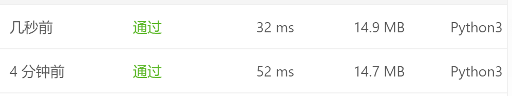

# [228. 汇总区间](https://leetcode-cn.com/problems/summary-ranges/)

给定一个无重复元素的有序整数数组 nums 。

返回 恰好覆盖数组中所有数字 的 最小有序 区间范围列表。也就是说，nums 的每个元素都恰好被某个区间范围所覆盖，并且不存在属于某个范围但不属于 nums 的数字 x 。

列表中的每个区间范围 [a,b] 应该按如下格式输出：

"a->b" ，如果 a != b
"a" ，如果 a == b

**示例 1：**

```
输入：nums = [0,1,2,4,5,7]
输出：["0->2","4->5","7"]
解释：区间范围是：
[0,2] --> "0->2"
[4,5] --> "4->5"
[7,7] --> "7"
```

**示例 2：**

```
输入：nums = [0,2,3,4,6,8,9]
输出：["0","2->4","6","8->9"]
解释：区间范围是：
[0,0] --> "0"
[2,4] --> "2->4"
[6,6] --> "6"
[8,9] --> "8->9"
```

**示例 3：**

```
输入：nums = []
输出：[]
```

**示例 4：**

```
输入：nums = [-1]
输出：["-1"]
```

**示例 5：**

```
输入：nums = [0]
输出：["0"]
```


提示：

- 0 <= nums.length <= 20
- -231 <= nums[i] <= 231 - 1
- nums 中的所有值都 互不相同
- nums 按升序排列

## 思路

- 如果初始数组为空，那么返回空
- 如果不为空遍历数组，如果连续则continue，否则让i2=i
- 如果i1=i2那么就说明这是个单独的
- 否则输出连续的长度

代码如下：

在提交代码的时候出现了很有意思的事情，我将一条判断语句删去之后速度一下子就上来了，很奇怪，记录下来。

```python
class Solution:
    def summaryRanges(self, nums: List[int]) -> List[str]:
        res = []
        i1 = 0
        if len(nums) == 0:
            return res

        for i in range(len(nums)):
            if i < len(nums) - 1 and nums[i] == nums[i + 1] - 1:
                continue
            else:
                i2 = i
            if i == len(nums) - 1:
                i2 = i
            if i1 == i2:
                res.append(str(nums[i2]))
                i1 += 1
            else:
                res.append(str(nums[i1]) + '->' + str(nums[i2]))
                i1 = i + 1
        return res
```

```python
class Solution:
    def summaryRanges(self, nums: List[int]) -> List[str]:
        res = []
        i1 = 0
        if len(nums) == 0:
            return res

        for i in range(len(nums)):
            if i < len(nums) - 1 and nums[i] == nums[i + 1] - 1:
                continue
            else:
                i2 = i
#            if i == len(nums) - 1:
#                i2 = i
            if i1 == i2:
                res.append(str(nums[i2]))
                i1 += 1
            else:
                res.append(str(nums[i1]) + '->' + str(nums[i2]))
                i1 = i + 1
        return res
```

区别在于注释的那部分，我发现这里比较冗余所以将这里删去。

然后就有了下图的效果：



个人觉得是LeetCode本身问题，每次可能都不太一样。