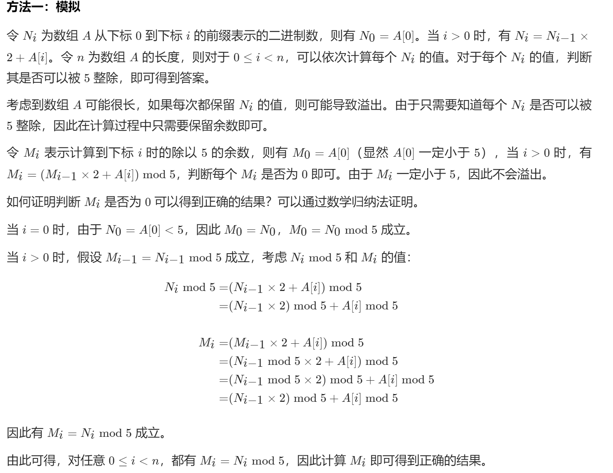

# [684. 冗余连接](https://leetcode-cn.com/problems/redundant-connection/)

在本问题中, 树指的是一个连通且无环的无向图。

输入一个图，该图由一个有着N个节点 (节点值不重复1, 2, ..., N) 的树及一条附加的边构成。附加的边的两个顶点包含在1到N中间，这条附加的边不属于树中已存在的边。

结果图是一个以`边`组成的二维数组。每一个边的元素是一对`[u, v]`，满足`u < v`，表示连接顶点`u`和`v`的无向图的边。

返回一条可以删去的边，使得结果图是一个有着`N`个节点的树。如果有多个答案，则返回二维数组中最后出现的边。答案边`[u, v]`应满足相同的格式`u < v`。

**示例 1：**

```
输入: [[1,2], [1,3], [2,3]]
输出: [2,3]
解释: 给定的无向图为:
  1
 / \
2 - 3
```

**示例 2：**

```
输入: [[1,2], [2,3], [3,4], [1,4], [1,5]]
输出: [1,4]
解释: 给定的无向图为:
5 - 1 - 2
    |   |
    4 - 3
```

**注意:**

- 输入的二维数组大小在 3 到 1000。

- 二维数组中的整数在1到N之间，其中N是输入数组的大小。

更新(2017-09-26):
我们已经重新检查了问题描述及测试用例，明确图是无向 图。对于有向图详见[冗余连接II](https://leetcodechina.com/problems/redundant-connection-ii/description/)。对于造成任何不便，我们深感歉意。

## 思路

首先是两个超时的方法：

一个是翻转列表，一个是翻转着加和。

- 反转列表

  ```python
  class Solution:
      def prefixesDivBy5(self, A: List[int]) -> List[bool]:
          cur = 0
          res = []
          count = []
          for i in range(len(A)):
              count.append(A[i])
              count.reverse()
              for j in range(len(count)):
                  cur += count[j] * 2 ** j
              count.reverse()
              res.append((cur % 5) == 0)
              cur = 0
          return res
  ```

- 翻转加和

  ```python
  class Solution:
      def prefixesDivBy5(self, A: List[int]) -> List[bool]:
          cur = 0
          res = []
          for i in range(len(A)):
              for j in range(i+1):
                  cur += A[j] * 2 ** (len(A) - j -1)
              res.append((cur % 5) == 0)
              cur = 0
          return res
  ```

两者结合：

```python
class Solution:
    def prefixesDivBy5(self, A: List[int]) -> List[bool]:
        cur = 0
        res = []
        A.reverse()
        for i in range(len(A)):
            cur += A[len(A) - i - 1] * 2 ** (len(A) - i - 1)
            res.append((cur % 5) == 0)
        return res
```

时间复杂度O(nlogn)

## 大神解法



```python
class Solution:
    def prefixesDivBy5(self, A: List[int]) -> List[bool]:
        ans = list()
        prefix = 0
        for num in A:
            prefix = ((prefix << 1) + num) % 5
            ans.append(prefix == 0)
        return ans
```

差一点，有想过用位运算，但是没想到这个。

相当于是每次移出来个0然后加上最后一位，无论最后一位是什么就是加上那个数的本身，妙哉！

复杂度O(n)

#### 方法二

这个方法算是我的方法的改进也是等同于位运算，代码如下：

```python
class Solution:
    def prefixesDivBy5(self, A: List[int]) -> List[bool]:
        ans = []
        n = len(A)
        res = 0
        for i in range(n):
            res = res * 2 + A[i]
            if res % 5 == 0:
                ans.append(True)
            else:
                ans.append(False)
        return ans
```

因为每次多一个的时候相当于总体乘2，所以这个思路很对。

## 参考

1. [官方题解](https://leetcode-cn.com/problems/binary-prefix-divisible-by-5/solution/ke-bei-5-zheng-chu-de-er-jin-zhi-qian-zh-asih/)
2. [pengkai](https://leetcode-cn.com/problems/binary-prefix-divisible-by-5/solution/ke-bei-5-zheng-chu-de-er-jin-zhi-qian-zh-asih/744231)