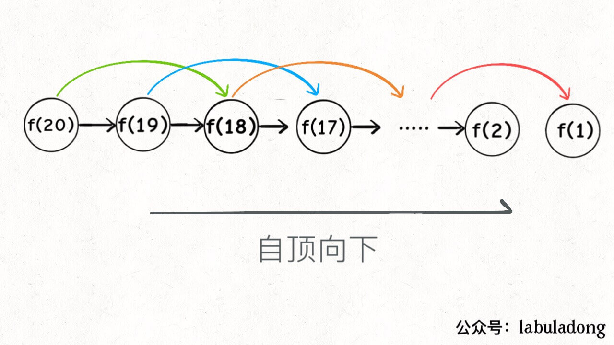
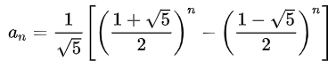

# [509. 斐波那契数](https://leetcode-cn.com/problems/fibonacci-number/)

斐波那契数，通常用 F(n) 表示，形成的序列称为 斐波那契数列 。该数列由 0 和 1 开始，后面的每一项数字都是前面两项数字的和。也就是：

F(0) = 0，F(1) = 1
F(n) = F(n - 1) + F(n - 2)，其中 n > 1

给你 n ，请计算 F(n) 。

示例 1：

```输入：2
输出：1
解释：F(2) = F(1) + F(0) = 1 + 0 = 1
```

示例 2：

```输入：3
输出：2
解释：F(3) = F(2) + F(1) = 1 + 1 = 2
```

示例 3：

```输入：4
输出：3
解释：F(4) = F(3) + F(2) = 2 + 1 = 3
```


提示：

- **0 <= n <= 30**

## 思路

最开始想到的方法就是分三种情况，0,1和其他，0和1就是直接输出即可，其他的话走递归，实现代码如下：

```python
class Solution:
    def fib(self, n: int) -> int:
        if n == 0:
            return 0
        if n == 1:
            return 1
        else:
            return self.fib(n - 1) + self.fib(n - 2)
```

然后我思考了一下，这种方法的代码很简洁但是有个问题就是用python实现的话时间消耗太大，由于是递归的方式这也是无法避免的，最后的执行用时: **784 ms**，内存消耗: **14.6 MB**。

那么用什么方式能改善一下呢，经过一番苦思冥想之后我想到了这样一种办法，采用循环的方式依次累加，具体实现代码如下：

```python
class Solution:
    def fib(self, n: int) -> int:
        a = 0
        b = 1
        c = a+b
        sum = 0
        if n == 0:
            return 0
        for i in range(1,n+1):
            if i == 1:
                sum = 1
            else:
                sum = c
                a = b
                b = c
                c = a +b
        return sum    
```

这种方式将时间复杂度控制在了O(n)，最后的执行用时: **36 ms**

内存消耗: **14.7 MB**。

在想出这两种办法之后，我便没有第三种思路了，然后我将这两种办法分别使用Go、C实现了一下。

**C**

```c
int fib(int n){
    if(n==0){
        return 0;
    }
    if(n==1){
        return 1;
    }
    else{
        return fib(n-1) + fib(n-2);
    }
}
```


```c
int fib(int n){
    int a=0;
    int b=1;
    int c=a+b;
    int sum;
    if(n==0){
        return 0;
    }
    for(int i=1;i<n+1;i++){
        if(i==1){
            sum=1;
        }else{
            sum=c;
            a=b;
            b=c;
            c=a+b;
        }
    }
    return sum;
}
```


**Go**

```Go
func fib(n int) int {
    if n == 0{
        return 0
    }
    if n == 1{
        return 1
    }else{
        return fib(n-1) + fib(n-2)
    }
}
```


```go
func fib(n int) int {
    var a int = 0
    var b int = 1
    var c int = a+b
    var sum int
    if(n==0){
        return 0
    }
    for i:=1;i<n+1;i++ {
        if(i==1){
            sum = 1
        }else{
            sum = c
            a = b
            b = c
            c = a+b
        }
    }
    return sum
}
```


从具体信息来看，这个相比于上面那个方法内存消耗还要小一些。

最后用JavaScript复现一下，实现如下：

```javascript
/**
 * @param {number} n
 * @return {number}
 */
var fib = function(n) {
    if(n==0){
        return 0
    }
    if(n==1){
        return 1
    }
    else
    {
        return fib(n-1)+fib(n-2)
    }
};
```


```javascript
/**
 * @param {number} n
 * @return {number}
 */
var fib = function(n) {
    var a=0
    var b=1
    var c=a+b
    var sum
    if(n==0){
        return 0
    }
    for(var i=1;i<n+1;i++){
        if(i==1){
            sum=1
        }else{
            sum=c
            a=b
            b=c
            c=a+b
        }
    }
    return sum
};
```


好了好了，其他的语言就不会了，可以看出来第一种递归方法耗时python>JavaScript>C>Go，第二种方法JavaScript>python>C>Go。

内存消耗JavaScript>python>C>Go。

最后贴个java实现的图


## 大神解题方法

### 参考一

这个题巧解的思路在于使用动态规划的方式解决问题，**动态规划问题一般形式就是求最值**。动态规划起始是运筹学的一种最优化方法，只不过在计算机问题上应用比较多，如最长递增子序列、最小编辑距离等。

求动态规划问题的核心就是**穷举**。因为要求最值，肯定要把所有可行的答案穷举出来，在其中找最值。

但问题是动态规划的穷举有些特殊，因为在这类问题中存在**【重叠子问题】**，如果采用暴力穷举的话效率会极其低下，所以要使用**【备忘录】**或者**【DP table】**来优化穷举过程，避免不必要的计算。

而且，动态规划问题一定会具备**【最优子结构】**，才能通过子问题的最值得到原问题的最值。

另外，虽然动态规划的核心思想是穷举求最值，但是问题可以千变万化，穷举所有可行解其实并不是一件容易的事，只有累出正确的**【状态转移方程】**才能正确的穷举。

以上提到的重叠子问题、最优子结构、状态转移方程就是动态规划三要素。在实际算法问题中，写出状态转移方程是最困难的。

一个思维框架如下：

**明确base case->明确【状态】->明确【选择】->定义dp数组/函数的含义。**

依照上面的框架，最终实现如下：

```c
# 初始化 base case
dp[0][0][...] = base
# 进行状态转移
for 状态1 in 状态1的所有取值：
    for 状态2 in 状态2的所有取值：
        for ...
            dp[状态1][状态2][...] = 求最值(选择1，选择2...)
```

然后，我们看实际题目，一共有三种方法来解决斐波那契数列问题

- **暴力递归**
- **带备忘录的递归解法**
- **dp 数组的迭代解法**

1、暴力递归

斐波那契数列的数学形式就是递归的，写成代码就是这样：

```c++
int fib(int N) {
    if (N == 1 || N == 2) return 1;
    return fib(N - 1) + fib(N - 2);
}
```


这个不用多说了，学校老师讲递归的时候似乎都是拿这个举例。我们也知道这样写代码虽然简洁易懂，但是十分低效，低效在哪里？假设 n = 20，请画出递归树：


PS：但凡遇到需要递归的问题，最好都画出递归树，这对你分析算法的复杂度，寻找算法低效的原因都有巨大帮助。

这个递归树怎么理解？就是说想要计算原问题 `f(20)`，我就得先计算出子问题 `f(19)` 和 `f(18)`，然后要计算 `f(19)`，我就要先算出子问题 `f(18)` 和 `f(17)`，以此类推。最后遇到 `f(1)` 或者 `f(2)` 的时候，结果已知，就能直接返回结果，递归树不再向下生长了。

递归算法的时间复杂度怎么计算？就是用子问题个数乘以解决一个子问题需要的时间。

首先计算子问题个数，即递归树中节点的总数。显然二叉树节点总数为指数级别，所以子问题个数为 **O(2^n)**。

然后计算解决一个子问题的时间，在本算法中，没有循环，只有 `f(n - 1) + f(n - 2)` 一个加法操作，时间为 **O(1)**。

所以，这个算法的时间复杂度为二者相乘，即 **O(2^n)**，指数级别，爆炸。

观察递归树，很明显发现了算法低效的原因：存在大量重复计算，比如 `f(18)` 被计算了两次，而且你可以看到，以 `f(18)` 为根的这个递归树体量巨大，多算一遍，会耗费巨大的时间。更何况，还不止 `f(18)` 这一个节点被重复计算，所以这个算法及其低效。

这就是动态规划问题的第一个性质：重叠子问题。下面，我们想办法解决这个问题。

2、带备忘录的递归解法

明确了问题，其实就已经把问题解决了一半。即然耗时的原因是重复计算，那么我们可以造一个「备忘录」，每次算出某个子问题的答案后别急着返回，先记到「备忘录」里再返回；每次遇到一个子问题先去「备忘录」里查一查，如果发现之前已经解决过这个问题了，直接把答案拿出来用，不要再耗时去计算了。

一般使用一个数组充当这个「备忘录」，当然你也可以使用哈希表（字典），思想都是一样的。

```c++
int fib(int N) {
    if (N < 1) return 0;
    // 备忘录全初始化为 0
    vector<int> memo(N + 1, 0);
    // 进行带备忘录的递归
    return helper(memo, N);
}

int helper(vector<int>& memo, int n) {
    // base case 
    if (n == 1 || n == 2) return 1;
    // 已经计算过
    if (memo[n] != 0) return memo[n];
    memo[n] = helper(memo, n - 1) + helper(memo, n - 2);
    return memo[n];
}
```

现在，画出递归树，你就知道「备忘录」到底做了什么。


实际上，带「备忘录」的递归算法，把一棵存在巨量冗余的递归树通过「剪枝」，改造成了一幅不存在冗余的递归图，极大减少了子问题（即递归图中节点）的个数。



递归算法的时间复杂度怎么计算？就是用子问题个数乘以解决一个子问题需要的时间。

子问题个数，即图中节点的总数，由于本算法不存在冗余计算，子问题就是 f(1), f(2), f(3) ... f(20)，数量和输入规模 n = 20 成正比，所以子问题个数为 **O(n)**。

解决一个子问题的时间，同上，没有什么循环，时间为 **O(1)**。

所以，本算法的时间复杂度是 **O(n)**。比起暴力算法，是降维打击。

至此，带备忘录的递归解法的效率已经和迭代的动态规划解法一样了。实际上，这种解法和迭代的动态规划已经差不多了，只不过这种方法叫做「自顶向下」，动态规划叫做「自底向上」。

啥叫「自顶向下」？注意我们刚才画的递归树（或者说图），是从上向下延伸，都是从一个规模较大的原问题比如说 f(20)，向下逐渐分解规模，直到 f(1) 和 f(2) 这两个 base case，然后逐层返回答案，这就叫「自顶向下」。

啥叫「自底向上」？反过来，我们直接从最底下，最简单，问题规模最小的 f(1) 和 f(2) 开始往上推，直到推到我们想要的答案 f(20)，这就是动态规划的思路，这也是为什么动态规划一般都脱离了递归，而是由循环迭代完成计算。

3、dp 数组的迭代解法

有了上一步「备忘录」的启发，我们可以把这个「备忘录」独立出来成为一张表，就叫做 DP table 吧，在这张表上完成「自底向上」的推算岂不美哉！

```c++
int fib(int N) {
    vector<int> dp(N + 1, 0);
    // base case
    dp[1] = dp[2] = 1;
    for (int i = 3; i <= N; i++)
        dp[i] = dp[i - 1] + dp[i - 2];
    return dp[N];
}
```


画个图就很好理解了，而且你发现这个 DP table 特别像之前那个「剪枝」后的结果，只是反过来算而已。实际上，带备忘录的递归解法中的「备忘录」，最终完成后就是这个 DP table，所以说这两种解法其实是差不多的，大部分情况下，效率也基本相同。

这里，引出「状态转移方程」这个名词，实际上就是描述问题结构的数学形式：


为啥叫「状态转移方程」？其实就是为了听起来高端。你把 `f(n)` 想做一个状态 `n`，这个状态 `n` 是由状态` n - 1` 和状态 `n - 2` 相加转移而来，这就叫状态转移，仅此而已。

你会发现，上面的几种解法中的所有操作，例如 `return f(n - 1) + f(n - 2)`，`dp[i] = dp[i - 1] + dp[i - 2]`，以及对备忘录或 DP table 的初始化操作，都是围绕这个方程式的不同表现形式。可见列出「状态转移方程」的重要性，它是解决问题的核心。而且很容易发现，其实状态转移方程直接代表着暴力解法。

**千万不要看不起暴力解，动态规划问题最困难的就是写出这个暴力解，即状态转移方程。**只要写出暴力解，优化方法无非是用备忘录或者 DP table，再无奥妙可言。

这个例子的最后，讲一个细节优化。细心的读者会发现，根据斐波那契数列的状态转移方程，当前状态只和之前的两个状态有关，其实并不需要那么长的一个 DP table 来存储所有的状态，只要想办法存储之前的两个状态就行了。所以，可以进一步优化，把空间复杂度降为 O(1)：

```c++


int fib(int n) {
    if (n == 2 || n == 1) 
        return 1;
    int prev = 1, curr = 1;
    for (int i = 3; i <= n; i++) {
        int sum = prev + curr;
        prev = curr;
        curr = sum;
    }
    return curr;
}
```

这个技巧就是所谓的「状态压缩」，如果我们发现每次状态转移只需要 DP table 中的一部分，那么可以尝试用状态压缩来缩小 DP table 的大小，只记录必要的数据，上述例子就相当于把DP table 的大小从 n 缩小到 2。后续的动态规划章节中我们还会看到这样的例子，一般来说是把一个二维的 DP table 压缩成一维，即把空间复杂度从 O(n^2) 压缩到 O(n)。

> 所以说我的第二种方法是状态压缩嘛，我都不知道诶。

有人会问，动态规划的另一个重要特性「最优子结构」，怎么没有涉及？下面会涉及。**斐波那契数列的例子严格来说不算动态规划，因为没有涉及求最值，以上旨在说明重叠子问题的消除方法，演示得到最优解法逐步求精的过程。**下面，看第二个例子，[凑零钱问题](https://leetcode-cn.com/problems/coin-change)。

### 参考二

实际上斐波那契数列是有公式的，公式如下：



```python
class Solution:
    def fib(self, n: int) -> int:
        f1 = (1+math.sqrt(5))/2
        f2 = (1-math.sqrt(5))/2
        return round((math.pow(f1,n)-math.pow(f2,n))/math.sqrt(5))
```

亦或者，不讲武德:

```python
class Solution:
    def fib(self, n: int) -> int:
        f = [0, 1, 1, 2, 3, 5, 8, 13, 21, 34, 55, 89, 144, 233, 377, 610, 987, 1597, 2584, 4181, 6765, 10946, 17711, 28657, 46368, 75025, 121393, 196418, 317811, 514229, 832040]
        return f[n]
```

## 参考

1. [动态规划套路详解](https://leetcode-cn.com/problems/fibonacci-number/solution/dong-tai-gui-hua-tao-lu-xiang-jie-by-labuladong/)
2. [4种解决方式，都击败了100%的用户](https://leetcode-cn.com/problems/fibonacci-number/solution/4chong-jie-jue-fang-shi-du-ji-bai-liao-1-92ud/)