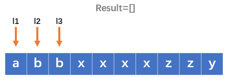
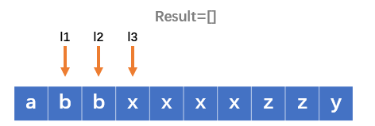
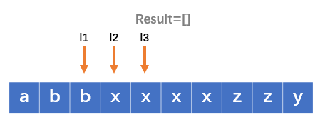
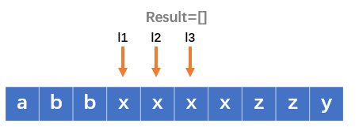
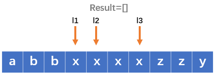
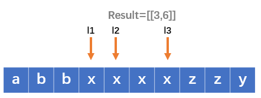
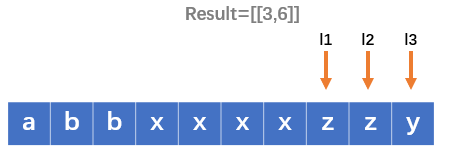
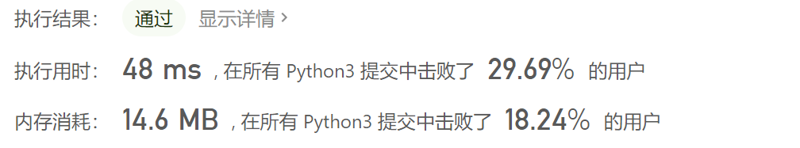
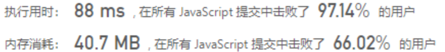
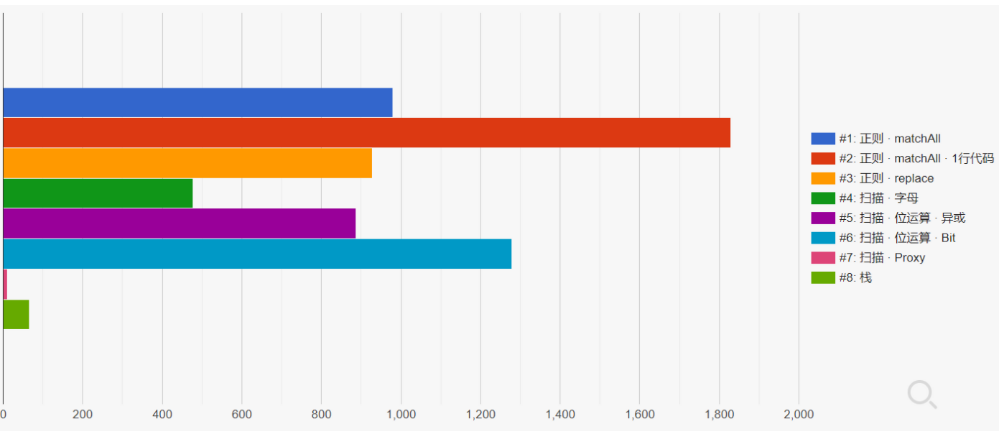

# [830. 较大分组的位置](https://leetcode-cn.com/problems/positions-of-large-groups/)

在一个由小写字母构成的字符串 `s` 中，包含由一些连续的相同字符所构成的分组。

例如，在字符串 s = `"abbxxxxzyy"` 中，就含有 `"a"`, `"bb"`, `"xxxx"`, `"z"` 和 `"yy"` 这样的一些分组。

分组可以用区间 `[start, end]` 表示，其中 `start` 和 `end` 分别表示该分组的起始和终止位置的下标。上例中的 `"xxxx"` 分组用区间表示为 [3,6] 。

我们称所有包含大于或等于三个连续字符的分组为 较大分组 。

找到每一个 较大分组 的区间，按起始位置下标递增顺序排序后，返回结果。

 

示例 1：

```
输入：s = "abbxxxxzzy"
输出：[[3,6]]
解释："xxxx" 是一个起始于 3 且终止于 6 的较大分组。
```

示例 2：

```
输入：s = "abc"
输出：[]
解释："a","b" 和 "c" 均不是符合要求的较大分组。
```

示例 3：

```
输入：s = "abcdddeeeeaabbbcd"
输出：[[3,5],[6,9],[12,14]]
解释：较大分组为 "ddd", "eeee" 和 "bbb"
```

示例 4：

```
输入：s = "aba"
输出：[]
```

提示：

```
1 <= s.length <= 1000
s 仅含小写英文字母
```

## 思路

沿用了一下昨天种花的一个思路，设置三个索引指向连续的三个值，然后判断三个值是否相等。如果相等的话就在判断第四个值和第三个值相不相等，如果相等就继续判断，如果不等就将插入到结果列表中，更新三个索引的值，进行下一个循环。















```python
class Solution:
    def largeGroupPositions(self, s: str) -> List[List[int]]:
        l1 = 0
        l2 = 1
        l3 = 2
        result = []
        print(len(s))
        while l3 < len(s):
            print(s[l1], s[l2], s[l3])
            if s[l1] == s[l2] == s[l3]:
                while l3 < len(s)-1 and s[l3] == s[l3 + 1]:
                    l3 += 1
                result.append([l1, l3])
                l1 = l3
                l2 = l1 + 1
                l3 = l2 + 1

            l1 += 1
            l2 += 1
            l3 += 1

        return result
```


看了一下，速度还不错，但是内存消耗太大了，想一想有什么方法优化一下。优化的想法是用一个索引头和一个列表作为要存入结果列表的列表。然后发现了一个问题，在传入result结果列表时如果简单的采用传入当时的cur是不行的，由于python的特性，在之后的过程中cur的值会变，因为用`=`的话相当于是拷贝的地址所以这样不可行，改为使用copy函数进行值传递，最后通过。

```python
class Solution:
    def largeGroupPositions(self, s: str) -> List[List[int]]:
        l = 0
        result = []
        cur = [0, 0]
        while l < len(s):
            if l < len(s) - 1 and s[l] == s[l + 1]:
                cur[0] = l
                while l < len(s) - 1 and s[l] == s[l + 1]:
                    l += 1
                    cur[1] = l
                if cur[1] - cur[0] >= 2:
                    result.append(cur.copy())
                    '''
                    或者改为cur1 = cur[:]
                    result.append(cur1)
                    但是这个要差
                    '''
                else:
                    cur = [0, 0]
            l += 1
        return result
```



看起来不是很成功，内存消耗并没有减少太多。

## 大神的解法

[正则 + 位 + 栈（4解法，超100%）](https://leetcode-cn.com/problems/positions-of-large-groups/solution/zheng-ze-wei-zhan-3jie-fa-chao-100-by-ma-r0vy/)

### 一、正则

([a-z])捕获小写字母，\1反向引用刚才捕获的字母，{2,}该字母又出现>=2次
matchAll

```javascript
var largeGroupPositions = function(s) {
    let g = s.matchAll(/([a-z])\1{2,}/g), r = [], t
    while (t = g.next().value) r.push([t.index, t.index + t[0].length - 1])
    return r
};
```

matchAll · 1行代码

```javascript
var largeGroupPositions = function(s) {
    return Array.from(s.matchAll(/(.)\1\1+/g), v => [v.index, v.index + v[0].length - 1])
};
```

replace：.匹配除换行符以外的任意字符

```javascript
var largeGroupPositions = function(s) {
    const r = []
    s.replace(/(.)\1{2,}/g, (a, _, i)=> r.push([i, i + a.length - 1]))
    return r
};
```

### 二、扫描

start不同字母首次出现索引，初始0。遍历遇下个不同字母，更新start
字母

```javascript
var largeGroupPositions = function(s) {
    let i = 0, start = 0, r = []
    while (++i <= s.length) // = 时，JS数组越界不报错，处理类似 aaa 情况
        if (s[start] !== s[i]) {
            if (i - start > 2) r.push([start, i - 1])
            start = i
        }
    return r
};

```

位运算 · 异或：字母转Unicode编码，相同^为0

```javascript
var largeGroupPositions = function(s) {
    let i = 0, start = 0, r = []
    while (++i <= s.length) 
        if (s.charCodeAt(start) ^ s.charCodeAt(i)) {
            if (i - start > 2) r.push([start, i - 1])
            start = i
        }
    return r
};
```

Proxy：拦截数组push方法，不满足连续出现次数>=3不真正push

```javascript
var largeGroupPositions = function(s) {
    let i = 0, start = 0, r = [], p = proxy(r)
    while (++i <= s.length) 
        if (s[start] !== s[i]) {
            p.push([start, i - 1])
            start = i
        }
    return r
};
const proxy = r => new Proxy(r, {
    set (t, p, v) {         
        if (typeof v === 'object' && v[1] - v[0] > 1) t[p] = v
        return true
    }
})

```

### 三、位

小写字母转Unicode编码-97，范围[0, 25]。二进制的32位从左到右[1, 26]位可表示[a, z]

```javascript
class Bit { // 构造Bit类，模仿Set，当Set用
    constructor () {
        this.clear()
    }
    add (v) { // 遇 a 转97，再-97 = 0，1左移0位 = 1。或 运算，占第1位
        this.bit |= 1 << v
        return this
    }
    has (v) { // 再遇 a，同上，1左移0位 = 1。且 运算，第1位已被占，找到连续 a
        return this.bit & 1 << v
    }
    clear () {
        this.bit = 0
        return this
    }
}
```

构造Bit类，遇不同字母(has返回0)，清空Bit并放入。相当于用!Bit.has代替上解法的!==

```javascript
var largeGroupPositions = function(s) {
    let i = 0, start = 0, b = new Bit, r = [], t
    b.add(s.charCodeAt(0) - 97)
    while (++i < s.length) {
        if (!b.has(t = s.charCodeAt(i) - 97)) {
            if (i - start > 2) r.push([start, i - 1])
            start = i
            b.clear().add(t)
        }
    }
    if (i - start > 2) r.push([start, i - 1])
    return r
};
```

#### 提示

Bit作用与Set一致，即判断字母是否重复出现。只是!Set.has字母不如直接!==快

```javascript
var largeGroupPositions = function(s) {
    let i = 0, start = 0, b = new Set(s[0]), r = [], t
    while (++i <= s.length) 
        if (!b.has(s[i])) {
            if (i - start > 2) r.push([start, i - 1])
            start = i
            b.clear()
            b.add(s[i])
        }
    return r
};
```

### 四 栈

构造特殊栈：push时，遇不同元素，清空栈 并 返回清空前的长度，该长度即相同元素个数

```javascript
class Stack {
    constructor () {
        this.q = []
    } 
    length () {
        return this.q.length
    }
    top () {
        return this.q[this.length() - 1]
    }
    clear () {
        this.q.length = 0
    }
    push (v) {
        let len = 0
        if (v !== this.top()) {
            len = this.length()
            this.clear()
        }
        this.q.push(v)
        return len
    }
}
```

遍历将元素放入栈，找 相同元素个数>=3 即可

```javascript
var largeGroupPositions = function(s) {
    let i = -1, q = new Stack, r = []
    while (++i <= s.length) {
        const n = q.push(s[i])
        if (n > 2) r.push([i - n, i - 1])
    }
    return r
};
```



### 排行




## 参考

1. [python菜鸟教程](https://www.runoob.com/python3/python3-att-list-copy.html)
2. 