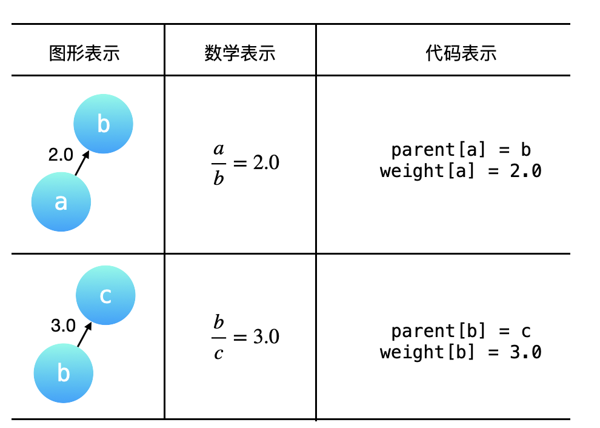
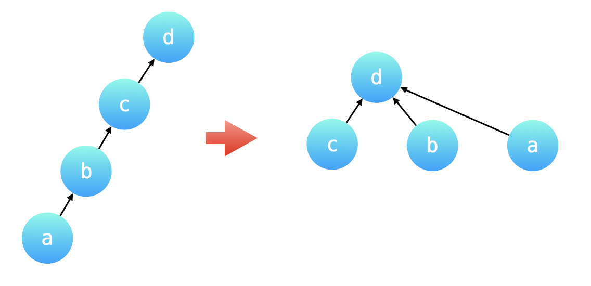
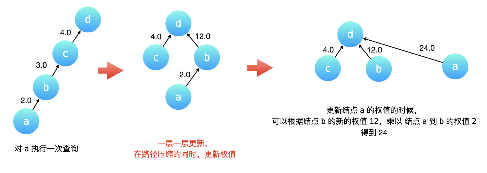
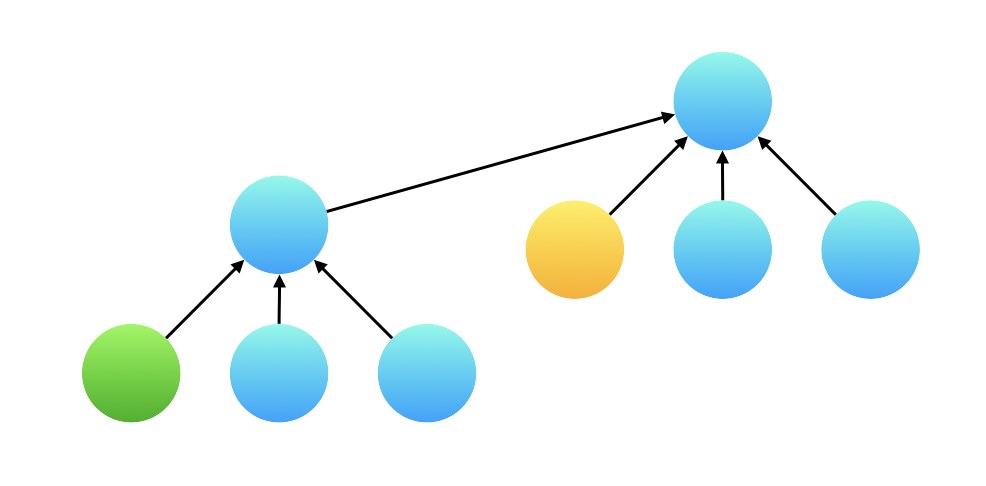
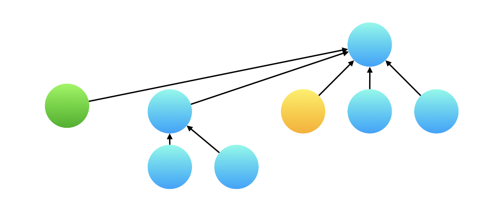

# [399. 除法求值](https://leetcode-cn.com/problems/evaluate-division/)

给你一个变量对数组 `equations` 和一个实数值数组 `values` 作为已知条件，其中 $equations[i] = [A_i, B_i]$ 和 `values[i]` 共同表示等式 $A_i / B_i = values[i]$ 。每个 $A_i$ 或 $B_i$ 是一个表示单个变量的字符串。

另有一些以数组 `queries` 表示的问题，其中 $queries[j] = [C_j, D_j]$ 表示第 j 个问题，请你根据已知条件找出 $C_j / D_j = ? $的结果作为答案。

返回 **所有问题的答案** 。如果存在某个无法确定的答案，则用 `-1.0` 替代这个答案。

 

注意：输入总是有效的。你可以假设除法运算中不会出现除数为 0 的情况，且不存在任何矛盾的结果。

 

示例 1：

```
输入：equations = [["a","b"],["b","c"]], values = [2.0,3.0], queries = [["a","c"],["b","a"],["a","e"],["a","a"],["x","x"]]
输出：[6.00000,0.50000,-1.00000,1.00000,-1.00000]
解释：
条件：a / b = 2.0, b / c = 3.0
问题：a / c = ?, b / a = ?, a / e = ?, a / a = ?, x / x = ?
结果：[6.0, 0.5, -1.0, 1.0, -1.0 ]
```


示例 2：

```
输入：equations = [["a","b"],["b","c"],["bc","cd"]], values = [1.5,2.5,5.0], queries = [["a","c"],["c","b"],["bc","cd"],["cd","bc"]]
输出：[3.75000,0.40000,5.00000,0.20000]
```


示例 3：

```
输入：equations = [["a","b"]], values = [0.5], queries = [["a","b"],["b","a"],["a","c"],["x","y"]]
输出：[0.50000,2.00000,-1.00000,-1.00000]
```


提示：

- `1 <= equations.length <= 20`
- `equations[i].length == 2`
- `1 <= Ai.length, Bi.length <= 5`
- `values.length == equations.length`
- `0.0 < values[i] <= 20.0`
- `1 <= queries.length <= 20`
- `queries[i].length == 2`
- `1 <= Cj.length, Dj.length <= 5`
- `Ai, Bi, Cj, Dj` 由小写英文字母与数字组成

## 思路

果然哈，中等难度不愧为中等难度，没有思路，想了大概半个小时吧，想法是穷举，把所有可能性都列举出来然后根据queries查询，但是没实现出来。

## 大神的解法

[先构造图再dfs的python实现](https://leetcode-cn.com/problems/evaluate-division/solution/xian-gou-zao-tu-zai-dfsde-pythonshi-xian-by-mai-ma/)

先构造图，使用dict实现，其天然的hash可以在in判断时做到O(1)复杂度。

对每个equation如"a/b=v"构造a到b的带权v的有向边和b到a的带权1/v的有向边，

之后对每个query，只需要进行dfs并将路径上的边权重叠乘就是结果了，如果路径不可达则结果为-1。

```python
def calcEquation(self, equations: List[List[str]], values: List[float], queries: List[List[str]]) -> List[float]:
    # 构造图，equations的第一项除以第二项等于value里的对应值，第二项除以第一项等于其倒数
    graph = {}
    for (x, y), v in zip(equations, values):
        if x in graph:
            graph[x][y] = v
        else:
            graph[x] = {y: v}
        if y in graph:
            graph[y][x] = 1/v
        else:
            graph[y] = {x: 1/v}
    
    # dfs找寻从s到t的路径并返回结果叠乘后的边权重即结果
    def dfs(s, t) -> int:
        if s not in graph:
            return -1
        if t == s:
            return 1
        for node in graph[s].keys():
            if node == t:
                return graph[s][node]
            elif node not in visited:
                visited.add(node)  # 添加到已访问避免重复遍历
                v = dfs(node, t)
                if v != -1:
                    return graph[s][node]*v
        return -1

    # 逐个计算query的值
    res = []
    for qs, qt in queries:
        visited = set()
        res.append(dfs(qs, qt))
    return res
```

### [官方题解](https://leetcode-cn.com/problems/evaluate-division/solution/399-chu-fa-qiu-zhi-nan-du-zhong-deng-286-w45d/)

#### 📖 文字解析

这道题是在「力扣」第 990 题（等式方程的可满足性）的基础上，在变量和变量之间有了倍数关系。由于 变量之间的倍数关系具有传递性，处理有传递性关系的问题，可以使用「并查集」，我们需要在并查集的「合并」与「查询」操作中 维护这些变量之间的倍数关系。

#### 方法：并查集

根据示例 1：

`a / b = 2.0` 说明 $a = 2b$， `a` 和 `b` 在一个集合中；

`b / c = 3.0` 说明 $b = 3c$ ，`b` 和 `c` 在一个集合中。

求$\frac{a}{c}$ ，可以把$a=2b,b=3c$依次带入，得到$\frac{a}{c}=\frac{2b}{c}=\frac{2-3c}{c}=6.0$;

求$\frac{b}{a}$，很显然根据$a=2b$，知道$\frac{b}{a}=0.5$，也可以把$b$和$a$都转换成为$c$的倍数，$\frac{b}{a}=\frac{b}{2b}=\frac{3c}{6c}=\frac{1}{2}=0.5$;

我们计算了两个结果，得到启发：可以将题目给出的 `equation` 中的两个变量进行「合并」，**同在一个集合中的两个变量就可以通过某种方式计算出它们的比值。**具体来说，可以把 **不同的变量的比值转换成为相同的变量的比值**，这样在做除法的时候就可以消去相同的变量，然后再计算转换成相同变量以后的系数的比值，就是题目要求的结果。**统一了比较的标准**，可以以 O(1)O(1) 的时间复杂度完成计算。

如果两个变量不在同一个集合中， 返回 -1.0−1.0。并且根据题目的意思，如果两个变量中 至少有一个变量 没有出现在所有 `equations` 出现的字符集合中，也返回 -1.0−1.0。

#### 构建有向图

通过例 1 的分析，我们就知道了，题目给出的 `equations` 和 `values` 可以表示成一个图，`equations` 中出现的变量就是图的顶点，「分子」于「分母」的比值可以表示成一个有向关系（因为「分子」和「分母」是有序的，不可以对换），并且这个图是一个带权图，values 就是对应的有向边的权值。例 1 中给出的 `equations `和 `values` 表示的「图形」、「数学表示」和「代表表示」如下。

其中 `parent[a] = b` 表示，顶点 `a` 的父结点是`b`，与之对应的有向边的权重，记为 `weight[a] = 2.0`。



##### 「统一变量」与「路径压缩」的关系

刚刚在分析例 1 的过程中，提到了：可以把一个一个 query 中的不同变量转换成 同一个变量，这样在计算 query 的时候就可以以 O(1)O(1) 计算出结果，在「并查集」的一个优化技巧中，「路径压缩」就恰好符合了这样的应用场景。

「路径压缩」是为了避免并查集所表示的树形结构高度过高，影响查询性能的优化。它的效果是：在查询一个结点 a 的根结点同时，把结点 a 到根结点的沿途所有结点的父亲结点都指向根结点。如下图所示，除了根结点以外，所有的结点的父亲结点都指向了根结点。特别地，也可以认为根结点的父亲结点就是根结点自己。



由于有「路径压缩」的优化，两个同在一个连通分量中的不同的变量，它们分别到根结点（父亲结点）的权值的比值，就是题目的要求的结果。

如何在「查询」操作的「路径压缩」优化中维护权值变化
如下图所示，我们在结点 a 执行一次「查询」操作。路径压缩会先一层一层向上先找到根结点 `d`，然后依次把 `c、b 、a` 的父亲结点指向根结点 `d`。

- `c` 的父亲结点已经是根结点了，它的权值不用更改；
- `b` 的父亲结点要修改成根结点，它的权值就是从当前结点到根结点经过的所有有向边的权值的乘积，因此是 3.03.0 乘以 4.04.0 也就是 12.012.0；
- `a` 的父亲结点要修改成根结点，它的权值就是依然是从当前结点到根结点经过的所有有向边的权值的乘积，但是我们 没有必要把这三条有向边的权值乘起来，这是因为 `b` 到 `c`，`c` 到 `d` 这两条有向边的权值的乘积，我们在把 `b` 指向 `d` 的时候已经计算出来了。因此，`a` 到根结点的权值就等于 `b` 到根结点 `d` 的新的权值原来乘以 `a` 到 `b` 的权值。



##### 如何在「合并」操作中维护权值的变化

「合并」操作基于这样一个 很重要的前提：我们将要合并的两棵树的高度最多为 22，换句话说两棵树都必需是「路径压缩」以后的效果，两棵树的叶子结点到根结点最多只需要经过一条边。

例如已知$\frac{a}{b}=3.0$,$\frac{d}{c}=4.0$，又已知$\frac{a}{d}=6.0$，现在我们合并结点 `a` 和 `d` 所在的集合，其实就是把 `a` 的根结点 `b` 指向 `d` 的根结 `c`，那么如何计算 `b` 指向 `c` 的这条有向边的权重呢？

根据 `a` 经过 `b` 可以到达` c`，`a` 经过 `d` 也可以到达 `c`，**因此 两条路径上的有向边的权值的乘积就应该是相等的**，我们把 `b` 到 `c` 的权值设置为 $x$，那么 `3.0` 乘以 `x` 就应该等于 `6.0` 乘以 `4.0` ，因此 `x=8.0`。


##### 一个容易忽略的细节

接下来还有一个小的细节问题：在合并以后，产生了一棵高度为 33 的树，那么我们在执行查询的时候，例如下图展示的绿色结点和黄色结点，绿色结点并不直接指向根结点，在计算这两个变量的比值的时候，用边的权值的比值得到的结果是不对的。



但其实我们不用担心这个问题，**并查集的「查询」操作会执行「路径压缩」**，所以真正在计算两个变量的权值的时候，绿色结点已经指向了根结点，和黄色结点的根结点相同。因此可以用它们指向根结点的有向边的权值的比值作为两个变量的比值。



我们通过这个细节向大家强调：一边查询一边修改结点指向是并查集的特色。

```java
import java.util.HashMap;
import java.util.List;
import java.util.Map;

public class Solution {

    public double[] calcEquation(List<List<String>> equations, double[] values, List<List<String>> queries) {
        int equationsSize = equations.size();

        UnionFind unionFind = new UnionFind(2 * equationsSize);
        // 第 1 步：预处理，将变量的值与 id 进行映射，使得并查集的底层使用数组实现，方便编码
        Map<String, Integer> hashMap = new HashMap<>(2 * equationsSize);
        int id = 0;
        for (int i = 0; i < equationsSize; i++) {
            List<String> equation = equations.get(i);
            String var1 = equation.get(0);
            String var2 = equation.get(1);

            if (!hashMap.containsKey(var1)) {
                hashMap.put(var1, id);
                id++;
            }
            if (!hashMap.containsKey(var2)) {
                hashMap.put(var2, id);
                id++;
            }
            unionFind.union(hashMap.get(var1), hashMap.get(var2), values[i]);
        }

        // 第 2 步：做查询
        int queriesSize = queries.size();
        double[] res = new double[queriesSize];
        for (int i = 0; i < queriesSize; i++) {
            String var1 = queries.get(i).get(0);
            String var2 = queries.get(i).get(1);

            Integer id1 = hashMap.get(var1);
            Integer id2 = hashMap.get(var2);

            if (id1 == null || id2 == null) {
                res[i] = -1.0d;
            } else {
                res[i] = unionFind.isConected(id1, id2);
            }
        }
        return res;
    }

    private class UnionFind {

        private int[] parent;

        /**
         * 指向的父结点的权值
         */
        private double[] weight;


        public UnionFind(int n) {
            this.parent = new int[n];
            this.weight = new double[n];
            for (int i = 0; i < n; i++) {
                parent[i] = i;
                weight[i] = 1.0d;
            }
        }

        public void union(int x, int y, double value) {
            int rootX = find(x);
            int rootY = find(y);
            if (rootX == rootY) {
                return;
            }

            parent[rootX] = rootY;
          	// 关系式的推导请见「参考代码」下方的示意图
            weight[rootX] = weight[y] * value / weight[x];
        }

        /**
         * 路径压缩
         *
         * @param x
         * @return 根结点的 id
         */
        public int find(int x) {
            if (x != parent[x]) {
                int origin = parent[x];
                parent[x] = find(parent[x]);
                weight[x] *= weight[origin];
            }
            return parent[x];
        }

        public double isConected(int x, int y) {
            int rootX = find(x);
            int rootY = find(y);
            if (rootX == rootY) {
                return weight[x] / weight[y];
            } else {
                return -1.0d;
            }
        }
    }
}
```

说明：代码 $weight[rootX] = weight[y] * value / weight[x];$ 的推导过程，主要需要明白各个变量的含义，由两条路径有向边的权值乘积相等得到相等关系，然后做等价变换即可。


#### 复杂度分析：

- 时间复杂度：$O((N + Q)\log A)$，
  - 构建并查集 $O(N \log A)$ ，这里 `N` 为输入方程 `equations` 的长度，每一次执行合并操作的时间复杂度是 O(\log A)O(logA)，这里 AA 是 equations 里不同字符的个数；
  - 查询并查集 $O(Q \log A)$，这里 QQ 为查询数组 `queries` 的长度，每一次查询时执行「路径压缩」的时间复杂度是 $O(\log A)$
- 空间复杂度：$O(A)$：创建字符与 `id` 的对应关系 `hashMap` 长度为 `A`，并查集底层使用的两个数组 `parent` 和 `weight` 存储每个变量的连通分量信息，`parent` 和 `weight` 的长度均为 `A`

