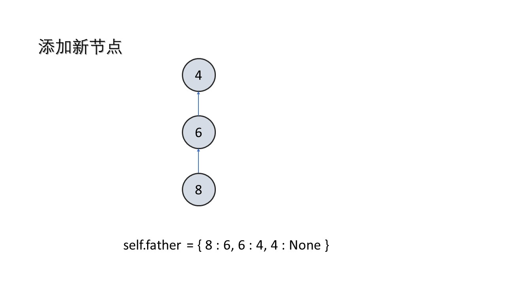
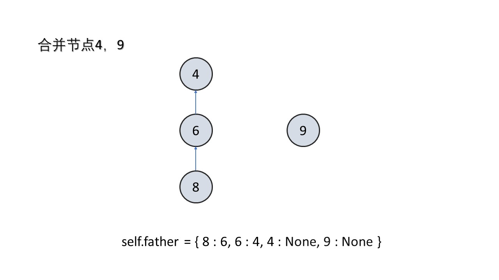
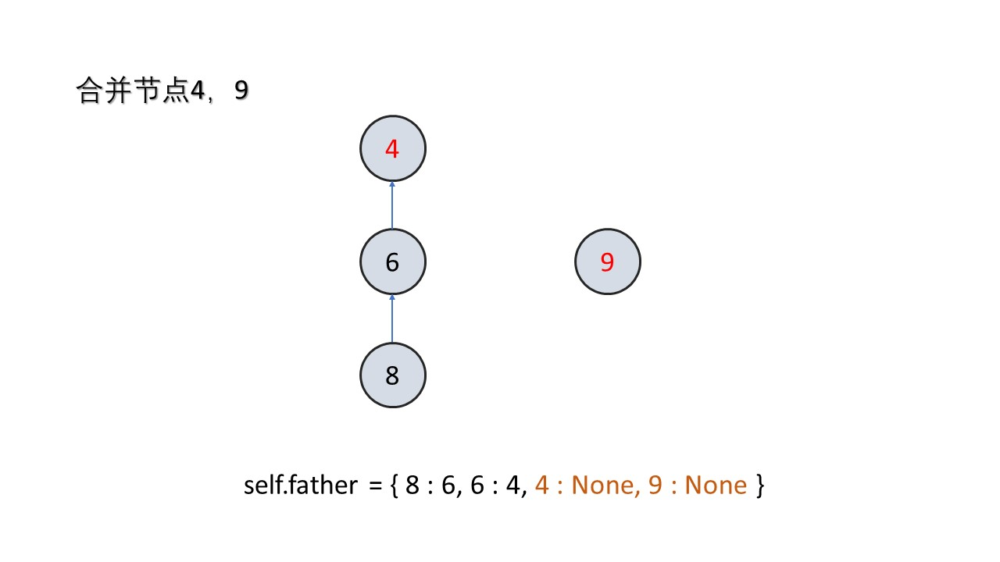
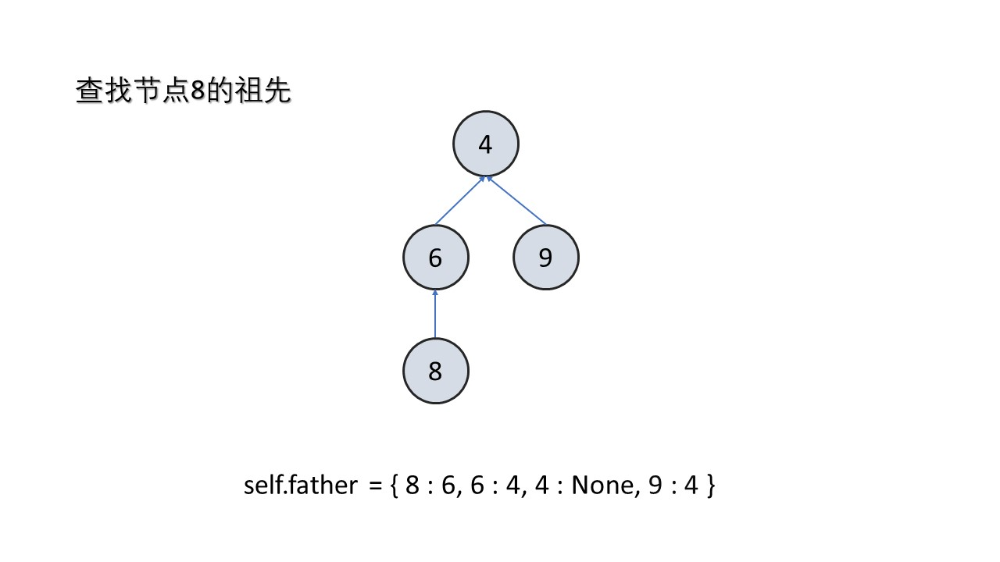
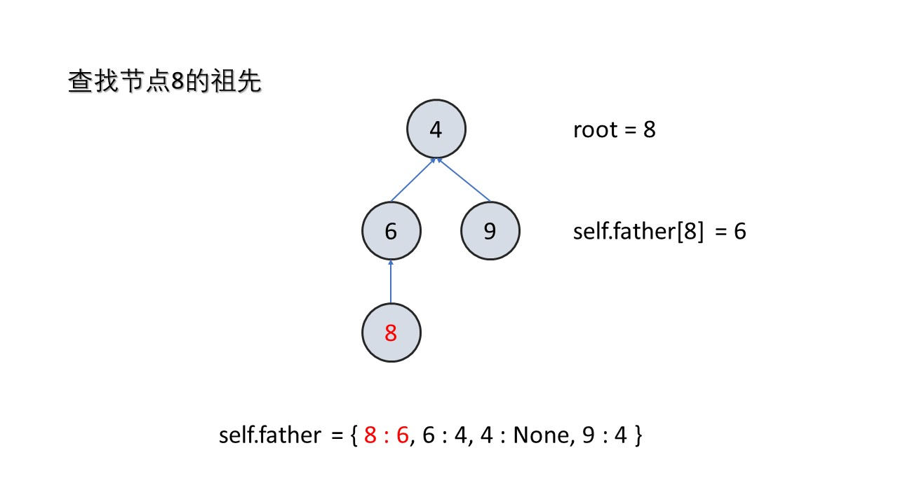
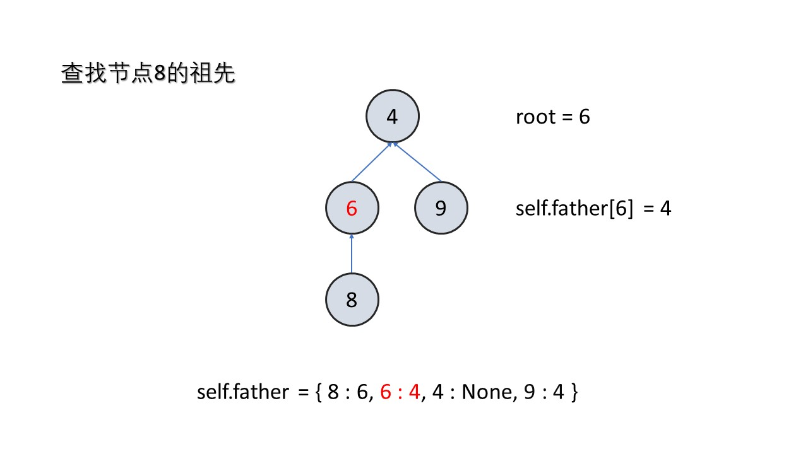
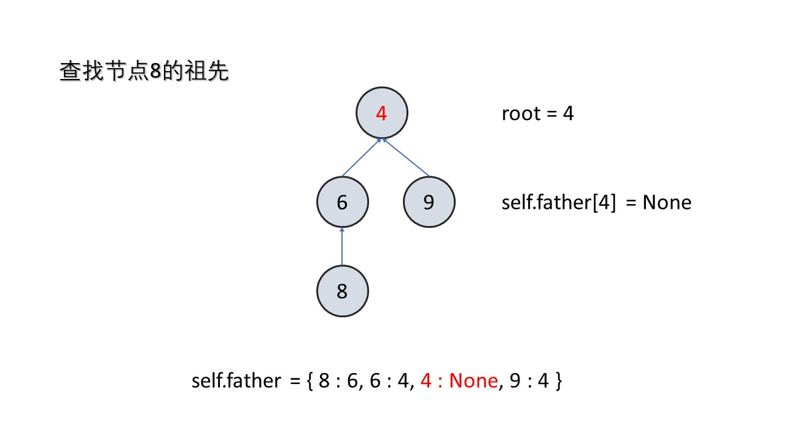

# [547. 省份数量](https://leetcode-cn.com/problems/number-of-provinces/)

有 `n` 个城市，其中一些彼此相连，另一些没有相连。如果城市 `a` 与城市 `b` 直接相连，且城市 `b` 与城市 `c` 直接相连，那么城市 `a` 与城市` c` 间接相连。

省份 是一组直接或间接相连的城市，组内不含其他没有相连的城市。

给你一个 `n x n` 的矩阵 `isConnected` ，其中 `isConnected\[i][j] = 1` 表示第 `i` 个城市和第 `j` 个城市直接相连，而 `isConnected\[i][j] = 0` 表示二者不直接相连。

返回矩阵中 **省份** 的数量。

 

示例 1：


```
输入：isConnected = [[1,1,0],[1,1,0],[0,0,1]]
输出：2
```


示例 2：


``` 
输入：isConnected = [[1,0,0],[0,1,0],[0,0,1]]
输出：3
```


提示：

- 1 <= n <= 200
- n == isConnected.length
- n == isConnected[i].length
- isConnected\[i][j] 为 1 或 0
- isConnected\[i][i] == 1
- isConnected\[i][j] == isConnected\[j][i]

## 思路

看一眼题目就知道这又是一个关于图的题目，想到的办法是dfs看看有几个子图。但是没有写过dfs的完整过程，就没有这么干，想从图的邻接矩阵入手看看能不能找到什么规律。

然后发现将其视为无向图，去找1的数量貌似是一个可行的办法，然而这个办法在遇到子图中存在环的时候就出现问题了，如果说子图中存在环那么就会给整个数量多减一次，所以这种方法不成立。但是还是把这种方法写出来吧，如果以后出现一种没有环的图还是可以用的，代码如下：

```python
class Solution:
    def findCircleNum(self, isConnected: List[List[int]]) -> int:
        import math
        n = len(isConnected)
        res = n
        for i in range(n):
            s = isConnected[i]
            for j in range(i + 1, n):
                print(j)
                if s[j] == 1:
                    res -= 1
        if res < 1:
            res = 1
        return res
```

## 大神的思路

然后查阅了一下题解，发现有几种方法：

- 并查集
- DFS
- BFS

[官方题解](https://leetcode-cn.com/problems/number-of-provinces/solution/sheng-fen-shu-liang-by-leetcode-solution-eyk0/)

可以把 n 个城市和它们之间的相连关系看成图，城市是图中的节点，相连关系是图中的边，给定的矩阵 $isConnected$  即为图的邻接矩阵，省份即为图中的连通分量。

计算省份总数，等价于计算图中的连通分量数，可以通过深度优先搜索或广度优先搜索实现，也可以通过并查集实现。

#### 方法一：深度优先搜索

深度优先搜索的思路是很直观的。遍历所有城市，对于每个城市，如果该城市尚未被访问过，则从该城市开始深度优先搜索，通过矩阵$isConnected$ 得到与该城市直接相连的城市有哪些，这些城市和该城市属于同一个连通分量，然后对这些城市继续深度优先搜索，直到同一个连通分量的所有城市都被访问到，即可得到一个省份。遍历完全部城市以后，即可得到连通分量的总数，即省份的总数。

```python
class Solution:
    def findCircleNum(self, isConnected: List[List[int]]) -> int:
        def dfs(i:int):
            for j in range(cities):
                if isConnected[i][j] == 1 and j not in visited:
                    visited.add(j)
                    dfs(j)
        
        cities = len(isConnected)
        visited = set()
        res = 0

        for i in range(cities):
            if i not in visited:
                dfs(i)
                res += 1
        return res
```

#### 复杂度分析

- 时间复杂度：$O(n^2)$，其中 n 是城市的数量。需要遍历矩阵 n 中的每个元素。

- 空间复杂度：$O(n)$，其中 n 是城市的数量。需要使用数组 $visited$ 记录每个城市是否被访问过，数组长度是 n，递归调用栈的深度不会超过 n。

#### 方法二：广度优先搜索

也可以通过广度优先搜索的方法得到省份的总数。对于每个城市，如果该城市尚未被访问过，则从该城市开始广度优先搜索，直到同一个连通分量中的所有城市都被访问到，即可得到一个省份。

```python
class Solution:
    def findCircleNum(self, isConnected: List[List[int]]) -> int:
        import collections
        cities = len(isConnected)
        visited = set()
        res = 0

        for i in range(cities):
            if i not in visited:
                Q = collections.deque([i]) # 双端队列
                while Q:
                    j = Q.popleft() # 右边出队
                    visited.add(j)
                    for k in range(cities):
                        if isConnected[j][k] == 1 and k not in visited:
                            Q.append(k)

                res += 1

        return res
```

[python collections.deque双边队列](https://www.cnblogs.com/lincappu/p/12890765.html)

这里使用了一个双端队列的结构，该结构的图解如下：


相比于list实现的队列，deque实现拥有更低的时间和空间复杂度。list实现在出队（pop）和插入（insert）时的空间复杂度大约为O(n)，deque在出队（pop）和入队（append）时的时间复杂度是O(1)。

#### 复杂度分析

时间复杂度：$O(n^2)$，其中 $n$ 是城市的数量。需要遍历矩阵 $isConnected$ 中的每个元素。

空间复杂度：$O(n)$，其中 $n$ 是城市的数量。需要使用数组 $visited$ 记录每个城市是否被访问过，数组长度是 $n$，广度优先搜索使用的队列的元素个数不会超过 $n$。

#### 方法三：并查集

计算连通分量数的另一个方法是使用并查集。初始时，每个城市都属于不同的连通分量。遍历矩阵 $isConnected$，如果两个城市之间有相连关系，则它们属于同一个连通分量，对它们进行合并。

遍历矩阵$isConnected$ 的全部元素之后，计算连通分量的总数，即为省份的总数

```py
class Solution:
    def findCircleNum(self, isConnected: List[List[int]]) -> int:
        def find(index: int) -> int:
            if parent[index] != index:
                parent[index] = find(parent[index])
            return parent[index]
        
        def union(index1: int, index2: int):
            parent[find(index1)] = find(index2)
        
        provinces = len(isConnected)
        parent = list(range(provinces))
        
        for i in range(provinces):
            for j in range(i + 1, provinces):
                if isConnected[i][j] == 1:
                    union(i, j)
        
        circles = sum(parent[i] == i for i in range(provinces))
        return circles
```

#### 复杂度分析

时间复杂度：$O(n^2 \log n)$，其中 n 是城市的数量。需要遍历矩阵$isConnected$ 中的所有元素，时间复杂度是 $O(n^2)$，如果遇到相连关系，则需要进行 2 次查找和最多 1 次合并，一共需要进行 $2n^2$次查找和最多 $n^2$次合并，因此总时间复杂度是$O(2n^2logn^2)=O(n^2logn)$。这里的并查集使用了路径压缩，但是没有使用按秩合并，最坏情况下的时间复杂度是 $O(n^2 \log n)$，平均情况下的时间复杂度依然是 $O(n^2 \alpha (n))$，其中 $\alpha$ 为阿克曼函数的反函数，$\alpha (n)$可以认为是一个很小的常数。

空间复杂度：$O(n)$，其中 $n$ 是城市的数量。需要使用数组 $parent$ 记录每个城市所属的连通分量的祖先。

### 并查集拓展

[[Python/C++/Java] 多图详解并查集](https://leetcode-cn.com/problems/number-of-provinces/solution/python-duo-tu-xiang-jie-bing-cha-ji-by-m-vjdr/)

#### 基本概念

1. 并查集是一种数据结构
2. 并查集这三个字，一个字代表一个意思。
3. 并（Union），代表合并
4. 查（Find），代表查找
5. 集（Set），代表这是一个以字典为基础的数据结构，它的基本功能是合并集合中的元素，查找集合中的元素
6. 并查集的典型应用是有关连通分量的问题
7. 并查集解决单个问题（添加，合并，查找）的时间复杂度都是O(1)O(1)
8. 因此，并查集可以应用到在线算法中

#### 并查集实现

##### 数据结构

并查集跟树有些类似，只不过她跟树是相反的。在树这个数据结构里面，每个节点会记录它的子节点。在并查集里，每个节点会记录它的父节点。

```python
class UnionFind:

    def __init__(self):
        """
        记录每个节点的父节点
        """
        self.father = {}
```


可以看到，如果节点是相互连通的（从一个节点可以到达另一个节点），那么他们在同一棵树里，或者说在同一个集合里，或者说他们的**祖先是相同的**。

##### 初始化

当把一个新节点添加到并查集中，它的父节点应该为空

```python
    def add(self,x):
        """
        添加新节点
        """
        if x not in self.father:
            self.father[x] = None
```




##### 合并两个节点

如果发现两个节点是连通的，那么就要把他们合并，也就是他们的祖先是相同的。这里究竟把谁当做父节点一般是没有区别的。

```python
    def merge(self,x,y,val):
        """
        合并两个节点
        """
        root_x,root_y = self.find(x),self.find(y)
        
        if root_x != root_y:
            self.father[root_x] = root_y
```






##### 两节点是否连通

我们判断两个节点是否处于同一个连通分量的时候，就需要判断它们的祖先是否相同

```python
    def is_connected(self,x,y):
        """
        判断两节点是否相连
        """
        return self.find(x) == self.find(y)
```

##### 查找祖先

查找祖先的方法是：如果节点的父节点不为空，那就不断迭代。

```python

    def find(self,x):
        """
        查找根节点
        """
        root = x

        while self.father[root] != None:
            root = self.father[root]

        return root
```









这里有一个优化的点：如果我们树很深，比如说退化成链表，那么每次查询的效率都会非常低。所以我们要做一下路径压缩。也就是把树的深度固定为二。

这么做可行的原因是，并查集只是记录了节点之间的连通关系，而节点相互连通只需要有一个相同的祖先就可以了。

路径压缩可以用递归，也可以迭代。这里用迭代的方法。


```python
    def find(self,x):
        """
        查找根节点
        路径压缩
        """
        root = x

        while self.father[root] != None:
            root = self.father[root]

        # 路径压缩
        while x != root:
            original_father = self.father[x]
            self.father[x] = root
            x = original_father
         
        return root
```

路径压缩的时间复杂度为$O(log^*n)$

$log ∗n$表示 n 取多少次$log_2n$并向下取整以后 变成 1可以认为$O(\log^*n) = O(1)$,因为\log^*2^{65536} = 5，而$2^{65536}$ 是一个天文数字。这个时间复杂度当成结论记下就可以。

```python
class UnionFind:
    def __init__(self):
        """
        记录每个节点的父节点
        """
        self.father = {}
    
    def find(self,x):
        """
        查找根节点
        路径压缩
        """
        root = x

        while self.father[root] != None:
            root = self.father[root]

        # 路径压缩
        while x != root:
            original_father = self.father[x]
            self.father[x] = root
            x = original_father
         
        return root
    
    def merge(self,x,y,val):
        """
        合并两个节点
        """
        root_x,root_y = self.find(x),self.find(y)
        
        if root_x != root_y:
            self.father[root_x] = root_y

    def is_connected(self,x,y):
        """
        判断两节点是否相连
        """
        return self.find(x) == self.find(y)
    
    def add(self,x):
        """
        添加新节点
        """
        if x not in self.father:
            self.father[x] = None
```

以上就是并查集的基本模板，根据不同的题目要求进行对应的添加即可。

#### 套用模板

- 今天的题目就是在考察连通分量的数目，所以我们要在模板中额外添加一个变量去跟踪集合的数量（有多少棵树）。
- 初始化的时候把集合数量加一
- 合并的时候让集合数量减一

```python
class UnionFind:
    def __init__(self):
        self.father = {}
        # 额外记录集合的数量
        self.num_of_sets = 0
    
    def find(self,x):
        root = x
        
        while self.father[root] != None:
            root = self.father[root]
        
        while x != root:
            original_father = self.father[x]
            self.father[x] = root
            x = original_father
        
        return root
    
    def merge(self,x,y):
        root_x,root_y = self.find(x),self.find(y)
        
        if root_x != root_y:
            self.father[root_x] = root_y
            # 集合的数量-1
            self.num_of_sets -= 1
    
    def add(self,x):
        if x not in self.father:
            self.father[x] = None
            # 集合的数量+1
            self.num_of_sets += 1

class Solution:
    def findCircleNum(self, M: List[List[int]]) -> int:
        uf = UnionFind()
        for i in range(len(M)):
            uf.add(i)
            for j in range(i):
                if M[i][j]:
                    uf.merge(i,j)
        
        return uf.num_of_sets
```

