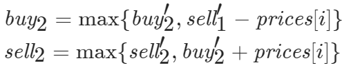
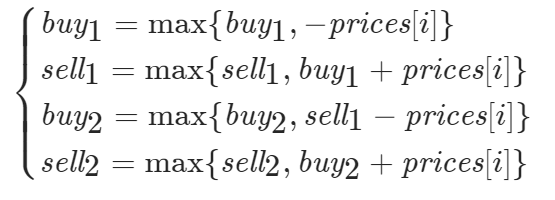

# [123. 买卖股票的最佳时机 III](https://leetcode-cn.com/problems/best-time-to-buy-and-sell-stock-iii/)

给定一个数组，它的第` i `个元素是一支给定的股票在第 `i` 天的价格。

设计一个算法来计算你所能获取的最大利润。你最多可以完成 **两笔** 交易。

注意：你不能同时参与多笔交易（你必须在再次购买前出售掉之前的股票）。

 

**示例 1:**

```
输入：prices = [3,3,5,0,0,3,1,4]
输出：6
解释：在第 4 天（股票价格 = 0）的时候买入，在第 6 天（股票价格 = 3）的时候卖出，这笔交易所能获得利润 = 3-0 = 3 。
     随后，在第 7 天（股票价格 = 1）的时候买入，在第 8 天 （股票价格 = 4）的时候卖出，这笔交易所能获得利润 = 4-1 = 3 。
```

**示例 2：**

```
输入：prices = [1,2,3,4,5]
输出：4
解释：在第 1 天（股票价格 = 1）的时候买入，在第 5 天 （股票价格 = 5）的时候卖出, 这笔交易所能获得利润 = 5-1 = 4 。   
     注意你不能在第 1 天和第 2 天接连购买股票，之后再将它们卖出。   
     因为这样属于同时参与了多笔交易，你必须在再次购买前出售掉之前的股票。
```

**示例 3：**

```
输入：prices = [7,6,4,3,1] 
输出：0 
解释：在这个情况下, 没有交易完成, 所以最大利润为 0。
```

**示例 4：**

```
输入：prices = [1]
输出：0
```

**提示：**

- 1 <= prices.length <= 105
- 0 <= prices[i] <= 105

## 思路

未完成，碰到的问题第一天可以不买，这个问题实在是没考虑好。

```
class Solution:
    def maxProfit(self, prices: List[int]) -> int:
        start = prices[0]
        maxtrack = 2
        res = 0
        if start == max(prices):
            return 0
        for i in range(1, len(prices)):
            if i < len(prices):
                cur = prices[i]
            if cur > start and i < len(prices) - 1 and maxtrack == 2 and cur > prices[i+1]:
                res += cur - start
                maxtrack -= 1
                start = prices[i + 1]
                continue
            if 0 < maxtrack < 2 and i < len(prices)-1:
                k = prices[i+1]
                if i < len(prices) and cur < k:
                    cur = k
                    continue
            elif i == len(prices)-1:
                res += cur - start
                maxtrack -= 1

        return res
```

## 大神思路

````
class Solution:
    def maxProfit(self, prices: List[int]) -> int:
        n = len(prices)
        buy1 = buy2 = -prices[0]
        sell1 = sell2 = 0
        for i in range(1, n):
            buy1 = max(buy1, -prices[i])
            sell1 = max(sell1, buy1 + prices[i])
            buy2 = max(buy2, sell1 - prices[i])
            sell2 = max(sell2, buy2 + prices[i])
        return sell2
````

### 方法一：动态规划

#### 思路与算法

由于我们最多可以完成两笔交易，因此在任意一天结束之后，我们会处于以下五个状态中的一种：

- 未进行过任何操作；
- 只进行过一次买操作；
- 进行了一次买操作和一次卖操作，即完成了一笔交易；
- 在完成了一笔交易的前提下，进行了第二次买操作；
- 完成了全部两笔交易。

由于第一个状态的利润显然为0，因此我们可以不用将其记录。对于剩下的四个状态，我们跟别讲它们的最大利润即为buy1,sell1,buy2以及sell2.

如果我们知道了第 $i-1$天结束后的这四个状态，那么如何通过状态转移方程得到第 ii 天结束后的这四个状态呢？

对于$buy_1$而言，在第$i$天我们可以不进行任何操作，保持不变，也可以在未进行任何操作的前提下以$prices[i]$ 的价格买入股票，那么$buy_1$的状态转移方程即为：

$$ buy_1 = max\lbrace{buy'_1-prices[i]\rbrace} $$

这里我们用$buy'_1$表示第$i-1$天的状态，以便于和第i天的状态$buy_1$进行区分。

对于$sell_1$而言，在第$i$天我们可以不进行任何操作，保持不变，也可以在只进行过一次买操作的前提下以$prices[i]$的价格卖出股票，那么$sell_1$的状态转移方程即为：

$$ sell_1=max\lbrace{sell'_1,buy'_1+prices[i]\rbrace} $$

同理我们可以得到 $\textit{buy}_2$和 $\textit{sell}_2$对应的状态转移方程：



在考虑边界条件时，我们需要理解下面的这个事实：

无论题目中是否允许「在同一天买入并且卖出」这一操作，最终的答案都不会受到影响，这是因为这一操作带来的收益为零。

因此，在状态转移时，我们可以直接写成：



例如在计算$\textit{sell}_1$时，我们直接使用$\textit{buy}_1$而不是$\textit{buy}_1'$进行转移。$\textit{buy}_1$比 $\textit{buy}_1'$多考虑的是在第$i$天买入股票的情况，而转移到$\textit{sell}_1$时，考虑的是在第$i$天卖出股票的情况，这样在同一天买入并且卖出收益为零，不会对答案产生影响。同理对于 $\textit{buy}_2$以及$\textit{sell}_2$，我们同样可以直接根据第$i$天计算出的值来进行状态转移。

那么对于边界条件，我们考虑第 $i=0$ 天时的四个状态：$\textit{buy}_1$即为以 $\textit{prices}[0]$的价格买入股票，因此 $\textit{buy}_1=-\textit{prices}[0]$；$\textit{sell}_1$即为在同一天买入并且卖出，因此 $\textit{sell}_1$；$\textit{buy}_2$即为在同一天买入并且卖出后再以 $\textit{prices}[0]$的价格买入股票，因此 $\textit{buy}_2=-\textit{prices}[0]$。我们将这四个状态作为边界条件，从$i=1$开始进行动态规划，即可得到答案。

在动态规划结束后，由于我们可以进行不超过两笔交易，因此最终的答案在 0，$\textit{sell}_1$
 ，$\textit{sell}_2$中，且为三者中的最大值。然而我们可以发现，由于在边界条件中 $\textit{sell}_1$和 $\textit{sell}_2$的值已经为 0，并且在状态转移的过程中我们维护的是最大值，因此 $\textit{sell}_1$ 和 $\textit{sell}_2$最终一定大于等于 0。同时，如果最优的情况对应的是恰好一笔交易，那么它也会因为我们在转移时允许在同一天买入并且卖出这一宽松的条件，从 $\textit{sell}_1$转移至 $\textit{sell}_2$，因此最终的答案即为 $\textit{sell}_2$ 。

