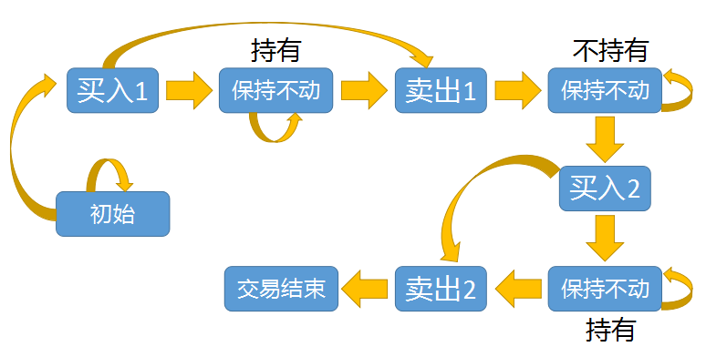
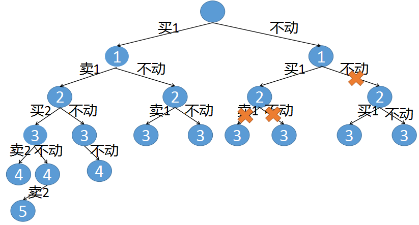
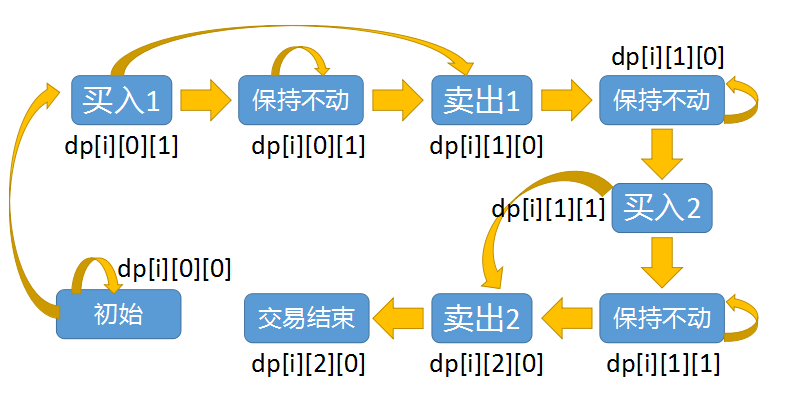
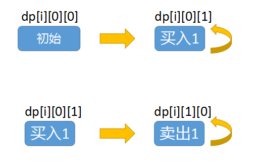
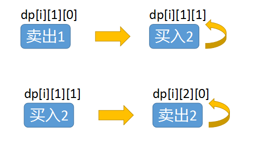
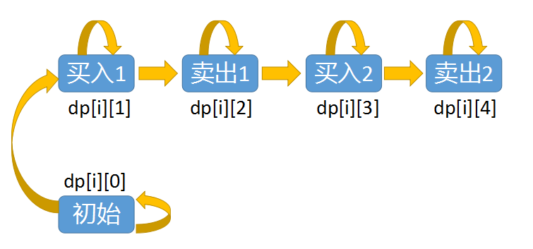
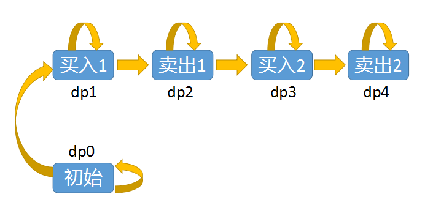

# [123. 买卖股票的最佳时机 III](https://leetcode-cn.com/problems/best-time-to-buy-and-sell-stock-iii/)

给定一个数组，它的第` i `个元素是一支给定的股票在第 `i` 天的价格。

设计一个算法来计算你所能获取的最大利润。你最多可以完成 **两笔** 交易。

注意：你不能同时参与多笔交易（你必须在再次购买前出售掉之前的股票）。

 

**示例 1:**

```
输入：prices = [3,3,5,0,0,3,1,4]
输出：6
解释：在第 4 天（股票价格 = 0）的时候买入，在第 6 天（股票价格 = 3）的时候卖出，这笔交易所能获得利润 = 3-0 = 3 。
     随后，在第 7 天（股票价格 = 1）的时候买入，在第 8 天 （股票价格 = 4）的时候卖出，这笔交易所能获得利润 = 4-1 = 3 。
```

**示例 2：**

```
输入：prices = [1,2,3,4,5]
输出：4
解释：在第 1 天（股票价格 = 1）的时候买入，在第 5 天 （股票价格 = 5）的时候卖出, 这笔交易所能获得利润 = 5-1 = 4 。   
     注意你不能在第 1 天和第 2 天接连购买股票，之后再将它们卖出。   
     因为这样属于同时参与了多笔交易，你必须在再次购买前出售掉之前的股票。
```

**示例 3：**

```
输入：prices = [7,6,4,3,1] 
输出：0 
解释：在这个情况下, 没有交易完成, 所以最大利润为 0。
```

**示例 4：**

```
输入：prices = [1]
输出：0
```

**提示：**

- 1 <= prices.length <= 105
- 0 <= prices[i] <= 105

## 思路

未完成，

```
class Solution:
    def maxProfit(self, prices: List[int]) -> int:
        start = prices[0]
        maxtrack = 2
        res = 0
        if start == max(prices):
            return 0
        for i in range(1, len(prices)):
            if i < len(prices):
                cur = prices[i]
            if cur > start and i < len(prices) - 1 and maxtrack == 2 and cur > prices[i+1]:
                res += cur - start
                maxtrack -= 1
                start = prices[i + 1]
                continue
            if 0 < maxtrack < 2 and i < len(prices)-1:
                k = prices[i+1]
                if i < len(prices) and cur < k:
                    cur = k
                    continue
            elif i == len(prices)-1:
                res += cur - start
                maxtrack -= 1

        return res
```

## 大神思路

````
class Solution:
    def maxProfit(self, prices: List[int]) -> int:
        n = len(prices)
        buy1 = buy2 = -prices[0]
        sell1 = sell2 = 0
        for i in range(1, n):
            buy1 = max(buy1, -prices[i])
            sell1 = max(sell1, buy1 + prices[i])
            buy2 = max(buy2, sell1 - prices[i])
            sell2 = max(sell2, buy2 + prices[i])
        return sell2
````

### 方法一：动态规划

#### 思路与算法

由于我们最多可以完成两笔交易，因此在任意一天结束之后，我们会处于以下五个状态中的一种：

- 未进行过任何操作；
- 只进行过一次买操作；
- 进行了一次买操作和一次卖操作，即完成了一笔交易；
- 在完成了一笔交易的前提下，进行了第二次买操作；
- 完成了全部两笔交易。

由于第一个状态的利润显然为$0$，因此我们可以不用将其记录。对于剩下的四个状态，我们跟别讲它们的最大利润即为$buy1,sell1,buy2$以及$sell2$.

如果我们知道了第 $i-1$天结束后的这四个状态，那么如何通过状态转移方程得到第$i$天结束后的这四个状态呢？

对于$buy_1$而言，在第$i$天我们可以不进行任何操作，保持不变，也可以在未进行任何操作的前提下以$prices[i]$ 的价格买入股票，那么$buy_1$的状态转移方程即为：

$$ buy_1 = max\lbrace{buy'_1-prices[i]\rbrace} $$

这里我们用$buy'_1$表示第$i-1$天的状态，以便于和第i天的状态$buy_1$进行区分。

对于$sell_1$而言，在第$i$天我们可以不进行任何操作，保持不变，也可以在只进行过一次买操作的前提下以$prices[i]$的价格卖出股票，那么$sell_1$的状态转移方程即为：

$$ sell_1=max\lbrace{sell'_1,buy'_1+prices[i]\rbrace} $$

同理我们可以得到 $\textit{buy}_2$和 $\textit{sell}_2$对应的状态转移方程：


在考虑边界条件时，我们需要理解下面的这个事实：

无论题目中是否允许**「在同一天买入并且卖出」**这一操作，最终的答案都不会受到影响，这是因为这一操作带来的收益为零。

因此，在状态转移时，我们可以直接写成：


例如在计算$\textit{sell}_1$时，我们直接使用$\textit{buy}_1$而不是$\textit{buy}_1'$进行转移。$\textit{buy}_1$比 $\textit{buy}_1'$多考虑的是在第$i$天买入股票的情况，而转移到$\textit{sell}_1$时，考虑的是在第$i$天卖出股票的情况，这样在同一天买入并且卖出收益为零，不会对答案产生影响。同理对于 $\textit{buy}_2$以及$\textit{sell}_2$，我们同样可以直接根据第$i$天计算出的值来进行状态转移。

那么对于边界条件，我们考虑第 $i=0$ 天时的四个状态：$\textit{buy}_1$即为以 $\textit{prices}[0]$的价格买入股票，因此 $\textit{buy}_1=-\textit{prices}[0]$；$\textit{sell}_1$即为在同一天买入并且卖出，因此 $\textit{sell}_1$；$\textit{buy}_2$即为在同一天买入并且卖出后再以 $\textit{prices}[0]$的价格买入股票，因此 $\textit{buy}_2=-\textit{prices}[0]$。我们将这四个状态作为边界条件，从$i=1$开始进行动态规划，即可得到答案。

在动态规划结束后，由于我们可以进行不超过两笔交易，因此最终的答案在 0，$\textit{sell}_1$，$\textit{sell}_2$中，且为三者中的最大值。然而我们可以发现，由于在边界条件中 $\textit{sell}_1$和 $\textit{sell}_2$的值已经为 0，并且在状态转移的过程中我们维护的是最大值，因此 $\textit{sell}_1$ 和 $\textit{sell}_2$最终一定大于等于 0。同时，如果最优的情况对应的是恰好一笔交易，那么它也会因为我们在转移时允许在同一天买入并且卖出这一宽松的条件，从 $\textit{sell}_1$转移至 $\textit{sell}_2$，因此最终的答案即为 $\textit{sell}_2$ 。

我遇到的问题是在给定输入[2,1,4]的时候出现了只在第一天买入然后在第三天卖出，但是这样的话收益是2而正确的输出是3。没有考虑到在第一天可以不进行购入的问题。

如果按上面那种思路应该理解为可以进行两次交易和两次买入，这样也就无需设置一个常量去记录交易次数。

$buy_1$考虑的是在第几天买入股票，$sell_1$考虑的是在第几天卖出的情况。以此类推，$buy_2$和$sell_2$也是一样的。

### 其他解法

[通俗易懂的动态规划解法][https://leetcode-cn.com/problems/best-time-to-buy-and-sell-stock-iii/solution/tong-su-yi-dong-de-dong-tai-gui-hua-jie-fa-by-marc/]

一天结束时，可能有持股、可能未持股、可能卖出过1次、可能卖出过2次、也可能未卖出过

所以定义状态转移数组dp[天数][当前是否持股][卖出的次数]

具体一天结束时的6种状态：

1. 未持股，未卖出过股票：说明从未进行过买卖，利润为0
   dp[i][0][0]=0

2. 未持股，卖出过1次股票：可能是今天卖出，也可能是之前卖的（昨天也未持股且卖出过）
   dp[i][0][1]=max(dp[i-1][1][0]+prices[i],dp[i-1][0][1])

3. 未持股，卖出过2次股票:可能是今天卖出，也可能是之前卖的（昨天也未持股且卖出过）
   dp[i][0][2]=max(dp[i-1][1][1]+prices[i],dp[i-1][0][2])

4. 持股，未卖出过股票：可能是今天买的，也可能是之前买的（昨天也持股）
   dp[i][1][0]=max(dp[i-1][0][0]-prices[i],dp[i-1][1][0])

5. 持股，卖出过1次股票：可能是今天买的，也可能是之前买的（昨天也持股）
   dp[i][1][1]=max(dp[i-1][0][1]-prices[i],dp[i-1][1][1])

6. 持股，卖出过2次股票：最多交易2次，这种情况不存在
   dp[i][1][2]=float('-inf')

根据这些状态即可轻松写出代码

```python
class Solution:
    def maxProfit(self, prices):
        if prices==[]:
            return 0
        length=len(prices)
        #结束时的最高利润=[天数][是否持有股票][卖出次数]
        dp=[ [[0,0,0],[0,0,0] ] for i in range(0,length) ]
        #第一天休息
        dp[0][0][0]=0
        #第一天买入
        dp[0][1][0]=-prices[0]
        # 第一天不可能已经有卖出
        dp[0][0][1] = float('-inf')
        dp[0][0][2] = float('-inf')
        #第一天不可能已经卖出
        dp[0][1][1]=float('-inf')
        dp[0][1][2]=float('-inf')
        for i in range(1,length):
            #未持股，未卖出过，说明从未进行过买卖
            dp[i][0][0]=0
            #未持股，卖出过1次，可能是今天卖的，可能是之前卖的
            dp[i][0][1]=max(dp[i-1][1][0]+prices[i],dp[i-1][0][1])
            #未持股，卖出过2次，可能是今天卖的，可能是之前卖的
            dp[i][0][2]=max(dp[i-1][1][1]+prices[i],dp[i-1][0][2])
            #持股，未卖出过，可能是今天买的，可能是之前买的
            dp[i][1][0]=max(dp[i-1][0][0]-prices[i],dp[i-1][1][0])
            #持股，卖出过1次，可能是今天买的，可能是之前买的
            dp[i][1][1]=max(dp[i-1][0][1]-prices[i],dp[i-1][1][1])
            #持股，卖出过2次，不可能
            dp[i][1][2]=float('-inf')
        return max(dp[length-1][0][1],dp[length-1][0][2],0)
```

### [五种实现+详细图解 123.买卖股票的最佳时机 III](https://leetcode-cn.com/problems/best-time-to-buy-and-sell-stock-iii/solution/wu-chong-shi-xian-xiang-xi-tu-jie-123mai-mai-gu-pi/)

#### 一、递归

股票系列的题目可以**无限次数**的买卖、或者**只能买卖一次**，显然这道**买卖两次**的状态转换就比之前要复杂的多，也是本题的难点所在。

需要注意的是，我们最终求出的最大利润，不一定是**非得交易两次**，也可能一次都不交易（行情不好，都是绿的），或者只交易了一次。

下面有个图展示了买卖两次时怎么进行状态转换：



一开始处于初始状态，也就是什么都不做，不买也不卖

初始状态只能转向**买入1**状态（第一次买入股票），也就是买入一股；当买入一股后，我们有两种选择：

- 可以立马转入**卖出1**状态（第一次卖出股票）
- 或者转入**保持不动**状态，相当于手里没有股票，等待一个好时机后再卖出。

在**卖出1**状态时：

- 我们可以立马转入**买入2**状态（第二次买入股票）
- 或者转入保持不动状态，相当于手里没有股票，等待一个好时机后再买入。

买入2和卖出2同理。

卖出2执行完成后，就只能转入到**交易结束**状态了，后面就无法再进行买卖。

通过上面的状态转换圈，我们可以用三个变量来表示买卖两次的交易状态

- index，用来表示当前是哪一天
- status，用来表示当前状态是买入、还是卖出
- k，表示交易了几次。

如果状态是买入

- 那么可以保持不动
- 或者马上卖掉

如果状态是卖出

- 可以保持不动（等待更好的股价出现，暂时不买）
- 或者立马再买一股
- 同时将count数+1,表示交易过一次了

对于数组`[1,2,3,4,5]`其递归调用树如下：


第一次只能买入，对应上图也就是节点l的买1，当然也可以选择不买，也就是不动。

第一次买之后可以立即卖掉，也就是上图中`根--买1-->1 --卖1-->2`这条路线。这就对应了第一张图中**买入1**转换到**卖出1**的过程。

或者也可以选择不动，对应到上图就是`根--买1-->1--不动-->2`这条路线。对应第一张图中**买1**后转入到**保持不动**这个过程。

卖1到买2、以及买2到卖2这之间的转换关系也是类似的，这里的调用链太长了没有画出来。

第二次卖出之后就无法在交易了，所以从调用树上来看，后面就不会再有调用的子结点了。

代码实现如下：

```python
class Solution(object):
    def maxProfit(self, prices):
        if not prices:
            return 0
        n = len(prices)
        def dfs(index,status,k):
            # 递归终止条件，数组执行到头了，或者交易了两次了
            if index==n or k==2:
                return 0
            # 定义三个变量，分别记录[不动]、[买]、[卖]
            a,b,c = 0,0,0
            # 保持不动
            a = dfs(index+1,status,k)
            if status:
                # 递归处理卖的情况，这里需要将k+1，表示执行了一次交易
                b = dfs(index+1,0,k+1)+prices[index]
            else:
                # 递归处理买的情况
                c = dfs(index+1,1,k)-prices[index]
            # 最终结果就是三个变量中的最大值
            return max(a,b,c)
        return dfs(0,0,0)
```

#### 二、递归+记忆化

这里直接加个缓存即可，把重复调用的结果给缓存起来。



这里的整体执行逻辑和递归版的几乎是一样的，只是在递归函数前增加了一个判断是否要继续，递归函数结束前将结果保存起来。

由于我们需要缓存三个变量：index、status、交易次数。

python实现起来比较容易，java则需要自定义一个Key来封装这三个变量，当然还需要加上自定义的hashCode函数和equals函数。

```python
class Solution(object):
    def maxProfit(self, prices):
        if not prices:
            return 0
        # 用一个哈希表缓存重复的调用    
        d = dict()
        n = len(prices)
        def dfs(index,status,k):
            if (index,status,k) in d:
                return d[index,status,k]
            if index==n or k==2:
                return 0
            a,b,c = 0,0,0
            a = dfs(index+1,status,k)
            if status:
                b = dfs(index+1,0,k+1)+prices[index]
            else:
                c = dfs(index+1,1,k)-prices[index]
            d[index,status,k] = max(a,b,c)
            return d[index,status,k]
        return dfs(0,0,0)
```

#### 三、动态规划 三维数组

在递归实现时，我们用了三个变量：index、status、k。这里我们定义一个三维数组dp\[n]\[3][2]这里的n表示天数

- dp\[i]\[0][0]：表示第`i`天交易了0次时卖出后的累计最大利润;
- dp\[i]\[0][1]：表示第`i`天交易了0次时买入后的累计最大利润;
- dp\[i]\[1][0]：表示第`i`天交易了1次时卖出后的累计最大利润;
- dp\[i]\[1][1]：表示第`i`天交易了1次时买入后的累计最大利润;
- dp\[i]\[2][0]：表示第`i`天交易了2次时卖出后的累计最大利润;
- dp\[i]\[2][1]：表示第`i`天交易了2次时买入后的累计最大利润。

注意，最后一个dp\[i]\[2][1]实际是不存在的，因为交易两次后，就不能再买入了。

分析一下上面定义的dp数组：



- dp\[i]\[0][0]：对应于初始状态，第i天0次交易卖出，既然都没交易，那何来卖出呢，所以只能是0。
- dp\[i]\[0][1]和dp\[i]\[1][0] 这两个是一对，对应到上图中就是第一次买入、第一次卖出。
- dp\[i]\[1][1]和dp\[i]\[2][0] 这两个也是一对，对应到上图中就是第二次买入、第二次卖出。

从这里也能看出为什么dp\[i]\[2][1]是无效的。

再看一下状态转换公式是如何推导的

前面分析过了，买入1这个状态只能从两个地方转换来，买入1本身（保持不动），或者是初始状态转换而来。

而卖出1这个状态，也只能从两个地方转换而来，卖出1本身（保持不动），或者从买入1转来。



那么根据上面描述，我们可以算出第一次买卖的DP公式：

```
第一次买入：从初始状态转换而来，或者第一次买入后保持不动
dp[i][0][1] = max(dp[i-1][0][1],dp[i-1][0][0]-prices[i])

第一次卖出：从第一次买入转换而来，或者第一次卖出后保持不动
dp[i][1][0] = max(dp[i-1][1][0],dp[i-1][0][1]+prices[i])
```

再来分下第二次的买卖过程：

同样，第二次买入只能从第一次买入转换过来，或者保持不动。

第二次卖出只能从第二次买入转换而来，或者保持不动。



那么根据上面描述，我们可以算出第二次买卖的DP公式：

```
第二次买入：从第一次卖出转换而来，或者第二次买入后保持不动
dp[i][1][1] = max(dp[i-1][1][1],dp[i-1][1][0]-prices[i])


第二次卖出：从第二次买入转换而来，或者第二次卖出后保持不动
dp[i][2][0] = max(dp[i-1][2][0],dp[i-1][1][1]+prices[i])
```

我们把第一次买卖、第二次买卖的DP公式合到一起，就拿到了完整的推导过程。
之后我们还需要处理一下 第一天的初始化状态(具体请看代码部分)
最后求的利润最大值就保存在 dp\[n-1]\[0][0]、dp\[n-1]\[0][1]、dp\[n-1]\[1][0]、dp\[n-1]\[1][1]、dp\[n-1]\[2][0]中，我们求出这几个值的max再返回就可以了。

代码如下：

```python
class Solution(object):
    def maxProfit(self, prices):
        if not prices:
            return 0
        n = len(prices)
        # 定义三维数组，第i天、交易了多少次、当前的买卖状态
        dp = [[[-1 for _ in xrange(2)] for _ in xrange(3)] for _ in xrange(n)]
        # 初始化第一天，这里的dp[0][2][1]可以不用管，后面也不会用到
        dp[0][0][0] = 0
        dp[0][0][1] = -prices[0]
        dp[0][1][0] = 0
        dp[0][1][1] = -prices[0]
        dp[0][2][0] = 0
        dp[0][2][1] = -prices[0]
        for i in xrange(1,n):
            # dp[i][0][0]相当于初始状态，它只能从初始状态转换来
            dp[i][0][0] = dp[i-1][0][0]
            # 处理第一次买入、第一次卖出
            dp[i][0][1] = max(dp[i-1][0][1],dp[i-1][0][0]-prices[i])
            dp[i][1][0] = max(dp[i-1][1][0],dp[i-1][0][1]+prices[i])
            # 处理第二次买入、第二次卖出
            dp[i][1][1] = max(dp[i-1][1][1],dp[i-1][1][0]-prices[i])
            dp[i][2][0] = max(dp[i-1][2][0],dp[i-1][1][1]+prices[i])
        # 返回最大值
        return max(dp[-1][0][0],dp[-1][0][1],dp[-1][1][0],dp[-1][1][1],dp[-1][2][0])
```

#### 四、动态规划 二维数组

这里参考了 liweiwei1419 大佬的题解
原文地址 -> [这里](https://leetcode-cn.com/problems/best-time-to-buy-and-sell-stock-iii/solution/dong-tai-gui-hua-by-liweiwei1419-7/)

这我们定义一个二维数组 dp\[n][5]
这的n表示天数，5表示5种不同的状态

其实这个转换跟 三维数组的有点类似，在三维数组中我们定义了交易次数、买卖状态。 因为交易次数和买卖状态都是常数个，所以我们把这两者整合到一起了。



我们定义了5种状态来代替三维数组中的交易次数和买卖状态，物种状态分别如上图

- dp\[i][0] 初始化状态
- dp\[i][1] 第一次买入
- dp\[i][2] 第一次卖出
- dp\[i][3] 第二次买入
- dp\[i][4] 第二次卖出

根据上面的转换关系，我们来推导一下DP公式

首先是第一次买卖：

```
第一次买入：从初始状态转换而来，或者第一次买入后保持不动
dp[i][1] = max(dp[i-1][1],dp[i-1][0]-prices[i])
            
第一次卖出：从第一次买入转换而来，或者第一次卖出后保持不动
dp[i][2] = max(dp[i-1][2],dp[i-1][1]+prices[i])
```

第二次买卖的DP推导如下：

````
第二次买入：从第一次卖出转换而来，或者第二次买入后保持不动
dp[i][3] = max(dp[i-1][3],dp[i-1][2]-prices[i])
# 第二次买入不动 第一次卖出转换而来
第二次卖出：从第二次买入转换而来，或者第二次卖出后保持不动
dp[i][4] = max(dp[i-1][4],dp[i-1][3]+prices[i])
# 第二次卖出保持不动 第二次买入转换而来
````

把上面两次买卖推导公式整合到一起就是完整的计算过程了，第一天的初始化过程请查看代码部分。
最后求的利润最大值就保存在 dp\[n-1][0]、dp\[n-1][1]、dp\[n-1][2]、dp\[n-1][3]、dp\[n-1][4]中，我们求出这几个值的max再返回就可以了。

代码实现如下：

```python
class Solution(object):
    def maxProfit(self, prices):
        if not prices:
            return 0
        n = len(prices)
        if n<2:
            return 0
        # 定义二维数组，5种状态    
        dp = [[-1 for _ in xrange(5)] for _ in xrange(n)]
        # 初始化第一天的状态
        dp[0][0] = 0
        dp[0][1] = -prices[0]
        dp[0][2] = 0
        dp[0][3] = -prices[0]
        dp[0][4] = 0
        for i in xrange(1,n):
            # dp[i][0]相当于初始状态，它只能从初始状态转换来
            dp[i][0] = 0
            # 处理第一次买入、第一次卖出
            dp[i][1] = max(dp[i-1][1],dp[i-1][0]-prices[i])
            dp[i][2] = max(dp[i-1][2],dp[i-1][1]+prices[i])
            # 处理第二次买入、第二次卖出
            dp[i][3] = max(dp[i-1][3],dp[i-1][2]-prices[i])
            dp[i][4] = max(dp[i-1][4],dp[i-1][3]+prices[i])
        # 返回最大值    
        return max(dp[-1][0],dp[-1][1],dp[-1][2],dp[-1][3],dp[-1][4])
```

#### 五、动态规划 空间优化

> 个人认为这个思路和我的想法契合度很高

通过二维数组的5个状态的定义，我们发现，每执行到一个状态时，只需要当前状态和前面一次状态的值就可以了。
比如要计算 第一次卖出(卖出1)这个状态，就只需要**买入1**和**卖出1**这两个状态就可以了。



计算 dp\[i][x] 时(这里的x表示任意状态)，只需要两个值：

dp\[i-1][x]
dp\[i-1][x-1] (if x>0)
即求完第i天的值后，就不需要第i-1天的数据了，dp数组是不断滚动更新的，所以我们可以用5个变量来代替二维数组。

- dp0：初始化状态
- dp1：第一次买入
- dp2：第一次卖出
- dp3：第二次买入
- dp4：第二次卖出

根据上面的转换关系，我们来推到一下DP公式
首先是第一次买卖：

```python
第一次买入：从初始状态转换而来，或者第一次买入后保持不动
dp1 = max(dp1,dp0-prices[i])
            
第一次卖出：从第一次买入转换而来，或者第一次卖出后保持不动
dp2 = max(dp2,dp1+prices[i])

```

第二次买卖的DP推导如下：

```python
第二次买入：从第一次卖出转换而来，或者第二次买入后保持不动
dp3= max(dp3,dp2-prices[i])


第二次卖出：从第二次买入转换而来，或者第二次卖出后保持不动
dp4 = max(dp4,dp3+prices[i])

```

最后求的利润最大值就保存在 d0、dp1、dp2、dp3、dp4中，我们求出这几个值的max再返回就可以了。

注：
评论区有网友提出，正着写、倒着写都可以通过，股票系列文章中：交易k次股票 也有这样的问题。
没有想明白原因，如果有朋友知道的话，麻烦在评论区留个言。

代码实现:

```python
class Solution(object):
    def maxProfit(self, prices):
        if not prices:
            return 0
        n = len(prices)
        # 定义5种状态，并初始化第一天的状态
        dp0 = 0
        dp1 = -prices[0]
        dp2 = 0
        dp3 = -prices[0]
        dp4 = 0
        for i in xrange(1,n):
            # 这里省略dp0，因为dp0每次都是从上一个dp0来的相当于每次都是0
            # 处理第一次买入、第一次卖出
            dp1 = max(dp1,dp0-prices[i])
            dp2 = max(dp2,dp1+prices[i])
            # 处理第二次买入、第二次卖出
            dp3 = max(dp3,dp2-prices[i])
            dp4 = max(dp4,dp3+prices[i])
        # 返回最大值    
        return max(dp0,dp1,dp2,dp3,dp4)
```

股票系列文章汇总

|             题目              |     题解      | 难度等级 |
| :---------------------------: | :-----------: | :------: |
| 买卖股票的最佳时机(交易一次)  | 五种实现+图解 |   简单   |
| 买卖股票的最佳时机2(交易多次) | 四种实现+图解 |   简单   |
|  买卖股票的最佳时机含手续费   | 四种实现+图解 |   中等   |
|  买卖股票的最佳时机含冷冻期   | 五种实现+图解 |   中等   |
| 买卖股票的最佳时机(交易两次)  | 五种实现+图解 |   困难   |
|  买卖股票的最佳时机(k次交易)  | 四种实现+图解 |   困难   |

参考链接：https://leetcode-cn.com/problems/best-time-to-buy-and-sell-stock-iii/solution/wu-chong-shi-xian-xiang-xi-tu-jie-123mai-mai-gu-pi/

