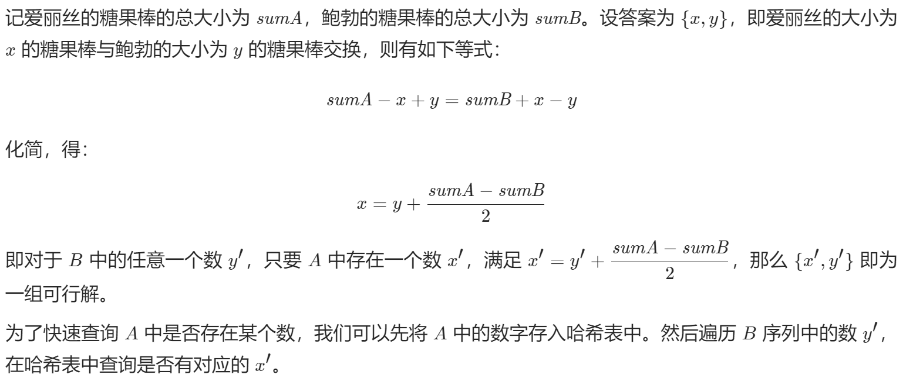

# [888. 公平的糖果棒交换](https://leetcode-cn.com/problems/fair-candy-swap/)

爱丽丝和鲍勃有不同大小的糖果棒：`A[i]` 是爱丽丝拥有的第 `i` 根糖果棒的大小，`B[j]` 是鲍勃拥有的第 `j` 根糖果棒的大小。

因为他们是朋友，所以他们想交换一根糖果棒，这样交换后，他们都有相同的糖果总量。（一个人拥有的糖果总量是他们拥有的糖果棒大小的总和。）

返回一个整数数组 `ans`，其中 `ans[0]` 是爱丽丝必须交换的糖果棒的大小，`ans[1]` 是 `Bob` 必须交换的糖果棒的大小。

如果有多个答案，你可以返回其中任何一个。保证答案存在。

 示例 1：

```
输入：A = [1,1], B = [2,2]
输出：[1,2]
```

示例 2：

```
输入：A = [1,2], B = [2,3]
输出：[1,2]
```

示例 3：

```
输入：A = [2], B = [1,3]
输出：[2,3]
```

示例 4：

```
输入：A = [1,2,5], B = [2,4]
输出：[5,4]
```


提示：

- `1 <= A.length <= 10000`
- `1 <= B.length <= 10000`
- `1 <= A[i] <= 100000`
- `1 <= B[i] <= 100000`
- 保证爱丽丝与鲍勃的糖果总量不同。
- 答案肯定存在。

## 思路



```python
class Solution:
    def fairCandySwap(self, A: List[int], B: List[int]) -> List[int]:
        sumA, sumB = sum(A), sum(B) # 分别计算两个人的糖果总数
        delta = (sumA - sumB) // 2 # 求一下两个人总数差值的均值
        rec = set(A) # rec表示A中不重复的元素
        ans = None # 这个不写也行 可能是要把这个内存地址占住还是其他的作用。
        for y in B: # 遍历B中元素
            x = y + delta	# x = B中元素加delta
            if x in rec: # 相当于交换后可以弥补差值
                ans = [x, y] # ans就是交换后的结果
                break	# 如果找到了就退出循环返回ans
        return ans
```

### 复杂度分析

- 时间复杂度：O(n + m)，其中 n 是序列 A 的长度，m 是序列 B 的长度。
- 空间复杂度：O(n)，其中 n 是序列 A 的长度。我们需要建立一个和序列 A 等大的哈希表。

下面是一个c版本

需要建立哈希表

```C
struct HashTable {
    int x;
    UT_hash_handle hh;
};

int* fairCandySwap(int* A, int ASize, int* B, int BSize, int* returnSize) {
    int sumA = 0, sumB = 0;
    for (int i = 0; i < ASize; i++) {
        sumA += A[i];
    }
    for (int i = 0; i < BSize; i++) {
        sumB += B[i];
    }
    int delta = (sumA - sumB) / 2;
    struct HashTable* hashTable = NULL;
    for (int i = 0; i < ASize; i++) {
        struct HashTable* tmp;
        HASH_FIND_INT(hashTable, &A[i], tmp);
        if (tmp == NULL) {
            tmp = malloc(sizeof(struct HashTable));
            tmp->x = A[i];
            HASH_ADD_INT(hashTable, x, tmp);
        }
    }
    int* ans = malloc(sizeof(int) * 2);
    for (int i = 0; i < BSize; i++) {
        int x = B[i] + delta;
        struct HashTable* tmp;
        HASH_FIND_INT(hashTable, &x, tmp);
        if (tmp != NULL) {
            ans[0] = x, ans[1] = B[i];
            *returnSize = 2;
            break;
        }
    }
    return ans;
}
```

## 哈希表

[五分钟速读：什么是散列表（哈希表）？](https://link.zhihu.com/?target=http%3A//mp.weixin.qq.com/s%3F__biz%3DMzUyNjQxNjYyMg%3D%3D%26mid%3D2247486499%26idx%3D4%26sn%3D7c9aee095ec972b1af842788c545d309%26chksm%3Dfa0e63a2cd79eab47649274533063bea75550d97aa55f60856f02037bc2f6b657270630f214b%26scene%3D21%23wechat_redirect)

[什么是哈希洪水攻击（Hash-Flooding Attack）？](https://link.zhihu.com/?target=http%3A//mp.weixin.qq.com/s%3F__biz%3DMzUyNjQxNjYyMg%3D%3D%26mid%3D2247485591%26idx%3D1%26sn%3D54cde6fab4f11a0478f0c6447069d47c%26chksm%3Dfa0e6716cd79ee00e3502116a4f2999ee9648b99999317d450d9d6ee8ebef8cf4d39f2f79372%26scene%3D21%23wechat_redirect)

[几道和散列（哈希）表有关的面试题](https://link.zhihu.com/?target=http%3A//mp.weixin.qq.com/s%3F__biz%3DMzUyNjQxNjYyMg%3D%3D%26mid%3D2247484977%26idx%3D1%26sn%3Df4a6148480555e3cca83231ac1df8d02%26chksm%3Dfa0e69b0cd79e0a686e31c547fc783eb9663d9fe19cc95ecd524e9f8f7e0d4a168945f8755e5%26scene%3D21%23wechat_redirect)

[如何判断一个元素在亿级数据中是否存在？](https://link.zhihu.com/?target=http%3A//mp.weixin.qq.com/s%3F__biz%3DMzUyNjQxNjYyMg%3D%3D%26mid%3D2247486559%26idx%3D2%26sn%3Dbd9e3575882181e31e33f0a0094376db%26chksm%3Dfa0e63decd79eac8adc455059de6309a510951461496cc5ee3444e3675a0d5ffb94f2745b003%26scene%3D21%23wechat_redirect)