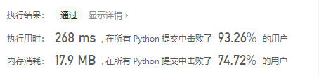
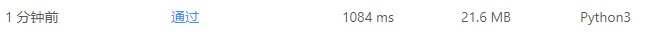

# [1438. 绝对差不超过限制的最长连续子数组](https://leetcode-cn.com/problems/longest-continuous-subarray-with-absolute-diff-less-than-or-equal-to-limit/)

给你一个整数数组 `nums` ，和一个表示限制的整数 `limit`，请你返回最长连续子数组的长度，该子数组中的任意两个元素之间的绝对差必须小于或者等于 `limit` 。

如果不存在满足条件的子数组，则返回 0 。

示例 1：

```
输入：nums = [8,2,4,7], limit = 4
输出：2 
解释：所有子数组如下：
[8] 最大绝对差 |8-8| = 0 <= 4.
[8,2] 最大绝对差 |8-2| = 6 > 4. 
[8,2,4] 最大绝对差 |8-2| = 6 > 4.
[8,2,4,7] 最大绝对差 |8-2| = 6 > 4.
[2] 最大绝对差 |2-2| = 0 <= 4.
[2,4] 最大绝对差 |2-4| = 2 <= 4.
[2,4,7] 最大绝对差 |2-7| = 5 > 4.
[4] 最大绝对差 |4-4| = 0 <= 4.
[4,7] 最大绝对差 |4-7| = 3 <= 4.
[7] 最大绝对差 |7-7| = 0 <= 4. 
因此，满足题意的最长子数组的长度为 2 。
```


示例 2：

```
输入：nums = [10,1,2,4,7,2], limit = 5
输出：4 
解释：满足题意的最长子数组是 [2,4,7,2]，其最大绝对差 |2-7| = 5 <= 5 。
```


示例 3：

```
输入：nums = [4,2,2,2,4,4,2,2], limit = 0
输出：3
```

提示：

- `1 <= nums.length <= 10^5`
- `1 <= nums[i] <= 10^9`
- `0 <= limit <= 10^9`

## 思路

首先想到的方法就是滑动窗口，采用递归的方式，设置一个窗口然后设置两个判定条件：

1. 如果右侧的数值大于左侧数值则左侧窗口起始索引加一，并将更新后的left赋值给right。
2. 如果窗口中的最大值-最小值大于限制长度则执行1中后半部分的内容。

但是这样有个问题，每次都要遍历一下list所以会超时，实现代码如下：

```python
class Solution:
    def longestSubarray(self, nums: List[int], limit: int) -> int:
        right, left = 0, 0
        res = 0
        cur_min = nums[left]
        cur_max = nums[right]
        while left < len(nums):
            if right < len(nums):
                cur_max = max(cur_max, nums[right])
                cur_min = min(cur_min, nums[right])
            if right < len(nums) and abs(nums[left] - nums[right]) <= limit and cur_max - cur_min <= limit:
                res = max(res, right - left + 1)
                right += 1
            else:
                left += 1
                right = left
                if right < len(nums):
                    cur_min = nums[left]
                    cur_max = nums[left]
        return res
```

#### 参考题解

使用collections中的deque()函数建立双边队列，（还是没太搞懂collections）

```python
class Solution(object):
    def longestSubarray(self, nums, limit):
        """
        :type nums: List[int]
        :type limit: int
        :rtype: int
        """    
        r = l = res = 0
        min_q = collections.deque()
        max_q = collections.deque()
        for num in nums:
            while len(min_q) and num < min_q[-1]: min_q.pop()	# 与队列中最右边元素对比如果小的话就弹出去，将当前元素放进来，移除最右端元素
            while len(max_q) and num > max_q[-1]: max_q.pop()	# 同理
            min_q.append(num)
            max_q.append(num)
            r += 1;
            while max_q[0] - min_q[0] > limit:	# 当最大值-最小值大于限制时，如果最小元素或者最大元素是当前nums中最左元素，那么就弹出最大最小元素栈中最左元素，维护到最大最小值之差满足限制
                if min_q[0] == nums[l]: min_q.popleft() 
                if max_q[0] == nums[l]: max_q.popleft()
                l += 1
            res = max(res, r - l)
        return res
```



这个算是我的想法的优化版。

```python
class Solution:
    def longestSubarray(self, nums: List[int], limit: int) -> int:
        from sortedcontainers import SortedList
        s = SortedList() # 有序list
        left, right = 0, 0 
        res = 0
        while right < len(nums):
            s.add(nums[right])	# 加入索引值为right的元素
            while s[-1] - s[0] > limit: # 如果有序列表中最右端元素-最左端元素大于限制值，就移除窗口中最左测元素
                s.remove(nums[left])
                left += 1
            res = max(res, right - left + 1)
            right += 1
        return res
```

