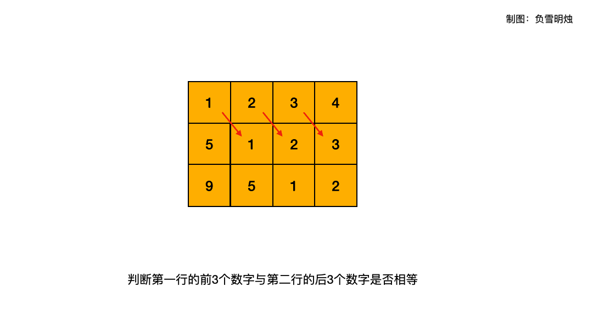
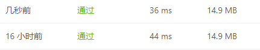

# [766. 托普利茨矩阵](https://leetcode-cn.com/problems/toeplitz-matrix/)

给你一个 `m x n` 的矩阵 `matrix` 。如果这个矩阵是托普利茨矩阵，返回 `true` ；否则，返回 `false` 。

如果矩阵上每一条由左上到右下的对角线上的元素都相同，那么这个矩阵是 托普利茨矩阵 。


**示例 1：**

```
输入：matrix = [[1,2,3,4],[5,1,2,3],[9,5,1,2]]
输出：true
解释：
在上述矩阵中, 其对角线为: 
"[9]", "[5, 5]", "[1, 1, 1]", "[2, 2, 2]", "[3, 3]", "[4]"。 
各条对角线上的所有元素均相同, 因此答案是 True 。
```

**示例 2：**


```
输入：matrix = [[1,2],[2,2]]
输出：false
解释：
对角线 "[1, 2]" 上的元素不同。
```

**提示：**

- `m == matrix.length`
- `n == matrix[i].length`
- `1 <= m, n <= 20`
- `0 <= matrix[i][j] <= 99`

**进阶：**

如果矩阵存储在磁盘上，并且内存有限，以至于一次最多只能将矩阵的一行加载到内存中，该怎么办？
如果矩阵太大，以至于一次只能将不完整的一行加载到内存中，该怎么办？

## 思路

最开始想到的是将元素一一对比，设置一个当前元素，然后顺着矩阵的左下一直到右上。然后发现这个方法实现起来过于复杂而且冗余度贼高，所以战略性放弃，看了题解。

题解给出的方法是通过切片的操作实现对角线元素的对比，妙哉！！!

```python
class Solution:
    def isToeplitzMatrix(self, matrix: List[List[int]]) -> bool:
        for i in range(len(matrix) - 1):
            if matrix[i][:-1] != matrix[i + 1][1:]:
                return False
        return True
```



上一层的0到行元素总数-1一定等于下一行的1到行元素总数

参考：https://leetcode-cn.com/problems/toeplitz-matrix/solution/pan-duan-mei-ge-yuan-su-he-ta-de-you-xia-x3fi/

然后又参考了一个java写的题解（[从磁盘读取成本分析两种 100% 遍历思路：按格子遍历 & 按线遍历](https://leetcode-cn.com/problems/toeplitz-matrix/solution/cong-ci-pan-du-qu-cheng-ben-fen-xi-liang-f20w/)），思路是和我之前依次对比有点类似，基本是一个思路，具体代码如下：

```python
class Solution:
    def isToeplitzMatrix(self, matrix: List[List[int]]) -> bool:
        m = len(matrix)
        n = len(matrix[0])
        for i in range(1, m):
            for j in range(1, n):
                if matrix[i][j] != matrix[i-1][j-1]:
                    return False
        return True
```



上面的是第二种思路，下面的是第一种思路。