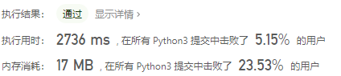

# [1052. 爱生气的书店老板](https://leetcode-cn.com/problems/grumpy-bookstore-owner/)

今天，书店老板有一家店打算试营业 `customers.length` 分钟。每分钟都有一些顾客（`customers[i]`）会进入书店，所有这些顾客都会在那一分钟结束后离开。

在某些时候，书店老板会生气。 如果书店老板在第 `i` 分钟生气，那么 `grumpy[i] = 1`，否则 `grumpy[i] = 0`。 当书店老板生气时，那一分钟的顾客就会不满意，不生气则他们是满意的。

书店老板知道一个秘密技巧，能抑制自己的情绪，可以让自己连续 X 分钟不生气，但却只能使用一次。

请你返回这一天营业下来，最多有多少客户能够感到满意的数量。

示例：

```
输入：customers = [1,0,1,2,1,1,7,5], grumpy = [0,1,0,1,0,1,0,1], X = 3
输出：16
解释：
书店老板在最后 3 分钟保持冷静。
感到满意的最大客户数量 = 1 + 1 + 1 + 1 + 7 + 5 = 16.
```


提示：

- `1 <= X <= customers.length == grumpy.length <= 20000`
- `0 <= customers[i] <= 1000`
- `0 <= grumpy[i] <= 1`

## 思路

1. 将grumpy取反，即1取0、0取1，由于1的时候是发脾气即此时的顾客不会满意，所以取反后相当于此时有无收益
2. 将两个list相乘即为在不控制自己的情况下得到的顾客满意的情况，记为cur
3. 设置一个max1记录cur和原始customers之间的最大差值
4. 返回为cur总和加上最大差值

```
class Solution:
    def maxSatisfied(self, customers: List[int], grumpy: List[int], X: int) -> int:
        for i in range(len(grumpy)):
            if grumpy[i] == 0:
                grumpy[i] = 1
            else:
                grumpy[i] = 0
        cur = [a * b for a, b in zip(customers, grumpy)]
        max1 = 0
        for i in range(len(customers)-X + 1):
            max1 = max(max1,sum(customers[i:i+X])-sum(cur[i:i+X]))

        return sum(cur) + max1
```



用时和内存消耗都不是很理想。


题解中有个我的这个优化版,计算的时候直接算了，不单独计算。

```python
class Solution:
    def maxSatisfied(self, customers: List[int], grumpy: List[int], X: int) -> int:
        N = len(customers)
        sum_ = 0
        # 所有不生气时间内的顾客总数
        for i in range(N):
            sum_ += customers[i] * (1 - grumpy[i])
        # 生气的 X 分钟内，会让多少顾客不满意
        curValue = 0
        # 先计算起始的 [0, X) 区间
        for i in range(X):
            curValue += customers[i] * grumpy[i]
        resValue = curValue
        # 然后利用滑动窗口，每次向右移动一步
        for i in range(X, N):
            # 如果新进入窗口的元素是生气的，累加不满意的顾客到滑动窗口中
            # 如果离开窗口的元素是生气的，则从滑动窗口中减去该不满意的顾客数
            curValue = curValue + customers[i] * grumpy[i] - customers[i - X] * grumpy[i - X]
            # 求所有窗口内不满意顾客的最大值
            resValue = max(resValue, curValue)
        # 最终结果是：不生气时的顾客总数 + 窗口X内挽留的因为生气被赶走的顾客数
        return sum_ + resValue
```

参考：[用「秘密技巧」挽留住最多的原本因为生气而被赶走的顾客](https://leetcode-cn.com/problems/grumpy-bookstore-owner/solution/yong-mi-mi-ji-qiao-wan-liu-zhu-zui-duo-d-py41/)