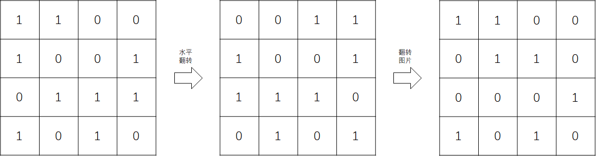
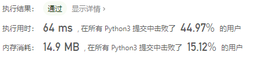

# [832. 翻转图像](https://leetcode-cn.com/problems/flipping-an-image/)

给定一个二进制矩阵 `A`，我们想先水平翻转图像，然后反转图像并返回结果。

水平翻转图片就是将图片的每一行都进行翻转，即逆序。例如，水平翻转 `[1, 1, 0]` 的结果是 `[0, 1, 1]`。

反转图片的意思是图片中的 `0` 全部被 `1` 替换， `1` 全部被 `0` 替换。例如，反转 `[0, 1, 1]` 的结果是 `[1, 0, 0]`。

示例 1:

```
输入: [[1,1,0],[1,0,1],[0,0,0]]
输出: [[1,0,0],[0,1,0],[1,1,1]]
解释: 首先翻转每一行: [[0,1,1],[1,0,1],[0,0,0]]；
     然后反转图片: [[1,0,0],[0,1,0],[1,1,1]]
```


示例 2:

```
输入: [[1,1,0,0],[1,0,0,1],[0,1,1,1],[1,0,1,0]]
输出: [[1,1,0,0],[0,1,1,0],[0,0,0,1],[1,0,1,0]]
解释: 首先翻转每一行: [[0,0,1,1],[1,0,0,1],[1,1,1,0],[0,1,0,1]]；
     然后反转图片: [[1,1,0,0],[0,1,1,0],[0,0,0,1],[1,0,1,0]]
```


说明:

- `1 <= A.length = A[0].length <= 20`
- `0 <= A[i][j] <= 1`

## 思路

首先，需要理解题干，翻转图像的意思是先水平翻转（逆序）再做反转图片（取反）操作，文字上可能不是那么好理解，我们来可视化一下：

（示例1）


（示例2）



#### 模拟操作

根据题干描述的操作进行模拟，首先进行水平翻转，再进行反转图片。

```python
class Solution:
    def flipAndInvertImage(self, A: List[List[int]]) -> List[List[int]]:
        for i in range(len(A)):
            A[i].reverse() # 按行逆序
        for i in range(len(A)):
            for j in range(len(A[i])):
                if A[i][j] == 1:
                    A[i][j] = 0	# 按行取反
                else:
                    A[i][j] = 1
        return A
```

