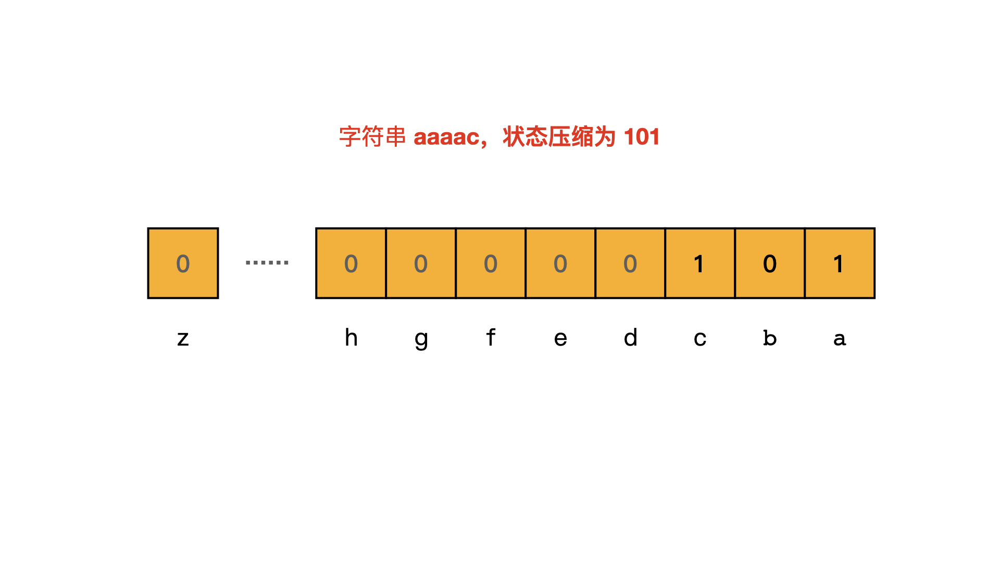

# [1178. 猜字谜](https://leetcode-cn.com/problems/number-of-valid-words-for-each-puzzle/)

外国友人仿照中国字谜设计了一个英文版猜字谜小游戏，请你来猜猜看吧。

字谜的迷面 `puzzle` 按字符串形式给出，如果一个单词 `word` 符合下面两个条件，那么它就可以算作谜底：

- 单词 `word` 中包含谜面 `puzzle` 的第一个字母。

- 单词 `word` 中的每一个字母都可以在谜面 `puzzle` 中找到。
  例如，如果字谜的谜面是 "abcdefg"，那么可以作为谜底的单词有 "faced", "cabbage", 和 "baggage"；而 "beefed"（不含字母 "a"）以及 "based"（其中的 "s" 没有出现在谜面中）都不能作为谜底。

  

返回一个答案数组 `answer`，数组中的每个元素 `answer[i]` 是在给出的单词列表 `words` 中可以作为字谜迷面 `puzzles[i]` 所对应的谜底的单词数目。

 

示例：

```
输入：
words = ["aaaa","asas","able","ability","actt","actor","access"], 
puzzles = ["aboveyz","abrodyz","abslute","absoryz","actresz","gaswxyz"]
输出：[1,1,3,2,4,0]
解释：
1 个单词可以作为 "aboveyz" 的谜底 : "aaaa" 
1 个单词可以作为 "abrodyz" 的谜底 : "aaaa"
3 个单词可以作为 "abslute" 的谜底 : "aaaa", "asas", "able"
2 个单词可以作为 "absoryz" 的谜底 : "aaaa", "asas"
4 个单词可以作为 "actresz" 的谜底 : "aaaa", "asas", "actt", "access"
没有单词可以作为 "gaswxyz" 的谜底，因为列表中的单词都不含字母 'g'。
```


提示：

- `1 <= words.length <= 10^5`
- `4 <= words[i].length <= 50`
- `1 <= puzzles.length <= 10^4`
- `puzzles[i].length == 7`
- `words[i][j]`, `puzzles[i][j]` 都是小写英文字母。
- 每个 `puzzles[i]` 所包含的字符都不重复。

## 思路

首先，我们来审下题目，谜底的两个条件：

1. word中包含puzzle的第一个字母；
2. word中每一个字母都能在puzzle中找到；


初步想法是找到word中每个单词的元素先判断首字母是否在，在判断是否都在，但是没做出来。

#### 参考题解

##### 第一步：状态压缩

第二个条件只要求能找到（出现一次即可），对出现次数没要求。为解决该问题，可以通过使用二进制数字来表示每个`word`和`puzzle`，该二进制数字就是`word`和`puzzle`的特征。该题只包含26个小写字母，可以压缩到一个int中。int中的每一位取`0`和`1`表示字符是否出现过。比如“aabb”可以用11表示，"accc"可以用101表示。

可以看出不同的单词可能映射成同一个数字，比如 "aabbb" 和 "ab" 都映射成了 11。这就是状态压缩。



把每个 word 都做状态压缩，并用 hashmap 保存每个二进制数字出现的次数。

##### 匹配(没看懂)

核心在于找到**`word`**状态压缩后的数字和**`puzzle[0] + subset(puzzle[1:N - 1])`**状态压缩后的数字相等。

暴力求出`puzzle[1:N-1]`的所有自己，然后计算`puzzle[0] + subset(puzzle[0] + subset(puzzle[1:N - 1]))`对应的状态。

求出`puzzle[0] + subset(puzzle[1:N - 1])`对应的二进制数字之后，累加 hashmap 中该二进制数字出现的次数，就是该 puzzle 对应的 word 有多少。


```python
class Solution:
    def findNumOfValidWords(self, words: List[str], puzzles: List[str]) -> List[int]:
        freq = collections.Counter() # 调用计数器
        for word in words:	# 遍历words
            mask = 0	
            for c in word:
                mask |= 1 << (ord(c) - ord('a'))
            freq[mask] += 1
        res = []
        for puzzle in puzzles:
            total = 0
            for perm in self.subsets(puzzle[1:]):
                mask = 1 << (ord(puzzle[0]) - ord('a'))
                for c in perm:
                    mask |= 1 << (ord(c) - ord('a'))
                total += freq[mask]
            res.append(total)
        return res
    
    def subsets(self, words: List[int]) -> List[List[int]]:
        res = [""]
        for i in words:
            res = res + [i + word for word in res]
        return res
```


