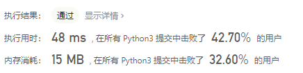
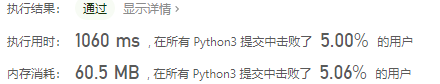
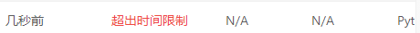

# [395. 至少有K个重复字符的最长子串](https://leetcode-cn.com/problems/longest-substring-with-at-least-k-repeating-characters/)

给你一个字符串 s 和一个整数 k ，请你找出 s 中的最长子串， 要求该子串中的每一字符出现次数都不少于 k 。返回这一子串的长度。

 

示例 1：

```
输入：s = "aaabb", k = 3
输出：3
解释：最长子串为 "aaa" ，其中 'a' 重复了 3 次。
```


示例 2：

```
输入：s = "ababbc", k = 2
输出：5
解释：最长子串为 "ababb" ，其中 'a' 重复了 2 次， 'b' 重复了 3 次。
```


提示：

- `1 <= s.length <= 104`
- `s` 仅由小写英文字母组成
- `1 <= k <= 105`

## 思路

第一个想法就是滑动窗口,但是有些许问题，想了个统计出现次数，但是被

```
"bbaaacbd"
```

这个例子所击败了，因为可以中间有别的字符，然后改为统计字符的出现次数并记录它们的索引，但这个思路没有继续下去，看题解。

### 题解

##### 解题思路——递归

> https://leetcode-cn.com/problems/longest-substring-with-at-least-k-repeating-characters/solution/jie-ben-ti-bang-zhu-da-jia-li-jie-di-gui-obla/

本题要求是求一个最长的子字符串的长度，该字符串中每个字符出现的次数最少为k。

一般而言，这类题型可以用滑动窗口来做，但是本题滑动窗口不好写（确实），所以改用递归。

- 重点：我们在调用递归函数的时候，把递归函数当做普通函数（黑箱）来调用，即明白该函数的输入输出是什么，而不用管次函数内部在做什么。

详细讲解：

1. 递归最基本的是记住递归函数的含义：题目中的(s,k)，s是源字符串；k是限制条件，即子字符串中每个字符最少出现的次数；函数返回为满足题意的最长子字符串长度。
2. 递归终止条件：如果s长度小于k，那么一定不存在满足题意的子字符串，返回0.
3. 调用递归（重点）：如果一个字符c在s中出现的次数少于k次，那么s中所有的包含c的子字符串都不能满足题意。所以，应该在s的所有不包含c的子字符串中继续寻找：把s按照c分割，得到很多的子字符串t；下一步要求t作为源字符串，它的最长满足题意的子字符串长度。
4. 未进入递归时的返回结果：如果s中的每个字符出现的次数都大于k次，那么s就是符合题意的字符串，直接返回该字符串长度。

```python
class Solution(object):
    def longestSubstring(self, s, k):
        if len(s) < k:
            return 0
        for c in set(s):
            if s.count(c) < k:
                return max(self.longestSubstring(t, k) for t in s.split(c)) # 按这个字符分割子字符串
        return len(s) # 找到符合题意的最长子字符串
```

- 时间复杂度：$O(N^2)$，因为for循环一次，循环里面对 s 分割再计算一次。超过了 84.40% 的提交。
- 空间复杂度：$O(N)$，递归用了系统的栈。



##### 解题思路——字符统计+定位

> https://leetcode-cn.com/problems/longest-substring-with-at-least-k-repeating-characters/solution/tu-jie-di-gui-si-lu-zi-fu-tong-ji-ding-w-qu1p/

先统计字符出现次数，切割字符串，分别寻找。

```python
class Solution:
    def longestSubstring(self, s: str, k: int) -> int:
        from collections import Counter
        def recursion(s, res):
            if not s:
                return res
            c = Counter(s)
            div = ""
            for key, val in c.items():
                if val < k:
                    div = key
                    break
            if not div:
                return s if len(s) > len(res) else res
            index = s.index(div)
            res_left = recursion(s[:index], res)
            res_right = recursion(s[index+1:], res)
            res = res_left if len(res_left) > len(res) else res
            res = res_right if len(res_right) > len(res) else res
            return res
        return len(recursion(s, ""))
```

这个也是使用递归思想，没有上面那个简单，但是理解上可能会好一些。



##### 解题思路——暴力破解

> https://leetcode-cn.com/problems/longest-substring-with-at-least-k-repeating-characters/solution/26zi-fu-qian-zhui-he-fen-zhi-er-cha-shu-de-hou-xu-/

暴力解法是最容易想到的，对于任一一个起点`i`，我们不断尝试延长区间长度`j`，检测区间`[i,j]`是否满足所有字符出现次数都是**大于等于** `k` 。

```python
class Solution:
    def longestSubstring(self, s: str, k: int) -> int:
        res = 0
        for i in range(len(s)):
            cnt = [0] * 26
            for j in range(i, len(s)): # 找到所有的子串
                cnt[ord(s[j])-ord("a")] += 1 # 统计字母出现次数
                for t in cnt:
                    if 0 < t < k: break
                else:
                    res = max(res, j - i + 1)
        return res
```



还有一种，在提交的时候看到的

```python
class Solution:
    def longestSubstring(self, s: str, k: int) -> int:
        stack = [s]
        ans = 0
        while stack:
            cur = stack.pop() # 看当前的子字符串
            for c in set(cur):
                if cur.count(c) < k:
                    stack.extend([t for t in cur.split(c)]) # 加入子字符串
                    break
            else:
                ans = max(ans, len(cur))
        return ans
```

