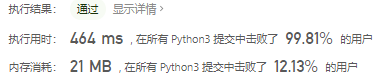
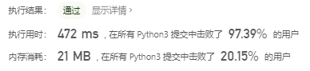
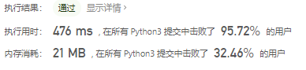

# [896. 单调数列](https://leetcode-cn.com/problems/monotonic-array/)

如果数组是单调递增或单调递减的，那么它是单调的。

如果对于所有 `i <= j`，`A[i] <= A[j]`，那么数组 A 是单调递增的。 如果对于所有 `i <= j`，`A[i]> = A[j]`，那么数组 A 是单调递减的。

当给定的数组 A 是单调数组时返回 true，否则返回 false。

 

**示例 1：**

```
输入：[1,2,2,3]
输出：true
```

**示例 2：**

```
输入：[6,5,4,4]
输出：true
```

**示例 3：**

```
输入：[1,3,2]
输出：false
```

**示例 4：**

```
输入：[1,2,4,5]
输出：true
```

**示例 5：**

```
输入：[1,1,1]
输出：true
```


提示：

- `1 <= A.length <= 50000`
- `-100000 <= A[i] <= 100000`

## 思路

考虑两种情况，单调递增或者单调递减（相等已经包含在这里面了），cur是递增排序的A，cur_r是递减排序的A，判断A是否与两者之一相等。相等就返回True不等就返回False。

```python
import operator

class Solution:
    def isMonotonic(self, A: List[int]) -> bool:
        cur = sorted(A)
        cur_r = cur.copy()
        cur_r.reverse()
        if operator.eq(cur, A) or operator.eq(cur_r, A):
            return True
        else:
            return False
```



### 题解思路

#### 两次遍历

分别弄两个函数判断是否是增或者是否是减。

```python
class Solution:
    def isMonotonic(self, A):
        return self.isIncreasing(A) or self.isDecreasing(A)
        
    def isIncreasing(self, A):
        N = len(A)
        for i in range(N - 1):
            if A[i + 1] - A[i] < 0:
                return False
        return True
    
    def isDecreasing(self, A):
        N = len(A)
        for i in range(N - 1):
            if A[i + 1] - A[i] > 0:
                return False
        return True
```



- 时间复杂度：O(2 * N) = O(N)
- 空间复杂度：O(1)

#### 一次遍历

也可以遍历一次：

- 使用 inc 标记数组是否单调上升的，如果有下降，则将其置为 false；

- 使用 dec 标记数组是否单调递减的，如果有上升，则将其置为 false。

那么：

- 如果数组是单调的，那么 inc 和 dec 会至少有一个一直保持 true。
- 如果 inc 和 dec 同时为 false，说明数列中既有递增的情况，也有递减的情况，所以数列就不是单调的。

以 `1,3,2` 为例，展示一下这个过程：


```python
class Solution:
    def isMonotonic(self, A):
        N = len(A)
        inc, dec = True, True
        for i in range(1, N):
            if A[i] < A[i - 1]:
                inc = False
            if A[i] > A[i - 1]:
                dec = False
            if not inc and not dec:
                return False
        return True
```

