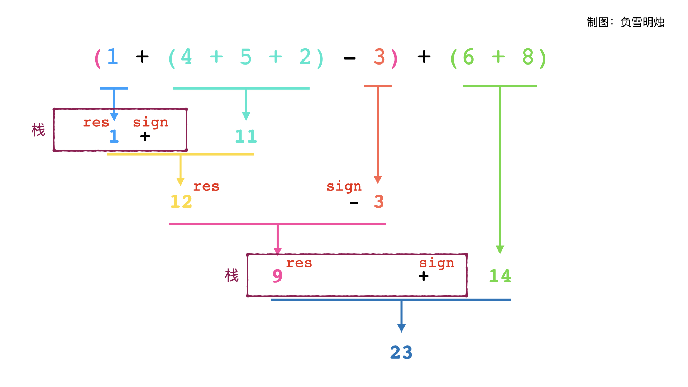

# [224. 基本计算器](https://leetcode-cn.com/problems/basic-calculator/)

实现一个基本的计算器来计算一个简单的字符串表达式 s 的值。

 

示例 1：

```
输入：s = "1 + 1"
输出：2
```

示例 2：

```
输入：s = " 2-1 + 2 "
输出：3
```

示例 3：

```
输入：s = "(1+(4+5+2)-3)+(6+8)"
输出：23
```


提示：

- $1 <= s.length <= 3 * 10^5$
- `s` 由数字、`'+'`、`'-'`、`'('、')'`、和 `' '` 组成
- `s` 表示一个有效的表达式

## 思路

重点：

- 本题目只有 `"+"`, `"-"` 运算，没有 `"*"` , `"/"` 运算，因此少了不同运算符优先级的比较；
- 遇到小括号，应该**先算括号里面的表达式**；

#### 递归

一个表达式分为三部分：
左边表达式①，运算符③，右边表达式②

本题中，左边和右边的表达式可以是一个数字，也可以是一个括号包起来的表达式；运算符可以是加减。

小学数学告诉我们，一个只包含加减和括号的表达式，我们可以从左到右计算，遇到括号就先算括号里面的。具体来说就是先计算左边的表达式，再计算右边表达式，最后根据运算符，计算 ①和②的运算 。

用题目示例 `(1+(4+5+2)-3)+(6+8)`来说明运算符计算的顺序：


根据上面的分析可知，当我们在计算一个表达式的时候，需要先计算左边表达式①，然后需要把①的结果和运算符③保存起来，再需要计算右边表达式②，最后计算①和②的运算。这个操作就是递归！！

### 栈

递归的程序可以用「栈」来模拟：栈为了保存左边表达式①的计算结果和运算符③，在计算右边表达式③的结果之后，从栈中取出运算符③和①的结果，再进行计算整个表达式的结果。

肯定有朋友想问了，用栈保存左边表达式结果的话，当遇到嵌套的括号怎么办？比如 (1 + (2 + (3 + 4)))。答案是：栈顶保留的是最里层嵌套的运算，弹出栈的时候，正好先算的是最里面括号的，再算外边括号的。这种情况时，栈里面保存的是 ["1", "+", "2", "+", "3", "+"]，然后遇到 4，此时计算的是 3 + 4，然后算 7 + 2，再算 9 + 1。可以通过递归来帮助理解。

#### 代码

代码里面:

- res 表示左边表达式除去栈内保存元素的计算结果；

- sign 表示运算符；

- num 表示当前遇到的数字，会更新到 res 中；

- 用栈保存遇到左括号时前面计算好了的结果和运算符。

操作的步骤是：

- 如果当前是数字，那么更新计算当前数字；
- 如果当前是操作符+或者-，那么需要更新计算当前计算的结果 res，并把
- 当前数字 num 设为 0，sign 设为正负，重新开始；
  如果当前是 ( ，那么说明遇到了右边的表达式，而后面的小括号里的内容需要优先计算，所以要把 res，sign 进栈，更新 res 和 sign 为新的开始；
- 如果当前是 ) ，那么说明右边的表达式结束，即当前括号里的内容已经计算完毕，所以要把之前的结果出栈，然后计算整个式子的结果；
- 最后，当所有数字结束的时候，需要把最后的一个 num 也更新到 res 中。

栈中存的是这个括号之前的符号和res。

```python
class Solution:
    def calculate(self, s: str) -> int:
        stack = []
        # 记录数字的符号，因为题目说明没有负数，说明第一个为正数，设为1
        sign = 1
        # 数字
        num = 0
        # 结果
        res = 0
        for c in s:
            if c.isdigit():  # 检测字符串是否只有数字组成
                num = 10 * num + int(c)  # 处理多位数情况
            elif c == "+":      # 加的情况
                res += sign * num
                # 为下一次做准备
                num = 0
                sign = 1
            elif c == "-":  # 减的情况
                res += sign * num
                num = 0
                sign = -1
            elif c == "(":  # 遇到左括号入栈
                stack.append(res)
                stack.append(sign)
                sign = 1
                res = 0
            elif c == ")":  # 遇到右括号出栈
                res += sign * num
                num = 0
                res = stack.pop() * res + stack.pop()
        res += sign * num
        return res
```

改为js

- 用正则化实现的判断是否为数字的函数
- js中栈也有pop和push
- 要单个定义

```
/**
 * @param {string} s
 * @return {number}
 */
function isNumber(val) {
    var regPos = /^\d+(\.\d+)?$/; //非负浮点数
    var regNeg = /^(-(([0-9]+\.[0-9]*[1-9][0-9]*)|([0-9]*[1-9][0-9]*\.[0-9]+)|([0-9]*[1-9][0-9]*)))$/; //负浮点数
    if(regPos.test(val) || regNeg.test(val)) {
        return true;
    } else {
        return false;
    }
}

var calculate = function(s) {
    let stack = [];
    let sign = 1;
    let num = 0;
    let res = 0;
    for(let i=0; i<s.length; i++){
        if(isNumber(s[i])){
            num = 10 * num + Number(s[i]);
        }else if(s[i] === "+"){
            res += sign * num;
            num = 0;
            sign = 1;
        }else if(s[i]==="-"){
            res += sign * num;
            num = 0;
            sign = -1;
        }else if(s[i]==="("){
            stack.push(res);
            stack.push(sign);
            res = 0;
            sign = 1;
        }else if(s[i]===")"){
            res += sign * num;
            num = 0;
            res = stack.pop() * res ;
            res = res + stack.pop()
        }
    }
    res += sign *num;
    return res
};
```