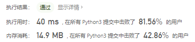
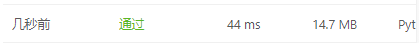
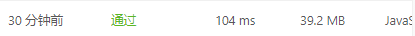

# [331. 验证二叉树的前序序列化](https://leetcode-cn.com/problems/verify-preorder-serialization-of-a-binary-tree/)

序列化二叉树的一种方法是使用前序遍历。当我们遇到一个非空节点时，我们可以记录下这个节点的值。如果它是一个空节点，我们可以使用一个标记值记录，例如 #。
```
     _9_
    /   \
   3    2
  / \   / \
 4   1  #  6
/ \ / \   / \
# # # #   #  #
```
例如，上面的二叉树可以被序列化为字符串 `"9,3,4,#,#,1,#,#,2,#,6,#,#"`，其中 `#` 代表一个空节点。

给定一串以逗号分隔的序列，验证它是否是正确的二叉树的前序序列化。编写一个在不重构树的条件下的可行算法。

每个以逗号分隔的字符或为一个整数或为一个表示 `null` 指针的 `'#'` 。

你可以认为输入格式总是有效的，例如它永远不会包含两个连续的逗号，比如 `"1,,3"` 。

示例 1:

```
输入: "9,3,4,#,#,1,#,#,2,#,6,#,#"
输出: true
```


示例 2:

```
输入: "1,#"
输出: false
```


示例 3:

```
输入: "9,#,#,1"
输出: false
```

## 思路

这个题的关键在于根据前序序列化判断其是否是正确的二叉树，那么这道题就包含如下几步:

- 找根节点，遍历左子树
- 找到左子树的根节点，遍历左子树，直到左子树为空，遍历当前节点的右节点，为空则返回
- 在这个过程中如果有不符合的情况就返回false，否则返回true

这个想法有问题，参考题解

#### 使用栈模拟前序遍历递归建树


```python
class Solution:
    def isValidSerialization(self, preorder: str) -> bool:
        preorder = preorder.split(",")
        stack = []
        for i in preorder:
            while stack and stack[-1] == "#" and i == "#":
                stack.pop()
                if not stack:  # 如果为空
                    return False
                stack.pop()
            stack.append(i)

        return len(stack) == 1 and stack[0] == "#"
```

遍历preorder，如果栈中元素不为空且栈顶和当前元素都为#说明这个子树符合，弹栈一次，如果此时栈为空则说明只有一个#在栈中，所以不符合要求故返回False，再次弹栈，判断条件。如果不满足while的条件则将当前元素加入栈中再次进入循环。

最后结果如果栈内只有一个元素且栈顶元素为#时满足要求



- 时间复杂度：*O*(*N*)
- 空间复杂度：*O*(*N*)

#### 出入度之差

- 每个空节点（ `"#"` ）会提供 0 个出度和 1 个入度。
- 每个非空节点会提供 2 个出度和 1 个入度。

```python
class Solution:
    def isValidSerialization(self, preorder: str) -> bool:
        preorder = preorder.split(",")
        edges = 1
        for i in preorder:
            edges -= 1
            if edges < 0:
                return False
            if i != "#":
                edges += 2
        return edges == 0
```



js

```javascript
/**
 * @param {string} preorder
 * @return {boolean}
 */
var isValidSerialization = function(preorder) {
    preorder = preorder.split(",")
    edges = 1
    for(let i=0;i<preorder.length;i++){
        edges -= 1
        if(edges<0){
            return false
        }
        if(preorder[i] !== "#"){
            edges += 2
        }
    }
    return edges === 0
};
```



```javascript
var isValidSerialization = function(preorder) {
    preorder = preorder.split(",")
    stack = []
    for(let i=0;i<preorder.length;i++){
        while ((stack.length)&&(stack[stack.length - 1]==="#")&&(preorder[i]==="#")){
            stack.pop()
            if(!stack.length){
                return false
            }
            stack.pop()
        }
        stack.push(preorder[i])
    }
    return stack.length === 1 && stack[0] === "#"
};
```


