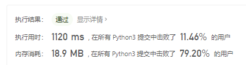
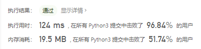

# [705. 设计哈希集合](https://leetcode-cn.com/problems/design-hashset/)

不使用任何内建的哈希表库设计一个哈希集合（HashSet）。

实现 `MyHashSet` 类：

- `void add(key)` 向哈希集合中插入值 `key` 。
- `bool contains(key)` 返回哈希集合中是否存在这个值 `key` 。
- `void remove(key)` 将给定值 `key` 从哈希集合中删除。如果哈希集合中没有这个值，什么也不做。

 

**示例：**

```
输入：
["MyHashSet", "add", "add", "contains", "contains", "add", "contains", "remove", "contains"]
[[], [1], [2], [1], [3], [2], [2], [2], [2]]
输出：
[null, null, null, true, false, null, true, null, false]

解释：
MyHashSet myHashSet = new MyHashSet();
myHashSet.add(1);      // set = [1]
myHashSet.add(2);      // set = [1, 2]
myHashSet.contains(1); // 返回 True
myHashSet.contains(3); // 返回 False ，（未找到）
myHashSet.add(2);      // set = [1, 2]
myHashSet.contains(2); // 返回 True
myHashSet.remove(2);   // set = [1]
myHashSet.contains(2); // 返回 False ，（已移除）
```

 

**提示：**

- `0 <= key <= 106`
- 最多调用 `104` 次 `add`、`remove` 和 `contains` 。

## 思路

这道题比较简单，只要清楚逻辑即可写出AC的代码，初步AC代码如下：

```python
class MyHashSet:

    def __init__(self):
        """
        Initialize your data structure here.
        """
        self._set = []


    def add(self, key: int) -> None:
        if key not in self._set:
            self._set.append(key)

    def remove(self, key: int) -> None:
        if key in self._set:
            self._set.remove(key)
        else:
            return False

    def contains(self, key: int) -> bool:
        """
        Returns true if this set contains the specified element
        """
        if key in self._set:
            return True
        else:
            return False
```

判断在不在，如果在的话就不加入，如果不在就加入，如果不包含就返回False，如果包含就返回True。



在python中还可以使用集合这个数据类型，根据集合的特性，集合中元素不会出现超过一次，实现代码如下：

```python
class MyHashSet:

    def __init__(self):
        """
        Initialize your data structure here.
        """
        self._set = set()


    def add(self, key: int) -> None:
        if key not in self._set:
            self._set.add(key)

    def remove(self, key: int) -> None:
        if key in self._set:
            self._set.remove(key)
        else:
            return False

    def contains(self, key: int) -> bool:
        """
        Returns true if this set contains the specified element
        """
        if key in self._set:
            return True
        else:
            return False


# Your MyHashSet object will be instantiated and called as such:
# obj = MyHashSet()
# obj.add(key)
# obj.remove(key)
# param_3 = obj.contains(key)
```



js实现

```
/**
 * Initialize your data structure here.
 */
var MyHashSet = function() {
    this._set = new Set()
};

/**
 * @param {number} key
 * @return {void}
 */
MyHashSet.prototype.add = function(key) {
    if(!this._set.has(key)){
        this._set.add(key);
    }
};

/**
 * @param {number} key
 * @return {void}
 */
MyHashSet.prototype.remove = function(key) {
    if(this._set.has(key)){
        this._set.delete(key);
    }else{
        return false
    }
};

/**
 * Returns true if this set contains the specified element
 * @param {number} key
 * @return {boolean}
 */
MyHashSet.prototype.contains = function(key) {
    if(this._set.has(key)){
        return true
    }else{
        return false
    }
};
/**
 * Your MyHashSet object will be instantiated and called as such:
 * var obj = new MyHashSet()
 * obj.add(key)
 * obj.remove(key)
 * var param_3 = obj.contains(key)
 */
```

- JavaScript中找这个值在不在这个数组中使用的是has()方法。