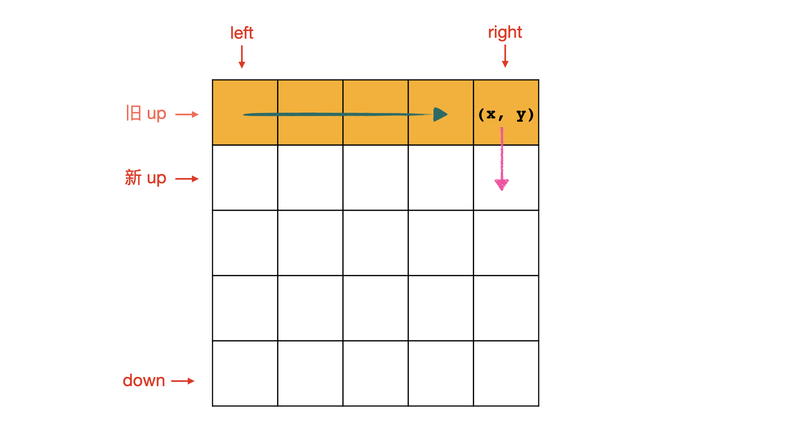

# [54. 螺旋矩阵](https://leetcode-cn.com/problems/spiral-matrix/)

给你一个 `m` 行 `n` 列的矩阵 `matrix` ，请按照 **顺时针螺旋顺序** ，返回矩阵中的所有元素。

 

**示例 1：**


```
输入：matrix = [[1,2,3],[4,5,6],[7,8,9]]
输出：[1,2,3,6,9,8,7,4,5]
```

**示例 2：**


```
输入：matrix = [[1,2,3,4],[5,6,7,8],[9,10,11,12]]
输出：[1,2,3,4,8,12,11,10,9,5,6,7]
```

 

**提示：**

- `m == matrix.length`
- `n == matrix[i].length`
- `1 <= m, n <= 10`
- `-100 <= matrix[i][j] <= 100`

## 思路

想要模拟遍历，但是边界条件找的有问题，所以参考题解。[矩阵遍历问题的四部曲](https://leetcode-cn.com/u/fuxuemingzhu/)

考虑以下几个问题：

1. 起始位置
2. 移动方向
3. 边界
4. 结束条件

### 起始位置

螺旋矩阵的遍历起点是左上角，即(0,0)

### 移动方向

右→，下↓，左←，上↑

### 边界

如果当前行（列）遍历结束之后，就需要把这一行（列）的边界向内移动一格。

以下面的图为例， up, down, left, right 分别表示四个方向的边界，初始时分别指向矩阵的四个边界。如果我们把第一行遍历结束（遍历到了右边界），此时需要修改新的移动方向为向下、并且把上边界 up 下移一格，即从 旧 up 位置移动到 新 up 位置。



当绕了一圈后，从下向上走到 新up 边界的时候，此时需要修改新的移动方向为向右、并且把左边界 left 下移一格，即从 旧 left 位置移动到 新 left 位置。


### 结束条件

螺旋遍历的结束条件是所有的位置都被遍历到。

- up, down, left, right 分别表示四个方向的边界。
- x, y 表示当前位置。
- dirs 分别表示移动方向是 右、下、左、上 。
- cur_d 表示当前的移动方向的下标，dirs[cur_d] 就是下一个方向需要怎么修改 x, y。
- cur_d == 0 and y == right 表示当前的移动方向是向右，并且到达了右边界，此时将移动方向更改为向下，并且上边界 up 向下移动一格。
- 结束条件是结果数组 res 的元素个数能与 matrix 中的元素个数。

代码如下：

```python
class Solution:
    def spiralOrder(self, matrix: List[List[int]]) -> List[int]:
        if not matrix or not matrix[0]: return []
        M, N = len(matrix), len(matrix[0])
        left, right, up, down = 0, N - 1, 0, M -1   # 设置边界
        res = []
        x, y = 0, 0 # 当前位置
        dirs = [(0, 1), (1, 0), (0, -1), (-1, 0)]   # 表示移动方向是右、下、左、上
        cur_d = 0   # 移动方向的下标
        while len(res) < M * N:
            res.append(matrix[x][y])
            if cur_d == 0 and y == right:   # 右到尽头向下
                cur_d += 1
                up += 1
            elif cur_d == 1 and x == down:  # 下到尽头向左
                cur_d += 1
                right -= 1
            elif cur_d == 2 and y == left:  # 左到尽头向上
                cur_d += 1
                down -= 1
            elif cur_d == 3 and x == up:    # 上到尽头向右
                cur_d += 1
                left += 1
            cur_d %= 4  # 循环查找
            x += dirs[cur_d][0]
            y += dirs[cur_d][1]

        return res
```

