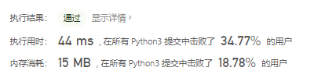

# [59. 螺旋矩阵 II](https://leetcode-cn.com/problems/spiral-matrix-ii/)

给你一个正整数 `n` ，生成一个包含 `1` 到 `n2` 所有元素，且元素按顺时针顺序螺旋排列的 `n x n` 正方形矩阵 `matrix` 。

 

**示例 1：**


```
输入：n = 3
输出：[[1,2,3],[8,9,4],[7,6,5]]
```

**示例 2：**

```
输入：n = 1
输出：[[1]]
```

 

**提示：**

- `1 <= n <= 20` 

## 思路

根据[54. 螺旋矩阵](https://leetcode-cn.com/problems/spiral-matrix/)进行改编，上一道题是模拟走法然后放到结果矩阵中，这道题就是将矩阵中索引位置的元素进行更新。

```python
class Solution:
    def generateMatrix(self, n: int) -> List[int]:
        left, right, up, down = 0, n - 1, 0, n - 1  # 设置边界
        res = [[0]*n for _ in range(n)]
        x, y = 0, 0  # 当前位置
        dirs = [(0, 1), (1, 0), (0, -1), (-1, 0)]  # 表示移动方向是右、下、左、上
        cur_d = 0  # 移动方向的下标
        i = 1
        while i <= n*n:
            res[x][y] = i
            if cur_d == 0 and y == right:  # 右到尽头向下
                cur_d += 1
                up += 1
            elif cur_d == 1 and x == down:  # 下到尽头向左
                cur_d += 1
                right -= 1
            elif cur_d == 2 and y == left:  # 左到尽头向上
                cur_d += 1
                down -= 1
            elif cur_d == 3 and x == up:  # 上到尽头向右
                cur_d += 1
                left += 1
            cur_d %= 4  # 循环查找
            x += dirs[cur_d][0]		#	更新坐标
            y += dirs[cur_d][1]		#	更新坐标
            i += 1

        return res
```



还有一种想法也是用四个变量标记边界，就是从左至右，然后右-1在从上到下上-1，从右到左左-1，从下到上下-1。

```python
class Solution:
    def generateMatrix(self, n: int) -> List[int]:
        left, right, up, down = 0, n - 1, 0, n - 1  # 设置边界
        res = [[0] * n for _ in range(n)]
        cur = 1
        while True:

            for i in range(left, right + 1):
                res[up][i] = cur
                cur += 1
            up += 1
            if up > down:
                break
            for i in range(up, down + 1):
                res[i][right] = cur
                cur += 1
            right -= 1
            if left > right:
                break
            for i in range(right, left - 1, -1):
                res[down][i] = cur
                cur += 1
            down -= 1
            if up > down:
                break
            for i in range(down, up - 1, -1):
                res[i][left] = cur
                cur += 1
            left += 1
            if left > right:
                break
        return res
```

#### 使用非0数字标记边界

初始移动方向是向右，如果遇到了数组边界或者遇到了非 0 的数字，那么就要转动方向。转向的方法是 cur_d = (cur_d + 1) % 4 ，cur_d 表示了当前的方向是 directions 中的哪个，顺序依次是 右、下、左、上。

```python
class Solution:
    def generateMatrix(self, n: int) -> List[int]:
        directions = [(0, 1), (1, 0), (0, -1), (-1, 0)]
        res = [[0]*n for _ in range(n)]
        x, y = 0, 0
        count = 0
        cur_d = 0
        while count != n*n:
            res[x][y] = count + 1
            count += 1
            dx, dy = directions[cur_d][0], directions[cur_d][1]
            newx, newy = x + dx, y + dy
            if newx < 0 or newx >= n or newy < 0 or newy >= n or res[newx][newy]!= 0:
                cur_d = (cur_d + 1) % 4
                dx, dy = directions[cur_d][0], directions[cur_d][1]
            x, y = x+dx, y+dy
        return res
```