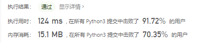
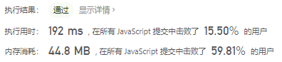

# [1603. 设计停车系统](https://leetcode-cn.com/problems/design-parking-system/)

请你给一个停车场设计一个停车系统。停车场总共有三种不同大小的车位：大，中和小，每种尺寸分别有固定数目的车位。

请你实现 `ParkingSystem` 类：

- `ParkingSystem(int big, int medium, int small)` 初始化 `ParkingSystem` 类，三个参数分别对应每种停车位的数目。
- `bool addCar(int carType)` 检查是否有 `carType` 对应的停车位。 `carType` 有三种类型：大，中，小，分别用数字 `1`， `2` 和 `3` 表示。**一辆车只能停在** `carType` 对应尺寸的停车位中。如果没有空车位，请返回 `false` ，否则将该车停入车位并返回 `true` 。

 

**示例 1：**

```
输入：
["ParkingSystem", "addCar", "addCar", "addCar", "addCar"]
[[1, 1, 0], [1], [2], [3], [1]]
输出：
[null, true, true, false, false]

解释：
ParkingSystem parkingSystem = new ParkingSystem(1, 1, 0);
parkingSystem.addCar(1); // 返回 true ，因为有 1 个空的大车位
parkingSystem.addCar(2); // 返回 true ，因为有 1 个空的中车位
parkingSystem.addCar(3); // 返回 false ，因为没有空的小车位
parkingSystem.addCar(1); // 返回 false ，因为没有空的大车位，唯一一个大车位已经被占据了
```

 

**提示：**

- `0 <= big, medium, small <= 1000`
- `carType` 取值为 `1`， `2` 或 `3`
- 最多会调用 `addCar` 函数 `1000` 次

## 思路

- 初始化一个数组[大、中、小]
- 判断当前停的车型，对应减1，然后返回True
- 如果当前位置数值为0，就返回False

```python
class ParkingSystem:

    def __init__(self, big: int, medium: int, small: int):
        self.init = [big, medium, small]


    def addCar(self, carType: int) -> bool:
        if (carType == 1 or carType == 2 or carType == 3) and self.init[carType-1] > 0:
            self.init[carType-1] -= 1
            return True
        else:
            return False
```



### js代码

```javascript
/**
 * @param {number} big
 * @param {number} medium
 * @param {number} small
 */
var ParkingSystem = function(big, medium, small) {
    this.init = [big, medium, small]
};

/**
 * @param {number} carType
 * @return {boolean}
 */
ParkingSystem.prototype.addCar = function(carType) {
    if((carType === 1 || carType === 2 || carType === 3) && this.init[carType - 1] > 0){
        this.init[carType - 1] = this.init[carType - 1] - 1
        return true
    }else{
        return false
    }
        };
```

