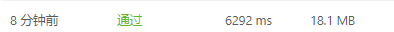

# [303. 区域和检索 - 数组不可变](https://leetcode-cn.com/problems/range-sum-query-immutable/)

给定一个整数数组  `nums`，求出数组从索引 `i` 到 `j（i ≤ j）`范围内元素的总和，包含 `i`、`j` 两点。

实现 `NumArray` 类：

- `NumArray(int[] nums)` 使用数组 `nums` 初始化对象
- `int sumRange(int i, int j)` 返回数组 `nums` 从索引 `i` 到 `j（i ≤ j）`范围内元素的总和，包含 `i`、`j` 两点（也就是 `sum(nums[i], nums[i + 1], ... , nums[j])`）

示例：

```
输入：
["NumArray", "sumRange", "sumRange", "sumRange"]
[[[-2, 0, 3, -5, 2, -1]], [0, 2], [2, 5], [0, 5]]
输出：
[null, 1, -1, -3]

解释：
NumArray numArray = new NumArray([-2, 0, 3, -5, 2, -1]);
numArray.sumRange(0, 2); // return 1 ((-2) + 0 + 3)
numArray.sumRange(2, 5); // return -1 (3 + (-5) + 2 + (-1)) 
numArray.sumRange(0, 5); // return -3 ((-2) + 0 + 3 + (-5) + 2 + (-1))
```


提示：

- `0 <= nums.length <= 104`
- `-105 <= nums[i] <= 105`
- `0 <= i <= j < nums.length`
- 最多调用 $10^4$ 次 `sumRange` 方法

## 思路

这个题不难但是不是很好理解题意，那么我们来理解一下题意。

- 输入，首先将整个输入输入类中初始化，然后通过给定的索引来检索总和
- 不用将整个列表输入，类函数完成的是检索操作。

首先想到的是通过索引遍历索引区间内的元素，累加元素得到结果，代码如下：

```python
class NumArray:

    def __init__(self, nums: List[int]):
        self.init = nums


    def sumRange(self, i: int, j: int) -> int:
        sum = 0
        for k in range(i, j+1):
            sum += self.init[k]
        return sum
```



然后想了想有没有什么更快的方法，然后选择采用python列表的切片操作，采用sum函数直接求和，代码如下：

```python
class NumArray:

    def __init__(self, nums: List[int]):
        self.init = nums


    def sumRange(self, i: int, j: int) -> int:
        sum1 = sum(self.init[i:j+1])
        return sum1
```


### 题解思路

参考：https://leetcode-cn.com/problems/range-sum-query-immutable/solution/presum-qian-zhui-he-xiang-xi-jiang-jie-b-nh23/

**preSum**（前缀和）

题目求一个区间`i,j`内的和，求区间和可以用preSum来做。

preSum方法能够快速计算指定区间段元素之和，它的计算方法是从左向右遍历数组，当遍历到数组的i位置时，`preSum`表示i位置左边的元素之和。

假设数组长度为N，我们定义一个长度为N+1的`preSum`数组，**preSum[i]表示该元素左边所有元素之和（不包含i元素）**。然后遍历一次数组，累加区间[0,i)范围内的元素，可以得到`preSum`数组。

求preSum的代码如下：

```python
N = len(nums)
preSum = range(N + 1)
for i in range(N):
    preSum[i + 1] = preSum[i] + nums[i]
print(preSum)
```

利用 `preSum` 数组，可以在 `O(1)` 的时间内快速求出 `nums` 任意区间 `[i, j]`(两端都包含) 的各元素之和。

`sum(i, j) = preSum[j + 1] - preSum[i]`

对于本题，可以在 `NumArray` 类的构造函数的里面，求数组每个位置的 `preSum`；当计算`sumRange(i, j)`的时候直接返回 `preSum[j + 1] - preSum[i]` 可以得到区间和。

下面以数组 `[1, 12, -5, -6, 50, 3]` 为例，展示了求 preSum 的过程。


代码如下：

```python
class NumArray:

    def __init__(self, nums: List[int]):
        '''
        在定义数组的时候就也定义了前缀和数组，找指定区间的元素和只需要大索引减小索引即可。
        '''
        N = len(nums)
        self.preSum = [0] * (N + 1)
        for i in range(N):
            self.preSum[i + 1] = self.preSum[i] + nums[i]

    def sumRange(self, i: int, j: int) -> int:
        return self.preSum[j + 1] - self.preSum[i]
```

- 时间复杂度：构造函数的时间复杂度是 O(N), `sumRange` 函数调用的时间复杂度是 O(1)
- 空间复杂度：O(N)。

