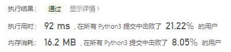
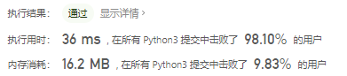

# [150. 逆波兰表达式求值](https://leetcode-cn.com/problems/evaluate-reverse-polish-notation/)

根据[ 逆波兰表示法](https://baike.baidu.com/item/逆波兰式/128437)，求表达式的值。

有效的算符包括 `+`、`-`、`*`、`/` 。每个运算对象可以是整数，也可以是另一个逆波兰表达式。

 

**说明：**

- 整数除法只保留整数部分。
- 给定逆波兰表达式总是有效的。换句话说，表达式总会得出有效数值且不存在除数为 0 的情况。

 

**示例 1：**

```
输入：tokens = ["2","1","+","3","*"]
输出：9
解释：该算式转化为常见的中缀算术表达式为：((2 + 1) * 3) = 9
```

**示例 2：**

```
输入：tokens = ["4","13","5","/","+"]
输出：6
解释：该算式转化为常见的中缀算术表达式为：(4 + (13 / 5)) = 6
```

**示例 3：**

```
输入：tokens = ["10","6","9","3","+","-11","*","/","*","17","+","5","+"]
输出：22
解释：
该算式转化为常见的中缀算术表达式为：
  ((10 * (6 / ((9 + 3) * -11))) + 17) + 5
= ((10 * (6 / (12 * -11))) + 17) + 5
= ((10 * (6 / -132)) + 17) + 5
= ((10 * 0) + 17) + 5
= (0 + 17) + 5
= 17 + 5
= 22
```

 

**提示：**

- `1 <= tokens.length <= 104`
- `tokens[i]` 要么是一个算符（`"+"`、`"-"`、`"*"` 或 `"/"`），要么是一个在范围 `[-200, 200]` 内的整数

 

**逆波兰表达式：**

逆波兰表达式是一种后缀表达式，所谓后缀就是指算符写在后面。

- 平常使用的算式则是一种中缀表达式，如 `( 1 + 2 ) * ( 3 + 4 )` 。
- 该算式的逆波兰表达式写法为 `( ( 1 2 + ) ( 3 4 + ) * )` 。

逆波兰表达式主要有以下两个优点：

- 去掉括号后表达式无歧义，上式即便写成 `1 2 + 3 4 + * `也可以依据次序计算出正确结果。
- 适合用栈操作运算：遇到数字则入栈；遇到算符则取出栈顶两个数字进行计算，并将结果压入栈中。

## 思路

- 遍历数组
- 如果是符号，则将数组中两个数字出栈，并相加然后入栈
- 如果是数字，则将其入栈
- 最后返回int类型

```python
class Solution:
    def evalRPN(self, tokens: List[str]) -> int:
        stack = []
        for t in tokens:        # 遍历逆波兰表达式
            if t in {"+", "-", "/", "*"}:   # 如果t是符号
                tmp1 = stack.pop()          # 出栈
                tmp2 = stack.pop()          # 出栈
                stack.append(str(int(eval(tmp2 + t + tmp1))))   # 相加并入栈
            else:
                stack.append(t)             # 如果是数字，就入栈
        return int(stack.pop())                  # 返回栈顶
```



使用匿名函数进行处理

```python
class Solution:
    def evalRPN(self, tokens: List[str]) -> int:
        stack = []
        plus = lambda a, b: b + a
        sub = lambda a, b: b - a
        mul = lambda a, b: b * a
        div = lambda a, b: int(b / a)
        opt = {
            "+": plus,
            "-": sub,
            "*": mul,
            "/": div
        }
        for t in tokens:
            if t in opt:
                stack.append(opt[t](stack.pop(), stack.pop()))
            else:
                stack.append(int(t))
        return stack.pop()
```

