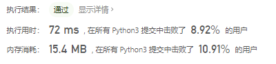
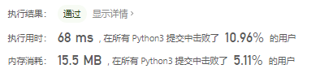
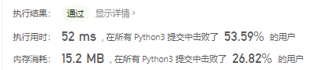

# [73. 矩阵置零](https://leetcode-cn.com/problems/set-matrix-zeroes/)

给定一个 `m x n` 的矩阵，如果一个元素为 **0** ，则将其所在行和列的所有元素都设为 **0** 。请使用 **[原地](http://baike.baidu.com/item/原地算法)** 算法**。**

**进阶：**

- 一个直观的解决方案是使用  $O(mn)$ 的额外空间，但这并不是一个好的解决方案。
- 一个简单的改进方案是使用 $O(m + n)$的额外空间，但这仍然不是最好的解决方案。
- 你能想出一个仅使用常量空间的解决方案吗？

 

**示例 1：**


```
输入：matrix = [[1,1,1],[1,0,1],[1,1,1]]
输出：[[1,0,1],[0,0,0],[1,0,1]]
```

**示例 2：**


```
输入：matrix = [[0,1,2,0],[3,4,5,2],[1,3,1,5]]
输出：[[0,0,0,0],[0,4,5,0],[0,3,1,0]]
```

 

**提示：**

- `m == matrix.length`
- `n == matrix[0].length`
- `1 <= m, n <= 200`
- `-231 <= matrix[i][j] <= 231 - 1`

## 思路

我的方法-暴力穷举

- 遍历矩阵找到当前矩阵0的位置，记录在列表中
- 遍历零位置列表，首先将该0所在的行和列都变为0

```python
class Solution:
    def setZeroes(self, matrix: List[List[int]]) -> None:
        """
        Do not return anything, modify matrix in-place instead.
        """
        zero_list = []
        for i in range(len(matrix)):
            for j in range(len(matrix[0])):
                if matrix[i][j] == 0:
                    zero_list.append([i,j])
        for i in zero_list:
            k = 0
            matrix[i[0]] = [0] * len(matrix[i[0]])
            while k < len(matrix):
                matrix[k][i[1]] = 0
                k += 1
```



实际上的暴力穷举

```python
class Solution:
    def setZeroes(self, matrix: List[List[int]]) -> None:
        """
        Do not return anything, modify matrix in-place instead.
        """
        if not matrix or not matrix[0]:
            return
        M, N = len(matrix), len(matrix[0])
        mat = copy.deepcopy(matrix)
        for i in range(M):
            for j in range(N):
                if mat[i][j] == 0:
                    for k in range(M):
                        matrix[k][j] = 0
                    for k in range(N):
                        matrix[i][k] = 0
```

复制一个 然后遍历再改



**记录0的位置**，感觉这个我的那个思路有点像

```python
class Solution:
    def setZeroes(self, matrix: List[List[int]]) -> None:
        if not matrix or not matrix[0]:
            return
        M, N = len(matrix), len(matrix[0])
        row, col = set(), set()
        for i in range(M):
            for j in range(N):
                if matrix[i][j] == 0:
                    row.add(i)
                    col.add(j)
        for i in range(M):
            for j in range(N):
                if i in row or j in col:
                    matrix[i][j] = 0
```



