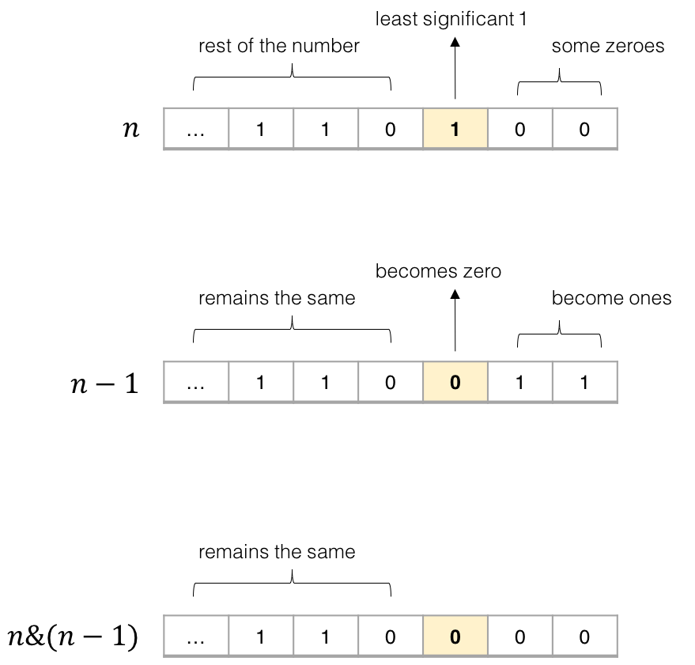

# [191. 位1的个数](https://leetcode-cn.com/problems/number-of-1-bits/)

编写一个函数，输入是一个无符号整数（以二进制串的形式），返回其二进制表达式中数字位数为 '1' 的个数（也被称为[汉明重量](https://baike.baidu.com/item/汉明重量)）。

 

**提示：**

- 请注意，在某些语言（如 Java）中，没有无符号整数类型。在这种情况下，输入和输出都将被指定为有符号整数类型，并且不应影响您的实现，因为无论整数是有符号的还是无符号的，其内部的二进制表示形式都是相同的。
- 在 Java 中，编译器使用[二进制补码](https://baike.baidu.com/item/二进制补码/5295284)记法来表示有符号整数。因此，在上面的 **示例 3** 中，输入表示有符号整数 `-3`。

 

**示例 1：**

```
输入：00000000000000000000000000001011
输出：3
解释：输入的二进制串 00000000000000000000000000001011 中，共有三位为 '1'。
```

**示例 2：**

```
输入：00000000000000000000000010000000
输出：1
解释：输入的二进制串 00000000000000000000000010000000 中，共有一位为 '1'。
```

**示例 3：**

```
输入：11111111111111111111111111111101
输出：31
解释：输入的二进制串 11111111111111111111111111111101 中，共有 31 位为 '1'。
```

 

**提示：**

- 输入必须是长度为 `32` 的 **二进制串** 。


 

**进阶**：

- 如果多次调用这个函数，你将如何优化你的算法？

## 思路

从头开找，依次相减

```python
class Solution:
    def hammingWeight(self, n: int) -> int:
        res = 0
        i = 32
        while n > 0:
            if n - 2 ** i >= 0:
                n = n - 2 ** i
                res += 1
            i -= 1

        return res
```


加了个缓存装饰器

```python
class Solution:
    @lru_cache(None)
    def hammingWeight(self, n: int) -> int:
        res = 0
        i = 32
        while n > 0:
            if n - 2 ** i >= 0:
                n = n - 2 ** i
                res += 1
            i -= 1

        return res
```


偷鸡方法，转成字符串统计1的个数

```python
class Solution(object):
    def hammingWeight(self, n):
        return bin(n).count("1")
```


**右移32次**

- 使用n&1得到二进制末尾是否为1
- 把n右移1位，直至结束

```python
class Solution:
    def hammingWeight(self, n: int) -> int:
        count = 0
        while n:
            count += 1
            n &= n - 1
        return count
```





```yaml
# bit操作
& 符号，x & y ，会将两个十进制数在二进制下进行与运算
| 符号，x | y ，会将两个十进制数在二进制下进行或运算
^ 符号，x ^ y ，会将两个十进制数在二进制下进行异或运算
<< 符号，x << y 左移操作，最右边用 0 填充
>> 符号，x >> y 右移操作，最左边用 0 填充
~ 符号，~x ，按位取反操作，将 x 在二进制下的每一位取反

# 整数集合set位运算
# 整数集合做标志时，比如回溯时的visited标志数组
vstd 访问 i ：vstd | (1 << i)
vstd 离开 i ：vstd & ~(1 << i)
vstd 不包含 i : not vstd & (1 << i)

并集 ：A | B
交集 ：A & B
全集 ：(1 << n) - 1
补集 ：((1 << n) - 1) ^ A
子集 ：(A & B) == B
判断是否是 2 的幂 ：A & (A - 1) == 0
最低位的 1 变为 0 ：n &= (n - 1)
最低位的 1：A & (-A)，最低位的 1 一般记为 lowbit(A)
```