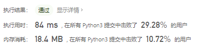

# [341. 扁平化嵌套列表迭代器](https://leetcode-cn.com/problems/flatten-nested-list-iterator/)

给你一个嵌套的整型列表。请你设计一个迭代器，使其能够遍历这个整型列表中的所有整数。

列表中的每一项或者为一个整数，或者是另一个列表。其中列表的元素也可能是整数或是其他列表。

 

**示例 1:**

```
输入: [[1,1],2,[1,1]]
输出: [1,1,2,1,1]
解释: 通过重复调用 next 直到 hasNext 返回 false，next 返回的元素的顺序应该是: [1,1,2,1,1]。
```

**示例 2:**

```
输入: [1,[4,[6]]]
输出: [1,4,6]
解释: 通过重复调用 next 直到 hasNext 返回 false，next 返回的元素的顺序应该是: [1,4,6]。
```

## 思路

本文有两种主要的思路：

1. 在构造函数中提前「扁平化」整个嵌套列表；
2. 在调用 `hasNext()` 或者 `next()` 方法的时候扁平化当前的**嵌套的子列表**。

### 递归：构造函数中提前「扁平化」整个嵌套列表


```python
class NestedIterator(object):

    def __init__(self, nestedList):
        """
        Initialize your data structure here.
        :type nestedList: List[NestedInteger]
        """
        self.queue = collections.deque()    # 双端队列

        def f(nestedList):
            for nested in nestedList:
                if nested.isInteger():  # 如果是整数
                    self.queue.append(nested.getInteger())
                else:
                    f(nested.getList())

        f(nestedList)

    def next(self):
        """
        :rtype: int
        """
        return self.queue.popleft()     # 左出

    def hasNext(self):
        """
        :rtype: bool
        """
        return len(self.queue) > 0  # 如果长度大于0
         

# Your NestedIterator object will be instantiated and called as such:
# i, v = NestedIterator(nestedList), []
# while i.hasNext(): v.append(i.next())
```



但这个方法不是面试官想要的方法

### 迭代：调用 `hasNext()` 或者 `next()` 方法的时候扁平化当前的嵌套的子列表

大部分情况，我们希望迭代器能够一边迭代一边获取当前的结果，而不是提前初始化好。

把递归方法转化为迭代方法，需要用到【栈】

在递归中，我们遍历时如果遇到一个嵌套的子list，就立即处理该子list，知道全部展开。

在迭代中，我们不需要全部展开，只需把当前list的所有元素放入list中。

由于【栈】的特性，我们需要逆序在栈中放入各元素。

流程如下：

1. 在构造函数中应该初始化，把当前列表的各个元素（不用摊平）逆序放入栈中
2. 在`hasNext()`方法中，访问（不弹出）栈顶元素，判断是否为int

- 如果是int那么说明有下一个元素，返回`true`；然后`next()`就会被调用，把栈顶的int弹出
- 如果是list需要把当前列表的各个元素（不用摊平）逆序放入栈中
- 如果栈为空，说明原始的嵌套列表已经访问结束了，返回false

算法整体的流程，通过举例说明。假如输入 [1, [2,3]] 。

```
1. 在构造函数中：栈里面放的应该是 stack = [[2, 3], 1]
2. 在调用 hasNext() 方法时，访问栈顶元素是 1，为 int，那么直接返回 true;
3. 然后调用 next() 方法，弹出栈顶元素 1；
4. 再调用 hasNext() 方法时，访问栈顶元素是 [2,3]，为 list，那么需要摊平，继续放到栈中。
       当前的栈是 stack = [3, 2]
5. 然后调用 next() 方法，弹出栈顶元素 2；
6. 然后调用 next() 方法，弹出栈顶元素 3；
7. 再调用 hasNext() 方法时，栈为空，因此返回 false，迭代器运行结束。
```


这里需要说一下为什么在 hasNext() 方法中摊平 list，而不是在 next() 方法中。比如对于 [[]] 的输入， hasNext()  方法是判断其中是否有 int 元素了，则必须把内层的 list 摊平来看，发现是空的，返回 false。

```python
class NestedIterator(object):

    def __init__(self, nestedList):
        """
        Initialize your data structure here.
        :type nestedList: List[NestedInteger]
        """
        self.stack = []
        for i in range(len(nestedList)-1, -1, -1):
            # 保证逆序
            self.stack.append(nestedList[i])

    def next(self):
        """
        :rtype: int
        """
        cur = self.stack.pop()
        return cur.getInteger()

    def hasNext(self):
        """
        :rtype: bool
        """
        while self.stack:
            cur = self.stack[-1]
            if cur.isInteger():
                return True
            self.stack.pop()
            for i in range(len(cur.getList()) - 1, -1, -1):
                self.stack.append(cur.getList()[i])
        return False
```


> python list的pop方法默认弹出最后一个元素

js方法

```javascript
var NestedIterator = function (nestedList) {
    this.stack = [];
    for (let i = nestedList.length - 1; i >= 0; i--) {
        this.stack.push(nestedList[i]);
    }
};

NestedIterator.prototype.stackTop2Integer = function () {
    // 将栈顶元素转为整型
    while (this.stack.length > 0) {
        const top = this.stack[this.stack.length - 1];
        if (top.isInteger()) {
            return;
        }
        this.stack.pop();
        const list = top.getList();
        for (let i = list.length - 1; i >= 0; i--) {
            this.stack.push(list[i]);
        }
    }
};

NestedIterator.prototype.next = function () {
    this.stackTop2Integer();
    const top = this.stack.pop();

    return top.getInteger();
};

NestedIterator.prototype.hasNext = function () {
    this.stackTop2Integer();
    return this.stack.length > 0;
};
```


#### 参考：

[【负雪明烛】详解题意，梳理递归和迭代两种思路 - 扁平化嵌套列表迭代器 - 力扣（LeetCode） (leetcode-cn.com)](https://leetcode-cn.com/problems/flatten-nested-list-iterator/solution/fu-xue-ming-zhu-xiang-jie-ti-yi-shu-li-d-n4qa/)

[栈 和 递归 两种解法 | 341. 扁平化嵌套列表迭代器 - 扁平化嵌套列表迭代器 - 力扣（LeetCode） (leetcode-cn.com)](https://leetcode-cn.com/problems/flatten-nested-list-iterator/solution/zhan-he-di-gui-liang-chong-jie-fa-341-bi-lunq/)