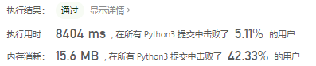

# [456. 132模式](https://leetcode-cn.com/problems/132-pattern/)

给定一个整数序列：a1, a2, ..., an，一个132模式的子序列 a**i**, a**j**, a**k** 被定义为：当 **i** < **j** < **k** 时，a**i** < a**k** < a**j**。设计一个算法，当给定有 n 个数字的序列时，验证这个序列中是否含有132模式的子序列。

**注意：**n 的值小于15000。

**示例1:**

```
输入: [1, 2, 3, 4]

输出: False

解释: 序列中不存在132模式的子序列。
```

**示例 2:**

```
输入: [3, 1, 4, 2]

输出: True

解释: 序列中有 1 个132模式的子序列： [1, 4, 2].
```

**示例 3:**

```
输入: [-1, 3, 2, 0]

输出: True

解释: 序列中有 3 个132模式的的子序列: [-1, 3, 2], [-1, 3, 0] 和 [-1, 2, 0].
```

## 思路

### 暴力穷举（超时）

设置三个值遍历链表，并判断索引按照顺序想排就返回True，否则返回False

```python
class Solution:
    def find132pattern(self, nums: List[int]) -> bool:
        left, mid, right = 0, 0, 0
        left_v, mid_v, right_v = 0, 0, 0
        for i in range(len(nums)):
            left = i
            left_v = nums[i]
            for j in range(left + 1, len(nums)):
                if nums[j] > left_v:
                    mid = j
                    mid_v = nums[j]
                    for k in range(mid + 1, len(nums)):
                        if left_v < nums[k] < mid_v:
                            right = k
                            right_v = nums[k]
                        if left_v < right_v < mid_v and left < mid < right:
                            return True
        return False
```

$O(N^3)$

### 优化的暴力穷举

我选择的方法是维护 132模式 中间的那个数字 3，因为 3 在 132 的中间的数字、也是最大的数字。我们的思路是个贪心的方法：我们要维护的 1 是 3 左边的最小的数字； 2 是 3 右边的比 3 小并且比 1 大的数字。

从左到右遍历一次，遍历的数字是 nums[j]nums[j] 也就是 132 模式中的 3。根据上面的贪心思想分析，我们想让 1 是 3 左边最小的元素，然后使用暴力在 nums[j+1 .. N-1]nums[j+1..N−1] 中找到 132 模式中的 2 就行。

```python
class Solution(object):
    def find132pattern(self, nums):
        N = len(nums)
        numsi = nums[0]
        for j in range(1, N):
            for k in range(N - 1, j, -1):
                if numsi < nums[k] < nums[j]:
                    return True
            numsi = min(numsi, nums[j])
        return False
```



### 单调栈

- 遍历的位置 j 相当于 132 模式中的 3，即 nums[j] ；
- 找到 3 左边的最小元素 为 1，即 nums[i] ；
- 找到 3 右边的比 3 小的最大元素 为 2，即 nums[k] ；

在方法一的做法中，是使用暴力求解得到的 2，很显然时间复杂度比较高。我们想要的 2 其实满足两个条件：

- 比 3 小；
- 在 nums[j+1 .. N-1] 区间的最大元素。

为了找到这样的元素，我们可以使用一个单调递减的「栈」。所谓「单调栈」就是栈中的元素都是依次递增或者递减的，从而方便我们能维护好数组的一个区间内的「最大值」「次大值」等等。

想要求比 3 小的最大元素，则需要一个单调递减的栈。这样的话，最大元素在栈底，次大元素在栈底的第二元素……

具体到本题的实现方式：

- 求任何位置的左边最小的元素 nums[i] ，可以提前遍历一次而得到；
- 使用「单调递减栈」，把 nums[j]  入栈时，需要把栈里面比它小的元素全都 pop 出来，由于越往栈底越大，所以 pop 出的最后一个元素，就是比 3 小的最大元素 nums[k] 。
- 判断如果 nums[i] < nums[k] ，那就说明得到了一个 132 模式。

因为单调栈是建立在 3 的右边的，因此，我们使用从右向左遍历

```python
class Solution(object):
    def find132pattern(self, nums):
        N = len(nums)
        leftMin = [float("inf")] * N
        for i in range(1, N):
            leftMin[i] = min(leftMin[i - 1], nums[i - 1])
        stack = []
        for j in range(N - 1, -1, -1):
            numsk = float("-inf")
            while stack and stack[-1] < nums[j]:
                numsk = stack.pop()
            if leftMin[j] < numsk:
                return True
            stack.append(nums[j])
        return False
```