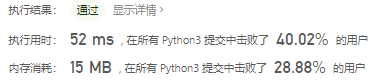
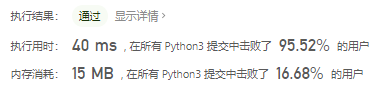
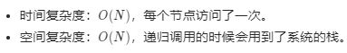
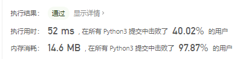
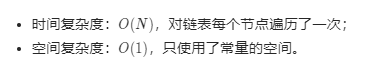
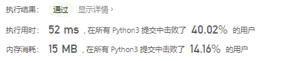
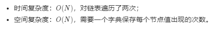

# [82. 删除排序链表中的重复元素 II](https://leetcode-cn.com/problems/remove-duplicates-from-sorted-list-ii/)

给定一个排序链表，删除所有含有重复数字的节点，只保留原始链表中 *没有重复出现* 的数字。

**示例 1:**

```
输入: 1->2->3->3->4->4->5
输出: 1->2->5
```

**示例 2:**

```
输入: 1->1->1->2->3
输出: 2->3
```

## 思路


```python
class Solution(object):
    def deleteDuplicates(self, head):
        # 新生成两个链表

        # tmp链表：
        # 这个链表中只存放一样的元素
        # 所有的新元素都要追加到这里
        # 当发现和tmp中元素不一样的时候
        # 就根据情况，看是否需要把tmp链表中的元素推到
        # ans链表中
        # 由于这里我们要求是没有重复出现过的元素
        # 所以我们只能当tmp链表中结点个数为1的时候
        # 才能把tmp链表放到ans链表中
        tmp = ListNode()
        tmp_tail = tmp

        # ans链表
        # 用来存放返回值
        ans = ListNode()
        ans_tail = ans

        p = head
        while p:
            back = p.next

            # 如果tmp为空，或者与tmp链表中的元素值相同
            if tmp_tail == tmp or tmp_tail.val == p.val:
                tmp_tail.next = p
                tmp_tail = p
            else:
                # 如果与 tmp中的元素不同
                # 1. 如果tmp中只有一个元素
                # 将tmp链表中的元素加到ans中
                if tmp_tail == tmp.next:
                    ans_tail.next = tmp_tail
                    ans_tail = ans_tail.next
                
                # 然后将tmp链表只装上 p这个结点
                tmp.next = p
                tmp_tail = p

            p = back
        
        # 如果tmp中还是只有一个结点
        if tmp_tail == tmp.next:
            ans_tail.next = tmp.next
            ans_tail = ans_tail.next
        
        ans_tail.next = None

        return ans.next
```

没咋看明白这个

```python
if __name__ == '__main__':
    s = Solution()
    list = [1, 2, 3, 3, 4, 4, 5]
    list.reverse()
    head = ListNode()	# 如果是尾插法的话里面应该是ListNode(list[1])
    # for i in range(1, len(list)):
    #	  尾插法
    #     temp = ListNode(list[i])
    #     p = head
    #     while p.next:
    #         p = p.next
    #     p.next = temp
    for i in range(len(list)):
        '''
        头插法
        '''
        temp = ListNode(list[i])
        p = head
        temp.next = p.next
        p.next = temp
    # while p.next:
    #     print(p.next.val)
    #     p = p.next
    c = s.deleteDuplicates(p)
    while c.next:
        print(c.next.val)
        c = c.next
```

> 这个在本地运行的时候头插法才行，尾插法实现的list会有问题



链表和树的问题，一般都可以有递归和迭代两种写法。对于本题一定记住是有序链表，值相同的节点会在一起。

### 递归

deleteDuplicate(head)，含义是删除以head作为开头的有序链表中，值出现重复的节点。

**终止条件**

- 如果`head`为空，那么肯定没有值出现重复的节点，直接返回head。
- 如果`head.next`为空，那么说明链表中只有一个节点，也没有出现值重复的节点，也直接返回head。

**递归调用**

- 如果`head.val != head.next.val`，说明头结点的值不等于下一个节点的值，所以当前的`head`节点必须保留；但是`head.next`节点要不要保留？我们还需对`head.next`进行递归，即对`head.next`作为头结点的链表，去除值重复的节点。所以`head.next=self.deleteDuplicates(head.next)`.
- 如果`head.val == head.next.val`，说明头节点的值等于下一个节点的值，所以当前的`head`节点必须删除；但是`head.next`节点要不要删除，还需要一直向后遍历寻找到与`head.val`不同的节点。与`head.val`相等的这一段链表都要删除，因此返回`deleteDuplicates(head.next)`

**返回结果**

- 如果`head.val != head.next.val`，头结点需要保留，因此返回的是`head`；

- 如果`head.val == head.next.val`，头结点需要删除，需要返回的`deleteDuplicates(move)`

```python
class Solution(object):
    def deleteDuplicates(self, head):
        if not head or not head.next:
            return head
        if head.val != head.next.val:
            head.next = self.deleteDuplicates(head.next)
        else:
            move = head.next
            while move and head.val == move.val:
                move = move.next # 一直移动到不相等 在进入递归
            return self.deleteDuplicates(move)
       return head
```





### 一次遍历

即一边遍历、一边统计相邻节点的值是否相等，如果值相等就继续后移找到值不相等的位置，然后删除这个值相等的区间。

如果`cur.val==cur.next.val`说明两个相邻节点相等，所以继续后移，一直找到`cur.val!=cur.next.val`，此时的`cur.next`就是值不等的节点。

- 比如：`1->2->2->2->3`用pre指向1；当cur指向第一个2时候，发现`cur.val=cur.next.val`，所以出现了值重复的节点，所以cur一直后移到最后一个2的时候发现`cur.val!=cur.next.val`。此时`cur.next=3`，所以`pre.next=cur.next`，即让1的next节点为3，即把中间所有重复的值删除。

  使用dummy节点，哑结点。以为本题而言，我们可能会删除头结点`head`，为了维护一个不变的头节点，所以我们添加了dummy，让`dummy.next=head`，这样即使head被删除了，那么操作`dummy.next`指向新的链表头部，所以最终返回的也是`dummy.next`。

```python
class Solution(object):
    def deleteDuplicates(self, head):
        if not head or not head.next:
            return head
        dummy = ListNode()
        dummy.next = head
        pre = dummy
        cur = head
        while cur:
            while cur.next and cur.val == cur.next.val:
                cur = cur.next
            if pre.next == cur:
                pre = pre.next	# pre往前走一个
            else:
                pre.next = cur.next	# pre的下一个节点为cur下一个节点
            cur = cur.next
        return dummy.next
```





利用计数两次遍历

```python
class Solution(object):
    def deleteDuplicates(self, head):
        dummy = ListNode(0)
        dummy.next = head
        val_list = []
        while head:
            val_list.append(head.val)
            head = head.next
        counter = collections.Counter(val_list)
        head = dummy
        while head and head.next:
            if counter[head.next.val] != 1:
                head.next = head.next.next
            else:
                head = head.next
        return dummy.next
```





js实现

```javascript
var deleteDuplicates = function(head) {
    if(!head || !head.next){
        return head
    }
    dummy = ListNode
    dummy.next = head
    let pre = dummy
    let cur = head
    while(cur!=null){
        while(cur.next!=null && cur.val == cur.next.val){
            cur = cur.next
        }
        if(pre.next == cur){
            pre = pre.next
        }else{
            pre.next = cur.next
        }
        cur = cur.next
    }
    return dummy.next
};
```


> js中定义结构使用dummy=ListNode即可不能使用ListNode() 空元素为null