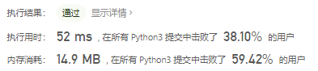
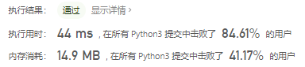
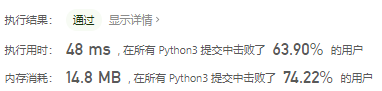
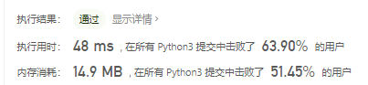
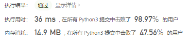

# [83. 删除排序链表中的重复元素](https://leetcode-cn.com/problems/remove-duplicates-from-sorted-list/)

存在一个按升序排列的链表，给你这个链表的头节点 `head` ，请你删除所有重复的元素，使每个元素 **只出现一次** 。

返回同样按升序排列的结果链表。

 

**示例 1：**


```
输入：head = [1,1,2]
输出：[1,2]
```

**示例 2：**


```
输入：head = [1,1,2,3,3]
输出：[1,2,3]
```

 

**提示：**

- 链表中节点数目在范围 `[0, 300]` 内
- `-100 <= Node.val <= 100`
- 题目数据保证链表已经按升序排列

## 思路

```python
class Solution:
    def deleteDuplicates(self, head: ListNode) -> ListNode:
        dummy = ListNode()
        tail = dummy

        p = head

        while p:
            back = p.next
            if tail == dummy or p.val != tail.val:
                tail.next = p
                tail = p
            p = back
        tail.next = None
        return dummy.next
```



### 一次遍历

```python
class Solution(object):
    def deleteDuplicates(self, head):
        if not head:
            return None
        prev, cur = head, head.next
        while cur:
            if cur.val == prev.val:
                prev.next = cur.next
            else:
                prev = cur
            cur = cur.next
        return head
```



### 递归，跳过连续相等的元素

```python
class Solution(object):
    def deleteDuplicates(self, head):
        if not head or not head.next:
            return head
        if head.val != head.next.val:
            head.next = self.deleteDuplicates(head.next)
        else:
            move = head.next
            while move.next and head.val == move.next.val:
                move = move.next
            return self.deleteDuplicates(move)
        return head
```



### 递归，删除下一个相等的元素

```python
class Solution(object):
    def deleteDuplicates(self, head):
        if not head or not head.next: return head
        head.next = self.deleteDuplicates(head.next)
        return head if head.val != head.next.val else head.next
```



### 利用 set 保存出现过的元素

```python
class Solution:
    def deleteDuplicates(self, head):
        if not head or not head.next: return head
        val_set = set()
        val_set.add(head.val)
        root = ListNode(0)
        root.next = head
        while head and head.next:
            if head.next.val in val_set:
                head.next = head.next.next
            else:
                head = head.next
                val_set.add(head.val)
        return root.next
```

