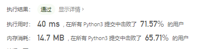
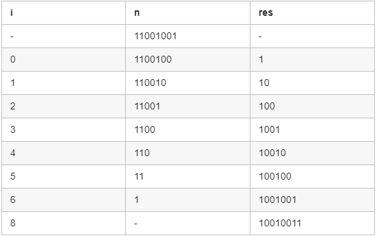
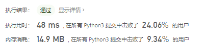
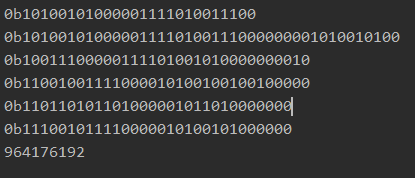
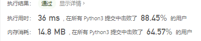

# [190. 颠倒二进制位](https://leetcode-cn.com/problems/reverse-bits/)

颠倒给定的 32 位无符号整数的二进制位。

 

**提示：**

- 请注意，在某些语言（如 Java）中，没有无符号整数类型。在这种情况下，输入和输出都将被指定为有符号整数类型，并且不应影响您的实现，因为无论整数是有符号的还是无符号的，其内部的二进制表示形式都是相同的。
- 在 Java 中，编译器使用[二进制补码](https://baike.baidu.com/item/二进制补码/5295284)记法来表示有符号整数。因此，在上面的 **示例 2** 中，输入表示有符号整数 `-3`，输出表示有符号整数 `-1073741825`。

 

**进阶**:
如果多次调用这个函数，你将如何优化你的算法？

 

**示例 1：**

```
输入: 00000010100101000001111010011100
输出: 00111001011110000010100101000000
解释: 输入的二进制串 00000010100101000001111010011100 表示无符号整数 43261596，
     因此返回 964176192，其二进制表示形式为 00111001011110000010100101000000。
```

**示例 2：**

```
输入：11111111111111111111111111111101
输出：10111111111111111111111111111111
解释：输入的二进制串 11111111111111111111111111111101 表示无符号整数 4294967293，
     因此返回 3221225471 其二进制表示形式为 10111111111111111111111111111111 。
```

**示例 1：**

```
输入：n = 00000010100101000001111010011100
输出：964176192 (00111001011110000010100101000000)
解释：输入的二进制串 00000010100101000001111010011100 表示无符号整数 43261596，
     因此返回 964176192，其二进制表示形式为 00111001011110000010100101000000。
```

**示例 2：**

```
输入：n = 11111111111111111111111111111101
输出：3221225471 (10111111111111111111111111111111)
解释：输入的二进制串 11111111111111111111111111111101 表示无符号整数 4294967293，
     因此返回 3221225471 其二进制表示形式为 10111111111111111111111111111111 。
```

 

**提示：**

- 输入是一个长度为 `32` 的二进制字符串

## 思路

转为字符串然后补零再逆向插入，遇到了几个问题：

- 输入的时候n=0b00000010100101000001111010011100，但是使用bin(n)以后就成了10100101000001111010011100，会把前面的0自己吞了
- 所以做了一个补零机制，小于32位的话就说明前面吞0了，然后把0加上
- res为结果二进制数，初始为0b这样转换的时候就代表了二进制

当然题解中可能存在更好的方法，这里需要进一步学习

```python
class Solution:
    @lru_cache(None)
    def reverseBits(self, n: int) -> int:
        cur = bin(n)
        zero = ''
        while len(zero) < 32 - len(cur[2:]):
            zero = zero + '0'
        cur = zero + cur[2:]
        # print(cur)
        res = '0b'
        for i in range(len(cur) - 1, -1, -1):
            res += cur[i]
        # print(res[2:])
        return int(str(res)[2:], 2)
```


摘除了缓存装饰器，效果更好了



## 题解思路

### 方法1：循环

这是最容易想到的方法了，每次把 `res` 左移，把 n的二进制末尾数字，拼接到结果 `res` 的末尾。然后把 n 右移。

举一个 8 位的二进制进行说明：



```python
class Solution:
    # @param n, an integer
    # @return an integer
    def reverseBits(self, n):
        res = 0
        for i in range(32):
            res = (res << 1) | (n & 1)
            n >>= 1	# n = n >> 1
        return res
```

<< 左移 将所有的0和1的位置进行左移，移位之后将空位补0。

| 或 只要有一位为1就为1

& 有一位为0就为0

通过为运算将res进行更新，判断n最后一位是0还是1放入res



### 方法2：分而治之

有另外一种不使用循环的做法，类似于归并排序。

其思想是分而治之，把数字分为两半，然后交换这两半的顺序；然后把前后两个半段都再分成两半，交换内部顺序……直至最后交换顺序的时候，交换的数字只有 1 位。

以一个 8 位的二进制数字为例：


```python
class Solution:
    # @param n, an integer
    # @return an integer
    def reverseBits(self, n):
        n = (n >> 16) | (n << 16)
        n = ((n & 0xff00ff00) >> 8) | ((n & 0x00ff00ff) << 8)
        n = ((n & 0xf0f0f0f0) >> 4) | ((n & 0x0f0f0f0f) << 4)
        n = ((n & 0xcccccccc) >> 2) | ((n & 0x33333333) << 2)
        n = ((n & 0xaaaaaaaa) >> 1) | ((n & 0x55555555) << 1)
        return n
```



> 0xaaaaaaaa = 10101010101010101010101010101010 (偶数位为1，奇数位为0）
>
> 0x55555555 = 01010101010101010101010101010101 (偶数位为0，奇数位为1）
>
> 0x33333333 = 110011001100110011001100110011 (1和0每隔两位交替出现)
>
> 0xcccccccc = 11001100110011001100110011001100 (0和1每隔两位交替出现)
>
> 0x0f0f0f0f = 00001111000011110000111100001111 (1和0每隔四位交替出现)
>
> 0xf0f0f0f0 = 11110000111100001111000011110000 (0和1每隔四位交替出现)


#### 转为字符串

```python
class Solution:
    def reverseBits(self, n: int) -> int:
        n = '{:032b}'.format(n) # ’{0:032b}’.format(n)将n转化为32位无符号数。
        return int(n[::-1], 2)
```



### 参考

[0x55555555,0xaaaaaaaa...等究竟是什么？](https://blog.csdn.net/u012604810/article/details/80623241)