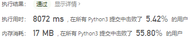
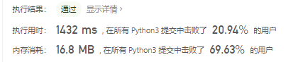
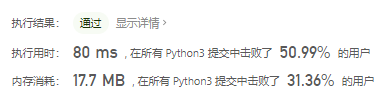

# [304. 二维区域和检索 - 矩阵不可变](https://leetcode-cn.com/problems/range-sum-query-2d-immutable/)

给定一个二维矩阵，计算其子矩形范围内元素的总和，该子矩阵的左上角为 (row1, col1) ，右下角为 (row2, col2)。


上图子矩阵左上角 (row1, col1) = (2, 1) ，右下角(row2, col2) = (4, 3)，该子矩形内元素的总和为 8。

示例:

```
给定 matrix = [
  [3, 0, 1, 4, 2],
  [5, 6, 3, 2, 1],
  [1, 2, 0, 1, 5],
  [4, 1, 0, 1, 7],
  [1, 0, 3, 0, 5]
]

sumRegion(2, 1, 4, 3) -> 8
sumRegion(1, 1, 2, 2) -> 11
sumRegion(1, 2, 2, 4) -> 12
```


说明:

- 你可以假设矩阵不可变。
- 会多次调用 sumRegion 方法。
- 你可以假设 row1 ≤ row2 且 col1 ≤ col2。

## 思路

先来一手暴力破解，找到起始索引和结束索引然后求和

```python
class NumMatrix:

    def __init__(self, matrix: List[List[int]]):
        self.init = matrix

    def sumRegion(self, row1: int, col1: int, row2: int, col2: int) -> int:
        res = 0
        for i in range(row1, row2 + 1):
            for j in range(col1, col2 + 1):
                res += self.init[i][j]
        return res


# Your NumMatrix object will be instantiated and called as such:
# obj = NumMatrix(matrix)
# param_1 = obj.sumRegion(row1,col1,row2,col2)
```



然后优化代码逻辑，每次找这行的总和即可

```python
class NumMatrix:

    def __init__(self, matrix: List[List[int]]):
        self.init = matrix

    def sumRegion(self, row1: int, col1: int, row2: int, col2: int) -> int:
        res = 0
        for i in range(row1, row2 + 1):
            res += sum(self.init[i][col1:col2+1])
        return res
```



根据昨天的题目，该题应该还有一种时间复杂度为线性的解法，但是根据前缀和的解法没有弄明白。

#### 参考题解

##### 步骤1：求preSum

首先定义preSum\[i][j]表示从[0,0]位置到[i,j]位置的子矩形所有元素和。

$S(O,D)=S(O,C)+S(O,B)−S(O,A)+D$


减去 S(O, A) 的原因是 S(O, C)和 S(O, B) 中都有 S(O, A)，即加了两次 S(O, A)，所以需要减去一次 S(O, A)。

如果用 preSum 表示的话，对应了以下的递推公式：

$preSum[i+1][j+1]=preSum[i][j+1]+preSum[i+1][j]−preSum[i][j]+matrix[i][j]$

##### 步骤2：根据preSum求子矩形面积

前面已经求出了数组中从[0,0]位置到[i,j]位置的preSum。下面要利用$preSum[i][j]$来快速求出任意子矩形的面积。

$S(A,D)=S(O,D)−S(O,E)−S(O,F)+S(O,G)$


加上子矩形 S(O, G)面积的原因是 S(O, E) 和 S(O, F) 中都有 S(O, G)，即减了两次 S(O, G)，所以需要加上一次 S(O,G)。

如果要求 \[row1, col1]到 \[row2, col2]的子矩形的面积的话，用 preSum 对应了以下的递推公式：

$preSum[row2][col2] - preSum[row2][col1 - 1] - preSum[row1 - 1][col2] + preSum[row1 - 1][col1 - 1]
preSum[row2][col2]−preSum[row2][col1−1]−preSum[row1−1][col2]+preSum[row1−1][col1−1]$

使用的 preSum 比原矩阵 matrix 多了一行一列，是为了让第 0 行与第 0 列的元素也能使用上面的递推公式。如果 preSum 矩阵大小和 martix 大小相等，则需要对第 0 行与第 0 列特殊判断。

代码如下：

```python
class NumMatrix:

    def __init__(self, matrix: List[List[int]]):
        if not matrix or not matrix[0]:
            M, N = 0, 0
        else:
            M, N = len(matrix), len(matrix[0])
        self.preSum = [[0] * (N + 1) for _ in range(M + 1)]
        for i in range(M):
            for j in range(N):
                self.preSum[i+1][j+1] = self.preSum[i][j+1] + self.preSum[i+1][j] - self.preSum[i][j] + matrix[i][j]

    def sumRegion(self, row1: int, col1: int, row2: int, col2: int) -> int:
        return self.preSum[row2+1][col2+1]-self.preSum[row2+1][col1] - self.preSum[row1][col2+1] + self[row1][col1]
```

采用了计算前缀和的方式，以空间换时间。

