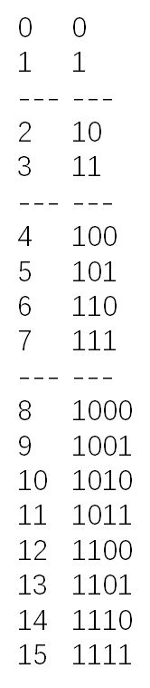

# [338. 比特位计数](https://leetcode-cn.com/problems/counting-bits/)

给定一个非负整数 **num**。对于 **0 ≤ i ≤ num** 范围中的每个数字 **i** ，计算其二进制数中的 1 的数目并将它们作为数组返回。

**示例 1:**

```
输入: 2
输出: [0,1,1]
```

**示例 2:**

```
输入: 5
输出: [0,1,1,2,1,2]
```

**进阶:**

- 给出时间复杂度为**O(n*sizeof(integer))**的解答非常容易。但你可以在线性时间O(n)内用一趟扫描做到吗？
- 要求算法的空间复杂度为O(n)。
- 你能进一步完善解法吗？要求在C++或任何其他语言中不使用任何内置函数（如 C++ 中的 **__builtin_popcount**）来执行此操作。

## 思路

自己想的是每次去找每个数中1的个数，但是发现这样的话时间太长了，然后看到了一个c的题解，感觉可以参考一下。

- 可以找到这样一个规律，整个分布是有一定的规律，4-7跟2-3有关，8-15和4-7有关，分别是该索引除2然后根据奇偶性判断是加0还是加1。
- 然而，要建立循环首先要初始化前四个元素，所以根据不同条件建立四种五种情况的判断语句。



```python
class Solution:
    def countBits(self, num: int) -> List[int]:
        res = []
        res.append(0)
        if num == 0:
            return res
        res.append(1)
        if num == 1:
            return res
        res.append(1)
        if num == 2:
            return res
        res.append(2)
        if num == 3:
            return res
        n = 4
        while n <= num:
            if n % 2 == 0: # 当n为偶数直接除2
                res.append(res[n // 2])
            else: # 当n为奇数，找到偶数项除2然后加1
                res.append(res[(n - 1) // 2] + 1)
            n += 1
        return res
```


然后我想了一下前面四个元素可以先建立起来，然后直接从4开始找即可。

```python
class Solution:
    def countBits(self, num: int) -> List[int]:
        res = [0, 1, 1, 2]
        if num <= 3:
            return res[0:num + 1]
        for i in range(4, num + 1):
            if i % 2:
                res.append(res[(i - 1) // 2] + 1)
            else:
                res.append(res[i // 2])
        return res
```


参考了提交记录中用时最短的代码，发现这个思路和我最初的建立res的想法相同，但是当时没有想明白个数怎么记录。

该实现方式是根据num来初始定义res长度然后每次更新基于该位的除2的值，然后根据该位的奇偶性判断是否加1，代码实现如下：

```python
class Solution:
    def countBits(self, num: int) -> List[int]:
        res = [0] * (num + 1)
        for i in range(1, num + 1):
            res[i] = res[i//2] + (i & 1)  # i&1可以判断尾数是否为1，即奇偶性判定
        return res
```

## 题解思路大全

https://leetcode-cn.com/problems/counting-bits/solution/yi-bu-bu-fen-xi-tui-dao-chu-dong-tai-gui-3yog/

方法一：遍历统计每个数字二进制中1的个数

```python
class Solution:
    def countBits(self, num: int) -> List[int]:
        res = []
        for i in range(num + 1):
            res.append(bin(i).count("1"))
        return res
```


然后我稍微改了一下，先建立结果list，内存会少一点

```python
class Solution:
    def countBits(self, num: int) -> List[int]:
        res = [0] * (num + 1)
        for i in range(1, num + 1):
            res[i] = bin(i).count('1')  # bin()函数可以将其中元素转换为二进制
        return res
```


方法二：递归

相当于每次除二去找，如果最后一次除2为奇数那就加1，如果不是就不加（返回0）。

```python
class Solution:
    def countBits(self, num: int) -> List[int]:
        res = []
        for i in range(num + 1):
            res.append(self.count(i))
        return res
    def count(self,num):
        if num == 0:
            return 0
        if num % 2 == 1:
            return self.count(num - 1) + 1
        return self.count(num//2)
```


方法三：记忆化搜索

优化递归，将每次递归的结果保存起来

举个例子，比如 i = 8 的时候，需要求 i = 4的情况，而 i = 4 的情况在之前已经计算过了，因此直接返回 memo[4] 即可。

```python
class Solution(object):
    def countBits(self, num):
        self.memo = [0] * (num + 1)
        res = []
        for i in range(num + 1):
            res.append(self.count(i))
        return res

    def count(self, num):
        if num == 0:
            return 0
        if self.memo[num] != 0:
            return self.memo[num]
        if num % 2 == 1:
            res = self.count(num - 1) + 1
        else:
            res = self.count(num // 2)
        self.memo[num] = res  # 更新memo
        return res
```


方法四：动态规划

其实很多时候，动态规划的方法都是从记忆化递归中优化出来的。本题也可以如此。

上面在记忆化搜索过程中，我们看到其实每次调用递归函数的时候，递归函数只会运行一次，就被 memo 捕获并返回了。那么其实可以去除递归函数，直接从 res 数组中查结果。

于是得到下面的动态规划的方案。

```python
class Solution:
    def countBits(self, num: int) -> List[int]:
        res = [0] * (num + 1)
        for i in range(1, num + 1):
            res[i] = res[i >> 1] + (i & 1)  # i&1可以判断尾数是否为1，即奇偶性判定
        return res
```


不同的是用i>>1更换i//2，基本原理相同。