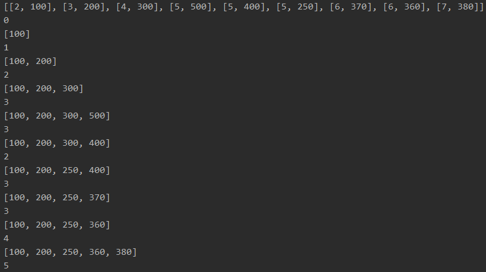
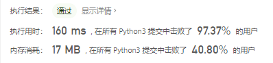
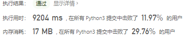

# [354. 俄罗斯套娃信封问题](https://leetcode-cn.com/problems/russian-doll-envelopes/)

给定一些标记了宽度和高度的信封，宽度和高度以整数对形式 (w, h) 出现。当另一个信封的宽度和高度都比这个信封大的时候，这个信封就可以放进另一个信封里，如同俄罗斯套娃一样。

请计算最多能有多少个信封能组成一组“俄罗斯套娃”信封（即可以把一个信封放到另一个信封里面）。

说明:
不允许旋转信封。

示例:

```
输入: envelopes = [[5,4],[6,4],[6,7],[2,3]]
输出: 3 
解释: 最多信封的个数为 3, 组合为: [2,3] => [5,4] => [6,7]。
```

## 思路

能想到动态规划，但是不熟。

关联最长上升子序列，定义dp[i]表示以i结尾的最长递增子序列长度。对每个位置，遍历[0,i)，对两个维度同时判断是否严格递增（不可相等）的，如果是的话，dp[i] = max(dp[i],dp[j]+1)。

参考：[两个维度的最长递增子序列 - 俄罗斯套娃信封问题 - 力扣（LeetCode） (leetcode-cn.com)](https://leetcode-cn.com/problems/russian-doll-envelopes/solution/liang-ge-wei-du-de-zui-chang-di-zeng-zi-ctbmd/)

对于(2,3)最长为1，对于（5，4）最长为2，对于（6，4）最长为2，对于（6，7）最长为3。

```python
class Solution:
    def maxEnvelopes(self, envelopes: List[List[int]]) -> int:
        if not envelopes:
            return 0
        N = len(envelopes)
        envelopes.sort()
        dp = [1] * N
        for i in range(N):
            for j in range(i):
                if envelopes[j][0] < envelopes[i][0] and envelopes[j][1] < envelopes[i][1]:
                    dp[i] = max(dp[i], dp[j]+1)
        return max(dp)
```

还有一个算法是w正着排，h逆着排，然后往tail中插入，找到最长上升子序列

```python
class Solution:
    def maxEnvelopes(self, envelopes: List[List[int]]) -> int:
        if not envelopes:
            return 0
        envelopes.sort(key=lambda e: (e[0], -e[1]))  # 一个正着排一个逆着排
        print(envelopes)
        tail = []
        for a, b in envelopes:
            index = bisect.bisect_left(tail, b)  # 返回b插入tail的位置
            print(index)
            if index == len(tail):
                tail.append(b)
            else:
                tail[index] = b
            print(tail)
        return len(tail)
```





下面这个也是w增h逆，但是后面还是用动态规划做的

```python
class Solution:
    def maxEnvelopes(self, envelopes: List[List[int]]) -> int:
        if not envelopes:
            return 0
        N = len(envelopes)
        envelopes.sort(key=lambda x: (x[0], -x[1]))
        dp = [1] * N
        for i in range(N):
            for j in range(i):
                if envelopes[j][1] < envelopes[i][1]:
                    dp[i] = max(dp[i], dp[j] + 1)
        return max(dp)
```




