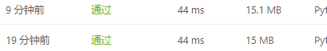
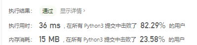
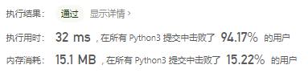
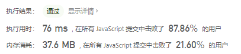

# [232. 用栈实现队列](https://leetcode-cn.com/problems/implement-queue-using-stacks/)

你仅使用两个栈实现先入先出队列。队列应当支持一般队列的支持的所有操作（push、pop、peek、empty）：

实现 `MyQueue` 类：

- void push(int x) 将元素 x 推到队列的末尾
- int pop() 从队列的开头移除并返回元素
- int peek() 返回队列开头的元素
- boolean empty() 如果队列为空，返回 true ；否则，返回 false


说明：

- 你只能使用标准的栈操作 —— 也就是只有 push to top, peek/pop from top, size, 和 is empty 操作是合法的。
- 你所使用的语言也许不支持栈。你可以使用 list 或者 deque（双端队列）来模拟一个栈，只要是标准的栈操作即可。


进阶：

- 你能否实现每个操作均摊时间复杂度为 O(1) 的队列？换句话说，执行 n 个操作的总时间复杂度为 O(n) ，即使其中一个操作可能花费较长时间。

示例：

```
输入：
["MyQueue", "push", "push", "peek", "pop", "empty"]
[[], [1], [2], [], [], []]
输出：
[null, null, null, 1, 1, false]

解释：
MyQueue myQueue = new MyQueue();
myQueue.push(1); // queue is: [1]
myQueue.push(2); // queue is: [1, 2] (leftmost is front of the queue)
myQueue.peek(); // return 1
myQueue.pop(); // return 1, queue is [2]
myQueue.empty(); // return false
```


提示：

- 1 <= x <= 9
- 最多调用 100 次 push、pop、peek 和 empty
- 假设所有操作都是有效的 （例如，一个空的队列不会调用 pop 或者 peek 操作）

## 思路

模拟双端队列，对于python而言list自身就能够完成双端队列的操作，比较简单，代码如下：

```python
class MyQueue:

    def __init__(self):
        """
        Initialize your data structure here.
        """
        self.init = []


    def push(self, x: int) -> None:
        """
        Push element x to the back of queue.
        """
        self.init.append(x)


    def pop(self) -> int:
        """
        Removes the element from in front of queue and returns that element.
        """
        cur = self.init[0]
        self.init.remove(self.init[0])
        return cur


    def peek(self) -> int:
        """
        Get the front element.
        """
        return self.init[0]


    def empty(self) -> bool:
        """
        Returns whether the queue is empty.
        """
        if len(self.init) == 0:
            return True
        else:
            return False


# Your MyQueue object will be instantiated and called as such:
# obj = MyQueue()
# obj.push(x)
# param_2 = obj.pop()
# param_3 = obj.peek()
# param_4 = obj.empty()
```



只用了一个list不符合题目要求，所以转换下思路想想连个list的，在\__init__中定义两个list然后在pop操作中用init2代替cur，效率大为提高，但此时我不明白为什么，是因为每次在pop中新定义cur 的问题吗

```python
class MyQueue:

    def __init__(self):
        """
        Initialize your data structure here.
        """
        self.init1 = []
        self.init2 = []


    def push(self, x: int) -> None:
        """
        Push element x to the back of queue.
        """
        self.init1.append(x)


    def pop(self) -> int:
        """
        Removes the element from in front of queue and returns that element.
        """
        if len(self.init2) != 0:
            self.init2[0] = self.init1[0]
        else:
            self.init2.append(self.init1[0])
        self.init1.remove(self.init1[0])
        return self.init2[0]


    def peek(self) -> int:
        """
        Get the front element.
        """
        return self.init1[0]


    def empty(self) -> bool:
        """
        Returns whether the queue is empty.
        """
        if len(self.init1) == 0:
            return True
        else:
            return False
```



优化了empty的机制

```python
class MyQueue:

    def __init__(self):
        """
        Initialize your data structure here.
        """
        self.init1 = []
        self.init2 = []


    def push(self, x: int) -> None:
        """
        Push element x to the back of queue.
        """
        self.init1.append(x)


    def pop(self) -> int:
        """
        Removes the element from in front of queue and returns that element.
        """
        if len(self.init2) != 0:
            self.init2[0] = self.init1[0]
        else:
            self.init2.append(self.init1[0])
        self.init1.remove(self.init1[0])
        return self.init2[0]


    def peek(self) -> int:
        """
        Get the front element.
        """
        return self.init1[0]


    def empty(self) -> bool:
        """
        Returns whether the queue is empty.
        """
        return len(self.init1) == 0
```



### js解法

```javascript
/**
 * Initialize your data structure here.
 */
var MyQueue = function(self) {
    this.init1 = new Array();
};

/**
 * Push element x to the back of queue.
 * @param {number} x
 * @return {void}
 */
MyQueue.prototype.push = function(x) {
    this.init1.push(x);
};

/**
 * Removes the element from in front of queue and returns that element.
 * @return {number}
 */
MyQueue.prototype.pop = function() {
    const cur = this.init1[0];
    this.init1.shift();
    return cur;
};

/**
 * Get the front element.
 * @return {number}
 */
MyQueue.prototype.peek = function() {
    return this.init1[0];
};

/**
 * Returns whether the queue is empty.
 * @return {boolean}
 */
MyQueue.prototype.empty = function() {
    return this.init1.length === 0;
};

/**
 * Your MyQueue object will be instantiated and called as such:
 * var obj = new MyQueue()
 * obj.push(x)
 * var param_2 = obj.pop()
 * var param_3 = obj.peek()
 * var param_4 = obj.empty()
 */
```




### 题解解法

- 栈：后进先出
- 队列：先进先出


```python
class MyQueue(object):

    def __init__(self):
        self.stack1 = []
        self.stack2 = []

    def push(self, x):
        self.stack1.append(x)

    def pop(self):
        if not self.stack2:
            while self.stack1:
                self.stack2.append(self.stack1.pop())
        return self.stack2.pop()

    def peek(self):
        if not self.stack2:
            while self.stack1:
                self.stack2.append(self.stack1.pop())
        return self.stack2[-1]

    def empty(self):
        return not self.stack1 and not self.stack2
```

思路是：**「输入栈」会把输入顺序颠倒；如果把「输入栈」的元素逐个弹出放到「输出栈」，再从「输出栈」弹出元素的时候，则可以负负得正，实现了先进先出**。

具体做法：

- 可以把一个栈当做「输入栈」，把另一个栈当做「输出栈」。
- 当 push() 新元素的时候，放到「输入栈」的栈顶，记此顺序为「输入序」。
- 当 pop() 元素的时候，是从「输出栈」弹出元素。如果「输出栈」为空，则把「输入栈」的元素逐个 pop() 并且 push() 到「输出栈」中，这一步会把「输入栈」的栈底元素放到了「输出栈」的栈顶。此时负负得正，从「输出栈」的 pop() 元素的顺序与「输入序」相同。


```python
class MyQueue(object):

    def __init__(self):
        self.stack1 = []
        self.stack2 = []

    def push(self, x):
        self.stack1.append(x)

    def pop(self):
        if not self.stack2:
            while self.stack1:
                self.stack2.append(self.stack1.pop())
        return self.stack2.pop()

    def peek(self):
        if not self.stack2:
            while self.stack1:
                self.stack2.append(self.stack1.pop())
        return self.stack2[-1]

    def empty(self):
        return not self.stack1 and not self.stack2
```

