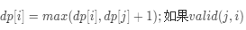

# [132. 分割回文串 II](https://leetcode-cn.com/problems/palindrome-partitioning-ii/)

给你一个字符串 s，请你将 s 分割成一些子串，使每个子串都是回文。

返回符合要求的 最少分割次数 。

 示例 1：

```
输入：s = "aab"
输出：1
解释：只需一次分割就可将 s 分割成 ["aa","b"] 这样两个回文子串。
```


示例 2：

```
输入：s = "a"
输出：0
```


示例 3：

```
输入：s = "ab"
输出：1
```

**提示：**

- 1 <= s.length <= 2000
- s 仅由小写英文字母组成

## 思路

与昨天的分割回文串不同，此题的目的是求出最少分割次数，参考题解[相同的思路：从最长递增子序列谈起](https://leetcode-cn.com/problems/palindrome-partitioning-ii/solution/xiang-tong-de-si-lu-cong-zui-chang-di-ze-9kfm/)单词s的长度可达两千，使用$O(N*2^N)$的时间复杂度一定会超时。

### 最长递增子序列

在最长递增子序列中使用了动态规划。dp[i]表示以i结尾的最长递增子序列的长度。对于每个i的位置，遍历[0,i)，对判断是否是nums[i]是否大于dp[j]的，如果是，dp[i] = max(dp[i],dp[j]+1)

dp[i]要求的以0\~i子数组的状态，它与0\~j子数组的状态和j~i子数组的有效性有关。即：



### 分割回文串的最少次数

关键是valid(j,i)的区别

- 最长递增子序列中的valid(j,i)=nums[j]<nums[i]，即nums[i]大于nums[j]
- 分割回文串的最少次数的valid(j,i)=isPalindrome(s[j+1...i])，即子字符串s[j...i]需要时回文串

与最长递增子序列类似，采用动态规划

- 状态定义：dp[i]是以i结尾的分割成回文串的最少次数；
- 状态转移方程：dp[i]=min(dp[i],dp[j]+1);如果isPalindrome(s[j+1...i])。

根据定义，dp[i]是以i结尾的分割成回文串的最少次数，那么dp[j]是以j结尾的分割成回文串的最少次数。只有子字符串dp[j+1...i]是回文字符串时，dp[i]可以通过dp[j]加上一个回文字符串s[j+1...i]而得到。我们遍历所有的$j\in[0,i-1]$，dp[i]就是所有的s[j+1...i]是回文字符串的情况下dp[j]的最小值+1。


上面的分析思路和最长递增子序列问题完全一样，只替换了 valid(j, i)。如果觉得不好理解的话，建议把本题和最长递增子序列问题一起琢磨琢磨。

另外，本题有个特殊的边界条件需要考虑：上面的分析中 dp[i] 都是通过 dp[j] 转移得到，其实如果 s[0..j] 本身也是个回文字符串，那么根本就不需要分割，也就无需从 dp[j] 转移得到，此时的 dp[i] = 0.

```python
class Solution:
    def minCut(self, s: str) -> int:
        N = len(s)
        dp = [N] * N  # 初始值设置最大
        for i in range(N):
            if self.isPalindrome(s[0:i + 1]):
                dp[i] = 0
                continue
            for j in range(i):
                if self.isPalindrome(s[j+1:i+1]):
                    dp[i] = min(dp[i], dp[j] + 1)
        return dp[N - 1]

    def isPalindrome(self, s):
        return s == s[::-1]
```

### 参考题解

看到了一个贼快的题解但是感觉偷鸡性质比较强，参考一下

```python
class Solution:
    def minCut(self, s: str) -> int:
        if s == s[::-1]:	# 首先判断整个字符串是否已经是回文字符串，如果已经是回文那么就不用分割
            return 0
        for i in range(1, len(s) + 1):	# 使用python切片地性质，判断是否分割一次之后字符串变满足需求
            if s[:i] == s[:i][::-1] and s[i:] == s[i:][::-1]:
                return 1
       
        n = list(range(-1,len(s)))	# 建立一个-1~len(s)-1的list
        for i in range(len(s)):
            r1, r2 = 0, 0
            
            while i-r1 >= 0 and i+r1 < len(s) and s[i-r1] == s[i+r1]:	# 如果i-r1大于等于0且i+r1小于s长度且s[i-r1]等于s[i+r1]，即符合回文
                n[i+r1+1] = min(n[i+r1+1],n[i-r1]+1)
                r1 += 1
                
            while i-r2 >= 0 and i+r2+1 < len(s) and s[i-r2] == s[i+r2+1]:
                n[i+r2+2] = min(n[i+r2+2],n[i-r2]+1)
                r2 += 1
                
        return n[-1]
```

