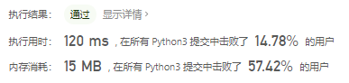
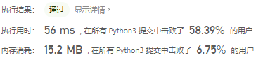
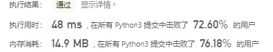

# [496. 下一个更大元素 I](https://leetcode-cn.com/problems/next-greater-element-i/)

给你两个 没有重复元素 的数组 `nums1` 和 `nums2` ，其中`nums1` 是 `nums2` 的子集。

请你找出 `nums1` 中每个元素在 `nums2` 中的下一个比其大的值。

`nums1` 中数字 `x` 的下一个更大元素是指 `x` 在 `nums2` 中对应位置的右边的第一个比 `x` 大的元素。如果不存在，对应位置输出 `-1` 。

示例 1:

```
输入: nums1 = [4,1,2], nums2 = [1,3,4,2].
输出: [-1,3,-1]
解释:
    对于 num1 中的数字 4 ，你无法在第二个数组中找到下一个更大的数字，因此输出 -1 。
    对于 num1 中的数字 1 ，第二个数组中数字1右边的下一个较大数字是 3 。
    对于 num1 中的数字 2 ，第二个数组中没有下一个更大的数字，因此输出 -1 。
```

示例 2:

```
输入: nums1 = [2,4], nums2 = [1,2,3,4].
输出: [3,-1]
解释:
    对于 num1 中的数字 2 ，第二个数组中的下一个较大数字是 3 。
    对于 num1 中的数字 4 ，第二个数组中没有下一个更大的数字，因此输出 -1 。
```


提示：

- `1 <= nums1.length <= nums2.length <= 1000`
- `0 <= nums1[i], nums2[i] <= 10^4`
- `nums1`和`nums2`中所有整数 **互不相同**
- `nums1` 中的所有整数同样出现在 `nums2` 中

**进阶：**你可以设计一个时间复杂度为 `O(nums1.length + nums2.length)` 的解决方案吗？

# 思路

关联[503. 下一个更大元素 II](https://leetcode-cn.com/problems/next-greater-element-ii/)

先来一个暴力破解的思路，遍历nums1找到nums1中每个元素在nums2中的位置，然后遍历nums2[num1位置:len(nums2)]，然后存入到结果列表中。

```python
class Solution:
    def nextGreaterElement(self, nums1: List[int], nums2: List[int]) -> List[int]:
        res = [0] * len(nums1)
        for i in range(len(nums1)):
            if i == max(nums2):
                res[i] = -1
            cur = nums2.index(nums1[i])
            for j in range(cur, len(nums2)):
                if nums2[j] > nums1[i]:
                    res[i] = nums2[j]
                    break
                elif j == len(nums2)-1:
                    res[i] = -1

        return res
```




### 优化版暴力破解

```python
class Solution:
    def nextGreaterElement(self, nums1: List[int], nums2: List[int]) -> List[int]:
        dic = {} # 设置一个字典

        for i in range(len(nums2)):	# 遍历nums2
            j = i + 1
            while j < len(nums2) and nums2[i] >= nums2[j]:	# 当j小于nums2长度且当前元素小于被比较元素，j加1
                j += 1
            if j < len(nums2) and nums2[i] < nums2[j]:	# 如果j小于nums2长度且当前项大，dic中key为nums2[i]的value为nums2[j]
                dic[nums2[i]] = nums2[j]
        return [dic.get(x, -1) for x in nums1] # 遍历nums1找到与之对应的value，否则返回-1
```

dic表示比当前元素的下一个更大元素



### 单调栈

- 向右找第一个比自己大的位置——从右向左维护一个单调递减栈

```python
class Solution:
    def nextGreaterElement(self, nums1: List[int], nums2: List[int]) -> List[int]:
        dic, stack = {}, []

        for i in range(len(nums2) - 1, -1, -1):
            while stack and stack[-1] <= nums2[i]:
                stack.pop()
            if stack: 
                dic[nums2[i]] = stack[-1]
            stack.append(nums2[i])

        return [dic.get(x, -1) for x in nums1]
```

用列表实现栈结构

- 从左向右维护单调栈，找元素右侧区域，第一个比自己大的位置

```python
class Solution:
    def nextGreaterElement(self, nums1: List[int], nums2: List[int]) -> List[int]:
        dic, stack = {}, []	# dic为带索引的下一个更大元素的字典，stack模拟栈

        for i in range(len(nums2)):	# 遍历nums2
            while stack and stack[-1] <= nums2[i]:	# 当栈不为空并且栈顶元素小于nums2时，更新dic中元素
                dic[stack.pop()] = nums2[i]	# stack.pop()弹栈，然后存入
            stack.append(nums2[i])	# 入栈

        return [dic.get(x, -1) for x in nums1] # 找到nums1中在dic中的value即为结果数组
```

