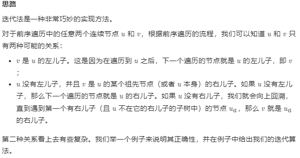

# 105. 从前序与中序遍历序列构造二叉树

根据一棵树的前序遍历与中序遍历构造二叉树。

**注意:**
你可以假设树中没有重复的元素。

例如，给出
```
前序遍历 preorder = [3,9,20,15,7]
中序遍历 inorder = [9,3,15,20,7]
```
返回如下的二叉树：

```
    3
   / \
  9  20
    /  \
   15   7
```

## 思路

对于这样一个给出了前序遍历和中序遍历的二叉树，首先要将根节点构建出来，然后根据每层的根节点将其他节点都构建进去。

```python
# Definition for a binary tree node.
# class TreeNode:
#     def __init__(self, val=0, left=None, right=None):
#         self.val = val
#         self.left = left
#         self.right = right
class Solution:
    def buildTree(self, preorder: List[int], inorder: List[int]) -> TreeNode:
        if not preorder or not inorder:
            return None # 结束递归的条件，啥都没了就返回None
        root = TreeNode(preoder[0])
        index = inorder.index(root.val) # 当前根节点的索引
        left_node = self.buildTree(preorder[1:index 
                                           +1],inorder[:index])
        right_node = self.buildTree(preorder[index + 1:],inorder[index+1:])
        root.right = right_node
        root.left = left_node
```


提交的时候看到的算法，先建立哈希表然后再递归这样能减少时间复杂度

```python
# Definition for a binary tree node.
# class TreeNode:
#     def __init__(self, val=0, left=None, right=None):
#         self.val = val
#         self.left = left
#         self.right = right
class Solution:
    def buildTree(self, preorder: List[int], inorder: List[int]) -> TreeNode:
        inorder_map = {v:i for i, v in enumerate(inorder)}

        def _build(preorder, inorder, pl, pr, il, ir):
            if pl > pr:
                return None

           
            root_val = preorder[pl]


            root_idx = inorder_map[root_val]

            left_size = root_idx - il
            root = TreeNode(root_val)


            root.left = _build(preorder, inorder, pl+1, pl+left_size, il, root_idx-1)
            root.right = _build(preorder, inorder, pl+left_size+1, pr, root_idx+1, ir)

            return root
        
        return _build(preorder, inorder, 0, len(preorder)-1, 0, len(inorder)-1)
```

递归




```python
class Solution:
    def buildTree(self, preorder: List[int], inorder: List[int]) -> TreeNode:
        if not preorder:
            return None

        root = TreeNode(preorder[0])
        stack = [root]
        inorderIndex = 0
        for i in range(1, len(preorder)):
            preorderVal = preorder[i]
            node = stack[-1]
            if node.val != inorder[inorderIndex]:
                node.left = TreeNode(preorderVal)
                stack.append(node.left)
            else:
                while stack and stack[-1].val == inorder[inorderIndex]:
                    node = stack.pop()
                    inorderIndex += 1
                node.right = TreeNode(preorderVal)
                stack.append(node.right)

        return root
```

作者：LeetCode-Solution
链接：https://leetcode-cn.com/problems/construct-binary-tree-from-preorder-and-inorder-traversal/solution/cong-qian-xu-yu-zhong-xu-bian-li-xu-lie-gou-zao-9/


