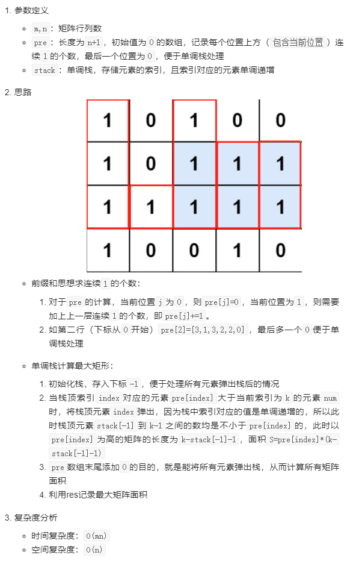
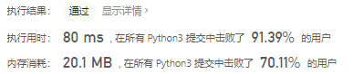

# [85. 最大矩形](https://leetcode-cn.com/problems/maximal-rectangle/)

给定一个仅包含 `0` 和 `1` 、大小为 `rows x cols` 的二维二进制矩阵，找出只包含 `1` 的最大矩形，并返回其面积。

**示例 1：**


```
输入：matrix = [["1","0","1","0","0"],["1","0","1","1","1"],["1","1","1","1","1"],["1","0","0","1","0"]]
输出：6
解释：最大矩形如上图所示。
```

**示例 2：**

```
输入：matrix = []
输出：0
```

**示例 3：**

```
输入：matrix = [["0"]]
输出：0
```

**示例 4：**

```
输入：matrix = [["1"]]
输出：1
```

**示例 5：**

```
输入：matrix = [["0","0"]]
输出：0
```


**提示：**

- `rows == matrix.length`
- `cols == matrix[0].length`
- `0 <= row, cols <= 200`
- `matrix[i][j] 为 '0' 或 '1'`

## 思路

最初的想法使用暴力破解求，但是能看出来这是一道求前缀和的题，但考虑的问题还是少了，没考虑向上求解只考虑了向下求。

参考[Python3 前缀和+单调栈计算最大矩形 - 最大矩形 - 力扣（LeetCode） (leetcode-cn.com)](https://leetcode-cn.com/problems/maximal-rectangle/solution/python3-qian-zhui-he-dan-diao-zhan-ji-su-vkpp/)



```python
class Solution:
    def maximalRectangle(self, matrix: List[List[str]]) -> int:
        if len(matrix) == 0:
            return 0
        m, n = len(matrix), len(matrix[0])
        pre = [0] * (n + 1)
        res = 0
        for i in range(m):
            for j in range(n):
                # 前缀和
                pre[j] = pre[j] + 1 if matrix[i][j] == "1" else 0

            # 单调栈
            stack = [-1]
            for k, num in enumerate(pre):
                while stack and pre[stack[-1]] > num:
                    index = stack.pop()
                    res = max(res, pre[index] * (k - stack[-1] - 1))
                stack.append(k)
        return res
```

