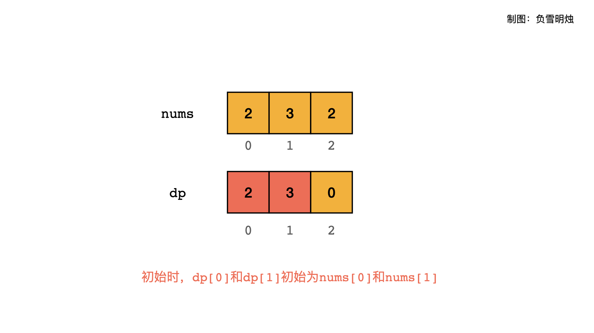

# [198. 打家劫舍](https://leetcode-cn.com/problems/house-robber/)

你是一个专业的小偷，计划偷窃沿街的房屋。每间房内都藏有一定的现金，影响你偷窃的唯一制约因素就是相邻的房屋装有相互连通的防盗系统，**如果两间相邻的房屋在同一晚上被小偷闯入，系统会自动报警**。

给定一个代表每个房屋存放金额的非负整数数组，计算你 **不触动警报装置的情况下** ，一夜之内能够偷窃到的最高金额。

 

**示例 1：**

```
输入：[1,2,3,1]
输出：4
解释：偷窃 1 号房屋 (金额 = 1) ，然后偷窃 3 号房屋 (金额 = 3)。
     偷窃到的最高金额 = 1 + 3 = 4 。
```

**示例 2：**

```
输入：[2,7,9,3,1]
输出：12
解释：偷窃 1 号房屋 (金额 = 2), 偷窃 3 号房屋 (金额 = 9)，接着偷窃 5 号房屋 (金额 = 1)。
     偷窃到的最高金额 = 2 + 9 + 1 = 12 。
```

 

**提示：**

- `0 <= nums.length <= 100`
- `0 <= nums[i] <= 400`

## 思路

对于「求数组中按照某种方法进行选择，求最值，而不用知道具体选择方案」的问题，可以考虑动态规划。动态规划最基本的是「状态的定义」，然后比较难的是「状态转移方程」。

「状态的定义」即 dp[i]，一般可以根据题意，题目要求什么我们就定义什么。比如本题，我们定义 dp[i]为**数组的前 i 个元素**中按照「两个相邻的房间不能同时偷」的方法，能够获取到的最大值。（经验：定义dp[i]为数组的前 i 个元素的结果）

考虑「状态转移方程」时，一定要想办法让 dp[i] 能够基于 dp[0~i-1]生成。本题要求不能同时偷相邻的房间。所以，dp[i] 有两种抉择：nums[i] 选或者不选。这确实是个问题。

- 如果 nums[i]选，那么由于不能选择相邻的房间，所以不可以选择 nums[i -1]，所以选择 nums[i]的情况下，数组的前 i 个元素构成的最大值dp[i] = dp[i - 2] + nums[i]；

- 如果 nums[i]不选，那么就可以选择 nums[i - 1]，所以数组的前 i 个元素构成的最大值 等于 数组前 i - 1 个元素构成的最大值，即 dp[i] = dp[i - 1]。

- 所以，最终的 dp[i]是上面两种情况的最大值。

「初始条件」比较简单：

- `dp[0] = nums[0]`

- `dp[1] = max(dp[0], nums[1]) = max(nums[0], nums[1])`

「返回结果」，可以根据我们的 dp[i]知道，最终要求的是在整个数组上能够取得的最大值。所以返回 dp[N - 1]。

举个栗子🌰，当输入 nums = [2,3,2] 时，动态规划的初始化和转移方程的过程如下面两个图所示。

初始化：



状态转移：


```python
class Solution:
    def rob(self, nums: List[int]) -> int:
        N = len(nums)
        if not nums:
            return 0
        if N == 1:
            return nums[0]
        dp = [0] * N
        dp[0] = nums[0]
        dp[1] = max(nums[0], nums[1])
        for i in range(2, N):
            dp[i] = max(dp[i - 2] + nums[i], dp[i - 1])
        return dp[-1]
```

