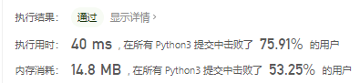
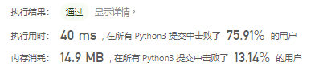
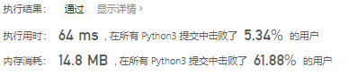

# [263. 丑数](https://leetcode-cn.com/problems/ugly-number/)

给你一个整数 `n` ，请你判断 `n` 是否为 **丑数** 。如果是，返回 `true` ；否则，返回 `false` 。

**丑数** 就是只包含质因数 `2`、`3` 和/或 `5` 的正整数。

 

**示例 1：**

```
输入：n = 6
输出：true
解释：6 = 2 × 3
```

**示例 2：**

```
输入：n = 8
输出：true
解释：8 = 2 × 2 × 2
```

**示例 3：**

```
输入：n = 14
输出：false
解释：14 不是丑数，因为它包含了另外一个质因数 7 。
```

**示例 4：**

```
输入：n = 1
输出：true
解释：1 通常被视为丑数。
```

 

**提示：**

- `-231 <= n <= 231 - 1`

## 思路

判断是否为丑数的情况：

- 能被2整除
- 能被3整除
- 能被5整除

如果不能就返回False。

还有两个边界条件：

- n为1
- n小于等于0

```python
class Solution:
    def isUgly(self, n: int) -> bool:
        if n == 1:
            return True
        if n <= 0:
            return False
        while abs(n) > 1:
            if n % 2 == 0:
                n = n // 2
                print(n)
            elif n % 3 == 0:
                n = n // 3
                print(n)
            elif n % 5 == 0:
                n = n // 5
                print(n)
            else:
                return False
        return True
```



```python
class Solution:
    def isUgly(self, n: int) -> bool:
        if n <= 0:
            return False
        while n > 1:
            if n % 2 == 0:
                n = n // 2
            elif n % 3 == 0:
                n = n // 3
            elif n % 5 == 0:
                n = n // 5
            else:
                return False
        return n == 1
```



另一种写法

```python
class Solution(object):
    def isUgly(self, n):
        if n <= 0:
            return False
        while n % 2 == 0:
            n //= 2
        while n % 3 == 0:
            n //= 3
        while n % 5 == 0:
            n //= 5
        return n == 1
```

