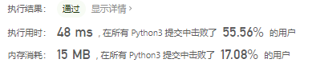

# [179. 最大数](https://leetcode-cn.com/problems/largest-number/)

给定一组非负整数 `nums`，重新排列每个数的顺序（每个数不可拆分）使之组成一个最大的整数。

**注意：**输出结果可能非常大，所以你需要返回一个字符串而不是整数。

 

**示例 1：**

```
输入：nums = [10,2]
输出："210"
```

**示例 2：**

```
输入：nums = [3,30,34,5,9]
输出："9534330"
```

**示例 3：**

```
输入：nums = [1]
输出："1"
```

**示例 4：**

```
输入：nums = [10]
输出："10"
```

 

**提示：**

- `1 <= nums.length <= 100`
- `0 <= nums[i] <= 109`

## 思路

转换为字符串

- nums_str为将nums转换为str
- compare为匿名函数，作用为正数大于，负数小于， x与y拼接比y与x拼接的值大，那么就用[x,y]的顺序，否则用[y,x]的顺序。

```python
class Solution:
    def largestNumber(self, nums: List[int]) -> str:
        nums_str = list(map(str, nums))
        compare = lambda x, y: 1 if x + y < y + x else -1
        nums_str.sort(key=cmp_to_key(compare))
        res = "".join(nums_str)
        if res[0] == "0":
            res = "0"
        return res
```

