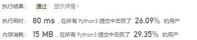
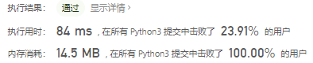
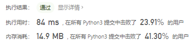
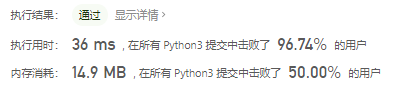

# [1006. 笨阶乘](https://leetcode-cn.com/problems/clumsy-factorial/)

通常，正整数 `n` 的阶乘是所有小于或等于 `n` 的正整数的乘积。例如，`factorial(10) = 10 * 9 * 8 * 7 * 6 * 5 * 4 * 3 * 2 * 1`。

相反，我们设计了一个笨阶乘 `clumsy`：在整数的递减序列中，我们以一个固定顺序的操作符序列来依次替换原有的乘法操作符：乘法(*)，除法(/)，加法(+)和减法(-)。

例如，`clumsy(10) = 10 * 9 / 8 + 7 - 6 * 5 / 4 + 3 - 2 * 1`。然而，这些运算仍然使用通常的算术运算顺序：我们在任何加、减步骤之前执行所有的乘法和除法步骤，并且按从左到右处理乘法和除法步骤。

另外，我们使用的除法是地板除法（*floor division*），所以 `10 * 9 / 8` 等于 `11`。这保证结果是一个整数。

实现上面定义的笨函数：给定一个整数 `N`，它返回 `N` 的笨阶乘。

 

**示例 1：**

```
输入：4
输出：7
解释：7 = 4 * 3 / 2 + 1
```

**示例 2：**

```
输入：10
输出：12
解释：12 = 10 * 9 / 8 + 7 - 6 * 5 / 4 + 3 - 2 * 1
```

 

**提示：**

1. `1 <= N <= 10000`
2. `-2^31 <= answer <= 2^31 - 1` （答案保证符合 32 位整数。）

# 思路

每四个分为一组运算，res第一个元素为被减数，其他元素为减数

```python
class Solution:
    def clumsy(self, N: int) -> int:
        if N < 5:
            res = [1]
        else:
            res = [1] * math.ceil(N / 4)
        index = 0
        cur = 0
        for i in range(N, 0, -1):
            if index == 0:
                res[cur] = i
                index += 1
            elif index == 1:
                res[cur] *= i
                index += 1
            elif index == 2:
                res[cur] //= i
                index += 1
            elif index == 3:
                if cur > 0:
                    res[cur] -= i
                else:
                    res[cur] += i
                index += 1
            if index == 4:
                cur += 1
                index = 0
        return res[0] - sum(res[1:])
```



把前面初始化长度判断优化了一下

```python
class Solution:
    def clumsy(self, N: int) -> int:
        res = [1] * math.ceil(N / 4)
        index = 0
        cur = 0
        for i in range(N, 0, -1):
            if index == 0:
                res[cur] = i
                index += 1
            elif index == 1:
                res[cur] *= i
                index += 1
            elif index == 2:
                res[cur] //= i
                index += 1
            elif index == 3:
                if cur > 0:
                    res[cur] -= i
                else:
                    res[cur] += i
                index += 1
            if index == 4:
                cur += 1
                index = 0
        return res[0] - sum(res[1:])
```



### 参考题解

使用栈，乘除一起算，加减直接带符号入栈

```python
class Solution(object):
    def clumsy(self, N):
        op = 0
        stack = [N]
        for i in range(N-1,0,-1):
            if op == 0:
                stack.append(stack.pop() * i)
            elif op == 1:
                stack.append(int(stack.pop() / float(i)))   # 乘除一起算
            elif op == 2:
                stack.append(i)     # 加
            elif op == 3:
                stack.append(-i)    # 减
            op = (op + 1) % 4
        print(stack)
        return sum(stack)
```



作弊方法

```python
class Solution:
    def clumsy(self, N: int) -> int:
        '''
        神秘代码
        :param N:
        :return:
        '''
        return N + ((3, 0, 0, 3) if N <= 4 else (1, 2, 2, -1))[N % 4]
```

