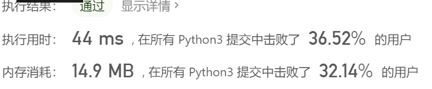
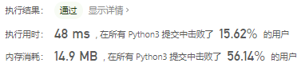
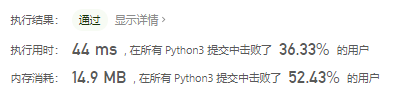

# [88. 合并两个有序数组](https://leetcode-cn.com/problems/merge-sorted-array/)

给你两个有序整数数组 `nums1` 和 `nums2`，请你将 `nums2` 合并到 `nums1` 中*，*使 `nums1` 成为一个有序数组。

初始化 `nums1` 和 `nums2` 的元素数量分别为 `m` 和 `n` 。你可以假设 `nums1` 的空间大小等于 `m + n`，这样它就有足够的空间保存来自 `nums2` 的元素。

 

**示例 1：**

```
输入：nums1 = [1,2,3,0,0,0], m = 3, nums2 = [2,5,6], n = 3
输出：[1,2,2,3,5,6]
```

**示例 2：**

```
输入：nums1 = [1], m = 1, nums2 = [], n = 0
输出：[1]
```

 

**提示：**

- `nums1.length == m + n`
- `nums2.length == n`
- `0 <= m, n <= 200`
- `1 <= m + n <= 200`
- `-109 <= nums1[i], nums2[i] <= 109`

## 思路

最简单的思路，num2拼接，然后在排序nums1

```python
class Solution:
    def merge(self, nums1: List[int], m: int, nums2: List[int], n: int) -> None:
        """
        Do not return anything, modify nums1 in-place instead.
        """
        nums1[m:] = nums2
        nums1.sort()
```



想一下别的思路

每次插入交换元素，但是也不是很好

```python
class Solution:
    def merge(self, nums1: List[int], m: int, nums2: List[int], n: int) -> None:
        """
        Do not return anything, modify nums1 in-place instead.
        """
        if n == 0 or len(nums1) < m + n:
            return
        l1, l2 = 0, 0
        while l1 < m + n or l2 < n:
            if nums1[l1] <= nums2[l2] and l1 < m:
                l1 += 1
            elif l1 >= m:
                nums1[l1] = nums2[l2]
                l1 += 1
                l2 += 1
            else:
                temp = nums2[l2]
                nums2[l2] = nums1[l1]
                nums1[l1] = temp
                l1 += 1
                nums2.sort()
```



手动实现排序

```python
class Solution(object):
    def merge(self, nums1, m, nums2, n):
        k = m + n - 1
        while m > 0 and n > 0:
            if nums1[m - 1] > nums2[n - 1]:
                nums1[k] = nums1[m - 1]
                m -= 1
            else:
                nums1[k] = nums2[n - 1]
                n -= 1
            k -= 1
        nums1[:n] = nums2[:n]
```

