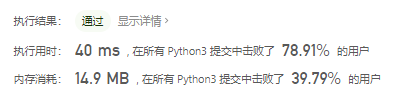
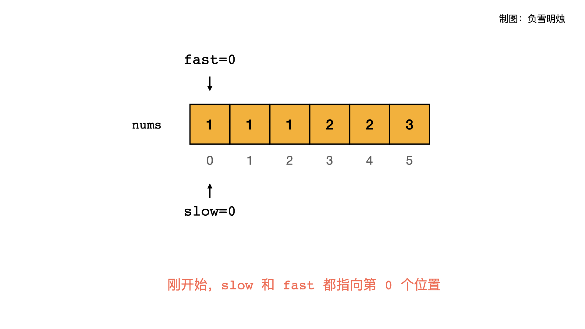
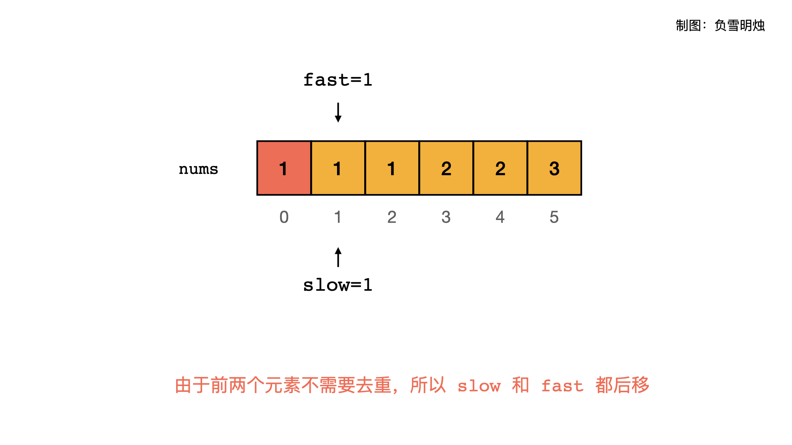
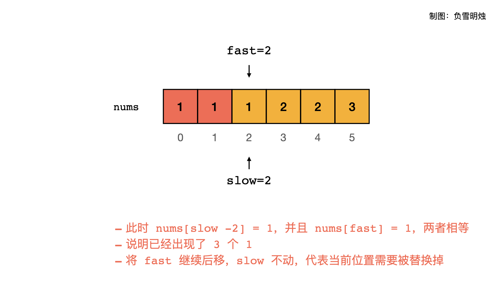
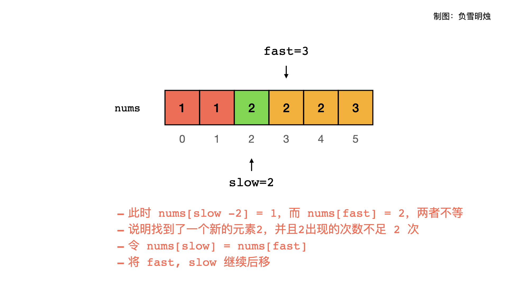
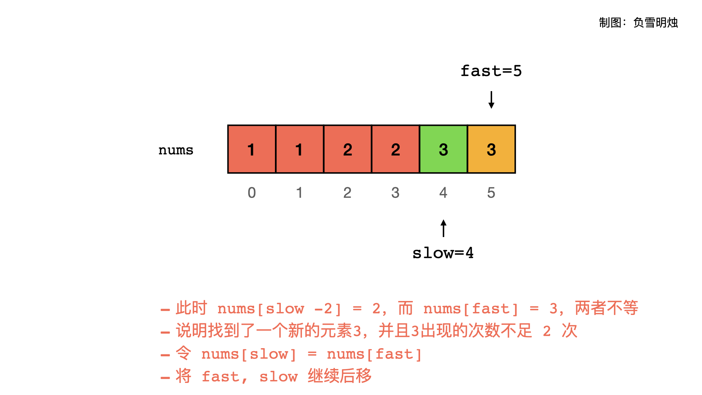
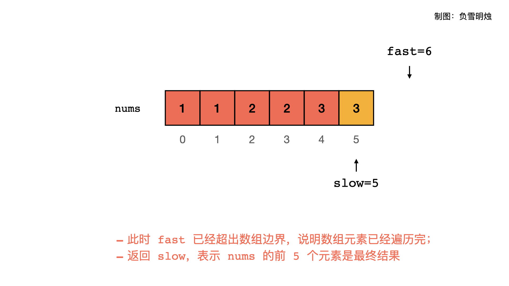

# [80. 删除有序数组中的重复项 II](https://leetcode-cn.com/problems/remove-duplicates-from-sorted-array-ii/)

给你一个有序数组 `nums` ，请你**[ 原地](http://baike.baidu.com/item/原地算法)** 删除重复出现的元素，使每个元素 **最多出现两次** ，返回删除后数组的新长度。

不要使用额外的数组空间，你必须在 **[原地 ](https://baike.baidu.com/item/原地算法)修改输入数组** 并在使用 O(1) 额外空间的条件下完成。

 

**说明：**

为什么返回数值是整数，但输出的答案是数组呢？

请注意，输入数组是以**「引用」**方式传递的，这意味着在函数里修改输入数组对于调用者是可见的。

你可以想象内部操作如下:

```
// nums 是以“引用”方式传递的。也就是说，不对实参做任何拷贝
int len = removeDuplicates(nums);

// 在函数里修改输入数组对于调用者是可见的。
// 根据你的函数返回的长度, 它会打印出数组中 该长度范围内 的所有元素。
for (int i = 0; i < len; i++) {
    print(nums[i]);
}
```

 

**示例 1：**

```
输入：nums = [1,1,1,2,2,3]
输出：5, nums = [1,1,2,2,3]
解释：函数应返回新长度 length = 5, 并且原数组的前五个元素被修改为 1, 1, 2, 2, 3 。 不需要考虑数组中超出新长度后面的元素。
```

**示例 2：**

```
输入：nums = [0,0,1,1,1,1,2,3,3]
输出：7, nums = [0,0,1,1,2,3,3]
解释：函数应返回新长度 length = 7, 并且原数组的前五个元素被修改为 0, 0, 1, 1, 2, 3, 3 。 不需要考虑数组中超出新长度后面的元素。
```

 

**提示：**

- `1 <= nums.length <= 3 * 104`
- `-104 <= nums[i] <= 104`
- `nums` 已按升序排列

## 思路

注意审题，原地置换

- 如果长度小于3，直接返回
- 设置起始索引为第三项，遍历list判断是否存在三个连续的元素
- 如果存在则删除最后一个并且重新循环，i不增加
- 否则i加1

```python
class Solution:
    def removeDuplicates(self, nums: List[int]) -> int:
        if len(nums) < 3:
            return len(nums)
        i = 2
        while i < len(nums):
            if nums[i] == nums[i - 1] == nums[i - 2]:
                nums.remove(nums[i])
                continue
            i += 1
        return len(nums)
```



### 快慢指针法

```python
class Solution(object):
    def removeDuplicates(self, nums):
        slow = 0
        for fast in range(len(nums)):
            if slow < 2 or nums[fast] != nums[slow - 2]:
                # 如果slow大于2并且nums[fast]等于nums[slow-2]跳过，否则slow加1
                nums[slow] = nums[fast]	# 重置slow
                slow += 1
        return slow
```

- **慢指针 slow** : 指向当前即将放置元素的位置；则 `slow - 1` 是刚才已经放置了元素的位置。
- **快指针 fast** : 向后遍历所有元素；












