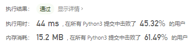
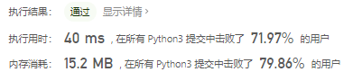

# [81. 搜索旋转排序数组 II](https://leetcode-cn.com/problems/search-in-rotated-sorted-array-ii/)

已知存在一个按非降序排列的整数数组 `nums` ，数组中的值不必互不相同。

在传递给函数之前，`nums` 在预先未知的某个下标 `k`（`0 <= k < nums.length`）上进行了 **旋转** ，使数组变为 `[nums[k], nums[k+1], ..., nums[n-1], nums[0], nums[1], ..., nums[k-1]]`（下标 **从 0 开始** 计数）。例如， `[0,1,2,4,4,4,5,6,6,7]` 在下标 `5` 处经旋转后可能变为 `[4,5,6,6,7,0,1,2,4,4]` 。

给你 **旋转后** 的数组 `nums` 和一个整数 `target` ，请你编写一个函数来判断给定的目标值是否存在于数组中。如果 `nums` 中存在这个目标值 `target` ，则返回 `true` ，否则返回 `false` 。

 

**示例 1：**

```
输入：nums = [2,5,6,0,0,1,2], target = 0
输出：true
```

**示例 2：**

```
输入：nums = [2,5,6,0,0,1,2], target = 3
输出：false
```

 

**提示：**

- `1 <= nums.length <= 5000`
- `-104 <= nums[i] <= 104`
- 题目数据保证 `nums` 在预先未知的某个下标上进行了旋转
- `-104 <= target <= 104`

 

**进阶：**

- 这是 [搜索旋转排序数组](https://leetcode-cn.com/problems/search-in-rotated-sorted-array/description/) 的延伸题目，本题中的 `nums` 可能包含重复元素。
- 这会影响到程序的时间复杂度吗？会有怎样的影响，为什么？

## 思路

不按题意来，就是直接找target是否在nums中

```python
class Solution:
    def search(self, nums: List[int], target: int) -> bool:
        if target in nums:
            return True
        return False
```


正常想法，分两边走

```python
class Solution:
    def search(self, nums: List[int], target: int) -> bool:
        if target == nums[0]:
            return True
        if target > nums[0]:
            for i in range(len(nums)):
                if target == nums[i]:
                    return True
        else:
            for i in range(len(nums) - 1, -1, -1):
                if target == nums[i]:
                    return True
        return False
```



真正想考的应该是二分法：

```python
class Solution:
    def search(self, nums: List[int], target: int) -> bool:
        if not nums:
            return False
        left, right = 0, len(nums) - 1
        while left <= right:
            mid = (left + right) // 2
            if nums[mid] == target:
                return True
            if nums[left] == nums[right]:
                left += 1
                continue
            if nums[mid] <= nums[right]:
                if target > nums[mid] and target <= nums[right]:
                    left = mid + 1
                else:
                    right = mid - 1
            else:
                if target < nums[mid] and target >= nums[left]:
                    right = mid - 1
                else:
                    left = mid + 1
        return False
```

