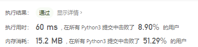
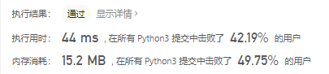
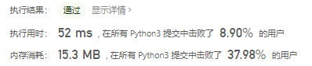
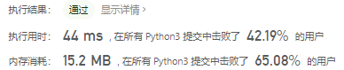

# [154. 寻找旋转排序数组中的最小值 II](https://leetcode-cn.com/problems/find-minimum-in-rotated-sorted-array-ii/)

已知一个长度为 `n` 的数组，预先按照升序排列，经由 `1` 到 `n` 次 **旋转** 后，得到输入数组。例如，原数组 `nums = [0,1,4,4,5,6,7]` 在变化后可能得到：

- 若旋转 `4` 次，则可以得到 `[4,5,6,7,0,1,4]`
- 若旋转 `7` 次，则可以得到 `[0,1,4,4,5,6,7]`

注意，数组 `[a[0], a[1], a[2], ..., a[n-1]]` **旋转一次** 的结果为数组 `[a[n-1], a[0], a[1], a[2], ..., a[n-2]]` 。

给你一个可能存在 **重复** 元素值的数组 `nums` ，它原来是一个升序排列的数组，并按上述情形进行了多次旋转。请你找出并返回数组中的 **最小元素** 。

 

**示例 1：**

```
输入：nums = [1,3,5]
输出：1
```

**示例 2：**

```
输入：nums = [2,2,2,0,1]
输出：0
```

 

**提示：**

- `n == nums.length`
- `1 <= n <= 5000`
- `-5000 <= nums[i] <= 5000`
- `nums` 原来是一个升序排序的数组，并进行了 `1` 至 `n` 次旋转

 

**进阶：**

- 这道题是 [寻找旋转排序数组中的最小值](https://leetcode-cn.com/problems/find-minimum-in-rotated-sorted-array/description/) 的延伸题目。
- 允许重复会影响算法的时间复杂度吗？会如何影响，为什么？

## 思路

### 二分查找

```python
class Solution:
    def findMin(self, nums: List[int]) -> int:
        n = len(nums)
        l, r = 0, n-1
        while l < r and nums[0] == nums[r]:
            r -= 1
        while l < r:
            mid = (l + r + 1) // 2
            if nums[mid] >= nums[0]:
                l = mid
            else:
                r = mid - 1
        return nums[r + 1] if r + 1 < n else nums[0]
```



### 左右开弓

```python
class Solution:
    def findMin(self, nums: List[int]) -> int:
        left, right = 0, len(nums) - 1
        res = nums[0]
        if nums[left] > nums[right]:
            for i in range(left, right + 1):
                res = min(res, nums[i])
            return res
        else:
            for i in range(right, -1, -1):
                print(i)
                res = min(res, nums[i])
            return res
```



### 偷鸡

```python
class Solution:
    def findMin(self, nums: List[int]) -> int:
        return min(nums)
```



### 偷鸡2

```python
class Solution:
    def findMin(self, nums: List[int]) -> int:
        nums = sorted(list(set(nums)))
        print(nums)
        left, right = 0, len(nums) - 1
        while left < right:
            mid = (left + right + 1) // 2
            if nums[mid] > nums[0]:
                left = mid
            else:
                right = mid - 1
        return nums[right + 1] if right + 1 < len(nums) else nums[0]
```

先变成集合再变成list在sorted一下

