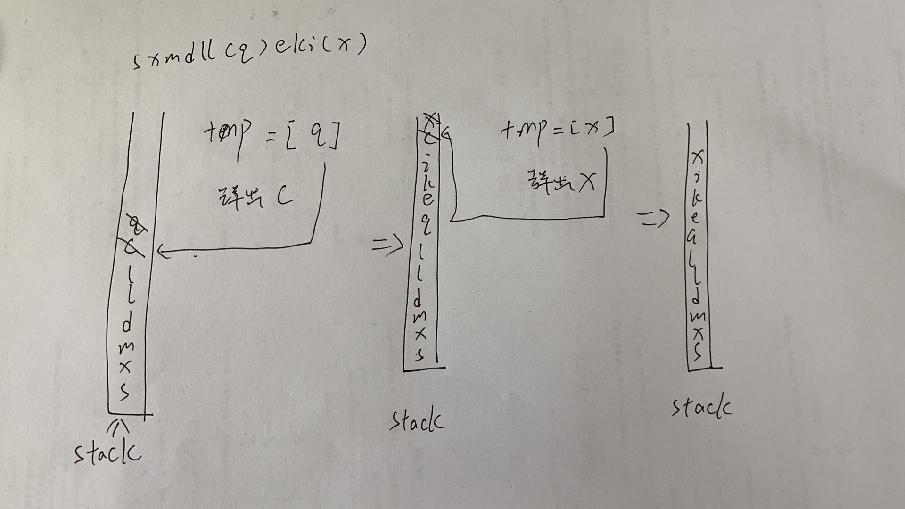

# [1190. 反转每对括号间的子串](https://leetcode-cn.com/problems/reverse-substrings-between-each-pair-of-parentheses/)

给出一个字符串 `s`（仅含有小写英文字母和括号）。

请你按照从括号内到外的顺序，逐层反转每对匹配括号中的字符串，并返回最终的结果。

注意，您的结果中 **不应** 包含任何括号。

 

**示例 1：**

```
输入：s = "(abcd)"
输出："dcba"
```

**示例 2：**

```
输入：s = "(u(love)i)"
输出："iloveu"
```

**示例 3：**

```
输入：s = "(ed(et(oc))el)"
输出："leetcode"
```

**示例 4：**

```
输入：s = "a(bcdefghijkl(mno)p)q"
输出："apmnolkjihgfedcbq"
```

 

**提示：**

- `0 <= s.length <= 2000`
- `s` 中只有小写英文字母和括号
- 我们确保所有括号都是成对出现的

## 思路

1. 当字符不为）的时候，将字符串一一入栈

2. 字符为）时将该）往前到第一个（之间的字符放入tmp中，利用栈的特性翻转存入。
3. 将tmp元素放回栈中
4. 使用"".join()将栈中元素转回字符串



```python
class Solution:
    def reverseParentheses(self, s: str) -> str:
        stack = []
        for c in s:
            if c != ')':
                stack.append(c)
            elif c == ')':
                tmp = []
                # 注意stack不为空才可以读取栈顶
                while stack and stack[-1] != '(':
                    tmp.append(stack.pop())
                if stack:
                    stack.pop()     # 将左括号抛出
                stack += tmp
            print(stack)
        return "".join(stack)
```

