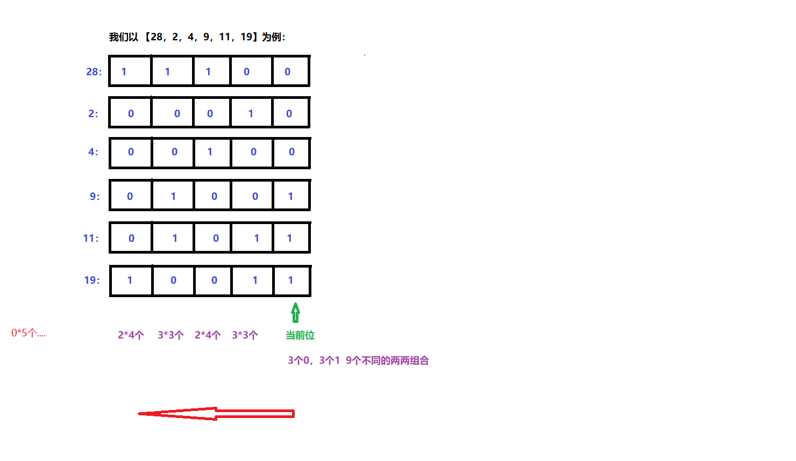

# [477. 汉明距离总和](https://leetcode-cn.com/problems/total-hamming-distance/)

两个整数的 [汉明距离](https://baike.baidu.com/item/汉明距离/475174?fr=aladdin) 指的是这两个数字的二进制数对应位不同的数量。

计算一个数组中，任意两个数之间汉明距离的总和。

**示例:**

```
输入: 4, 14, 2

输出: 6

解释: 在二进制表示中，4表示为0100，14表示为1110，2表示为0010。（这样表示是为了体现后四位之间关系）
所以答案为：
HammingDistance(4, 14) + HammingDistance(4, 2) + HammingDistance(14, 2) = 2 + 2 + 2 = 6.
```

**注意:**

1. 数组中元素的范围为从 `0`到 `10^9`。
2. 数组的长度不超过 `10^4`。

## 思路

起初想到的思路是暴力破解，通过找到每一个组合来调用之前的函数完成求和操作，但是会出现超出时间限制的问题。

```python
class Solution:
    def hammingDistance(self, x: int, y: int) -> int:
        res = 0
        cur = str(bin(x ^ y))[2:]
        for i in cur:
            if i == '1':
                res += 1
        return res
    def totalHammingDistance(self, nums: List[int]) -> int:
        res1 = 0
        for i in range(len(nums)):
            for j in range(i+1,len(nums)):
                print(nums[i], nums[j])
                res1 += self.hammingDistance(nums[i], nums[j])
        return res1
```

查看题解，发现可以通过位运算的方式，按每一位找，最多31位。



```python
class Solution:
    def totalHammingDistance(self, nums: List[int]) -> int:
        res = 0
        for i in range(0, 31):
            bit = 1 << i
            count0, count1 = 0, 0
            for j in range(0, len(nums)):
                if bit == nums[j] & bit:
                    count1 += 1
                else:
                    count0 += 1
            res += count1 * count0  # 1的数量和0的数量相乘
        return res
```


```python
class Solution:
    def totalHammingDistance(self, nums: List[int]) -> int:
        ans = 0
        for i in range(31, -1, -1):
            s1, s0 = 0, 0
            for u in nums:
                if ((u >> i) & 1) == 1:
                    s1 += 1
                else:
                    s0 += 1
            ans += s0 *s1
        return ans
```

