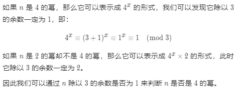

# [342. 4的幂](https://leetcode-cn.com/problems/power-of-four/)

给定一个整数，写一个函数来判断它是否是 4 的幂次方。如果是，返回 `true` ；否则，返回 `false` 。

整数 `n` 是 4 的幂次方需满足：存在整数 `x` 使得 `n == 4x`

 

**示例 1：**

```
输入：n = 16
输出：true
```

**示例 2：**

```
输入：n = 5
输出：false
```

**示例 3：**

```
输入：n = 1
输出：true
```

 

**提示：**

- `-231 <= n <= 231 - 1`

 

**进阶：**

- 你能不使用循环或者递归来完成本题吗？

## 思路

首先是比较好想到的使用循环的方式，每次除4

```python
class Solution:
    def isPowerOfFour(self, n: int) -> bool:
        if n <= 0:
            return False
        while n > 1:
            if n % 4 == 0:
                n = n // 4
            else:
                return False
        return True
```


将数字转换为字符串，首先判断字符串中有且仅有一个1，判断字符串长度为奇数，因为4的幂次必定为奇数。

```python
class Solution:
    def isPowerOfFour(self, n: int) -> bool:
        if str(bin(n))[2:].count('1') == 1 and len(str(bin(n))[2:]) % 2 != 0 and n > 0:
            return True
        else:
            return False
```


**查看题解**

二进制中1的位置


```python
class Solution:
    def isPowerOfFour(self, n: int) -> bool:
        return n > 0 and (n & (n - 1)) == 0 and (n & 0xaaaaaaaa) == 0
```


取模性质



```python
class Solution:
    def isPowerOfFour(self, n: int) -> bool:
        return n > 0 and (n & (n - 1)) == 0 and n % 3 == 1
```

